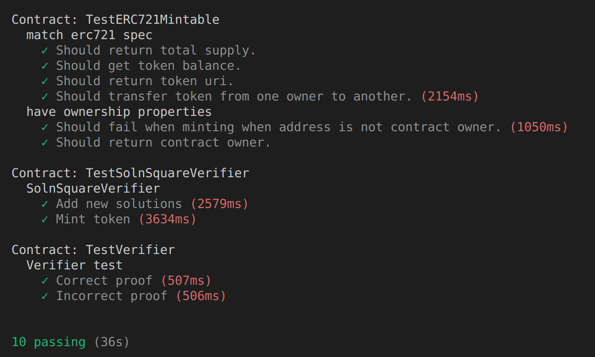

# Blockchain Capstone Project
## Steps:

## Install node modules:
```
npm install
npm install @truffle/hdwallet-provider --save
```

## Versions of frameworks and libraries:

* Truffle v5.4.29 (core: 5.4.29)
* Solidity v0.5.16 (solc-js)
* Node v14.18.1
* Web3.js v1.5.3

## Zokrates docker installation:
```
sudo usermod -a -G docker [your_user]
newgrp docker
docker run -v ~/projects/udacity/blockchain/blockchain-capstone:/home/zokrates/code -ti zokrates/zokrates /bin/bash
```

## In the docker instance terminal execute the following:
```
cd ~/code/zokrates/code/square
zokrates compile -i square.code
zokrates setup
zokrates compute-witness -a 3 9
zokrates generate-proof
zokrates export-verifier
```

## Test contracts in Truffle devlopment local environment:
```
truffle develop
```

## In the truffle console run the following commands:
```
compile
migrate --reset
test
```

## Tests results:


## Deploy contracts in Rinkeby testnet
* Config truffle-config.js with your metmask rinkeby mnemonic and infura endpoint
* Execute:
  ```
  truffle migrate --network rinkeby --reset
  ```

## Contracts Addresses:
* SolnSquareVerifier: 0xA96D95F920c20445699b678F6778c5D3f74F0e20
* SquareVerifier:     0x2252fD47bdF13eeB33b59abc3285944f60C4506E
* Migrations:         0x10B304e641C372fAb4E605d0f612C520ad0F799c

## Mint 10 tokens using `scripts/mint_tool.js`
## Export the following environment variables or define them in a .env file in the root of the project:
```
export OWNER=_ADDRESS"<owner_address>"
export CONTRACT_ADDRESS="0xA96D95F920c20445699b678F6778c5D3f74F0e20"
export MNEMONIC="<metmask_mnemonic>"
export INFURA_KEY="<infura_key>"
node scripts/mint_tool.js
```

## Open Sea URLs:
Seller: https://testnets.opensea.io/collection/open-sea-real-estate-token-721
Buyer: https://testnets.opensea.io/0xF634100Bc14E2B301E9C4aDF56Bc6c1C9d91a7B0

## SolnSquareVerifier Contract ABI:
```
{
  "contractName": "SolnSquareVerifier",
  "abi": [
    {
      "anonymous": false,
      "inputs": [
        {
          "indexed": false,
          "internalType": "uint256",
          "name": "tokenId",
          "type": "uint256"
        },
        {
          "indexed": false,
          "internalType": "address",
          "name": "to",
          "type": "address"
        }
      ],
      "name": "AddedSol",
      "type": "event"
    },
    {
      "anonymous": false,
      "inputs": [
        {
          "indexed": true,
          "internalType": "address",
          "name": "owner",
          "type": "address"
        },
        {
          "indexed": true,
          "internalType": "address",
          "name": "approved",
          "type": "address"
        },
        {
          "indexed": true,
          "internalType": "uint256",
          "name": "tokenId",
          "type": "uint256"
        }
      ],
      "name": "Approval",
      "type": "event"
    },
    {
      "anonymous": false,
      "inputs": [
        {
          "indexed": true,
          "internalType": "address",
          "name": "owner",
          "type": "address"
        },
        {
          "indexed": true,
          "internalType": "address",
          "name": "operator",
          "type": "address"
        },
        {
          "indexed": false,
          "internalType": "bool",
          "name": "approved",
          "type": "bool"
        }
      ],
      "name": "ApprovalForAll",
      "type": "event"
    },
    {
      "anonymous": false,
      "inputs": [
        {
          "indexed": false,
          "internalType": "address",
          "name": "from",
          "type": "address"
        }
      ],
      "name": "Paused",
      "type": "event"
    },
    {
      "anonymous": false,
      "inputs": [
        {
          "indexed": true,
          "internalType": "address",
          "name": "from",
          "type": "address"
        },
        {
          "indexed": true,
          "internalType": "address",
          "name": "to",
          "type": "address"
        },
        {
          "indexed": true,
          "internalType": "uint256",
          "name": "tokenId",
          "type": "uint256"
        }
      ],
      "name": "Transfer",
      "type": "event"
    },
    {
      "anonymous": false,
      "inputs": [
        {
          "indexed": false,
          "internalType": "address",
          "name": "newOwner",
          "type": "address"
        }
      ],
      "name": "TransferredOwnership",
      "type": "event"
    },
    {
      "anonymous": false,
      "inputs": [
        {
          "indexed": false,
          "internalType": "address",
          "name": "from",
          "type": "address"
        }
      ],
      "name": "Unpaused",
      "type": "event"
    },
    {
      "constant": false,
      "inputs": [
        {
          "internalType": "bytes32",
          "name": "_myid",
          "type": "bytes32"
        },
        {
          "internalType": "string",
          "name": "_result",
          "type": "string"
        }
      ],
      "name": "__callback",
      "outputs": [],
      "payable": false,
      "stateMutability": "nonpayable",
      "type": "function"
    },
    {
      "constant": false,
      "inputs": [
        {
          "internalType": "bytes32",
          "name": "_myid",
          "type": "bytes32"
        },
        {
          "internalType": "string",
          "name": "_result",
          "type": "string"
        },
        {
          "internalType": "bytes",
          "name": "_proof",
          "type": "bytes"
        }
      ],
      "name": "__callback",
      "outputs": [],
      "payable": false,
      "stateMutability": "nonpayable",
      "type": "function"
    },
    {
      "constant": false,
      "inputs": [
        {
          "internalType": "address",
          "name": "to",
          "type": "address"
        },
        {
          "internalType": "uint256",
          "name": "tokenId",
          "type": "uint256"
        }
      ],
      "name": "approve",
      "outputs": [],
      "payable": false,
      "stateMutability": "nonpayable",
      "type": "function"
    },
    {
      "constant": true,
      "inputs": [
        {
          "internalType": "address",
          "name": "owner",
          "type": "address"
        }
      ],
      "name": "balanceOf",
      "outputs": [
        {
          "internalType": "uint256",
          "name": "",
          "type": "uint256"
        }
      ],
      "payable": false,
      "stateMutability": "view",
      "type": "function"
    },
    {
      "constant": true,
      "inputs": [],
      "name": "basetokenURI",
      "outputs": [
        {
          "internalType": "string",
          "name": "",
          "type": "string"
        }
      ],
      "payable": false,
      "stateMutability": "view",
      "type": "function"
    },
    {
      "constant": true,
      "inputs": [
        {
          "internalType": "uint256",
          "name": "tokenId",
          "type": "uint256"
        }
      ],
      "name": "getApproved",
      "outputs": [
        {
          "internalType": "address",
          "name": "",
          "type": "address"
        }
      ],
      "payable": false,
      "stateMutability": "view",
      "type": "function"
    },
    {
      "constant": true,
      "inputs": [
        {
          "internalType": "address",
          "name": "owner",
          "type": "address"
        },
        {
          "internalType": "address",
          "name": "operator",
          "type": "address"
        }
      ],
      "name": "isApprovedForAll",
      "outputs": [
        {
          "internalType": "bool",
          "name": "",
          "type": "bool"
        }
      ],
      "payable": false,
      "stateMutability": "view",
      "type": "function"
    },
    {
      "constant": false,
      "inputs": [
        {
          "internalType": "address",
          "name": "to",
          "type": "address"
        },
        {
          "internalType": "uint256",
          "name": "tokenId",
          "type": "uint256"
        }
      ],
      "name": "mint",
      "outputs": [
        {
          "internalType": "bool",
          "name": "",
          "type": "bool"
        }
      ],
      "payable": false,
      "stateMutability": "nonpayable",
      "type": "function"
    },
    {
      "constant": true,
      "inputs": [],
      "name": "name",
      "outputs": [
        {
          "internalType": "string",
          "name": "",
          "type": "string"
        }
      ],
      "payable": false,
      "stateMutability": "view",
      "type": "function"
    },
    {
      "constant": true,
      "inputs": [],
      "name": "owner",
      "outputs": [
        {
          "internalType": "address",
          "name": "",
          "type": "address"
        }
      ],
      "payable": false,
      "stateMutability": "view",
      "type": "function"
    },
    {
      "constant": true,
      "inputs": [
        {
          "internalType": "uint256",
          "name": "tokenId",
          "type": "uint256"
        }
      ],
      "name": "ownerOf",
      "outputs": [
        {
          "internalType": "address",
          "name": "",
          "type": "address"
        }
      ],
      "payable": false,
      "stateMutability": "view",
      "type": "function"
    },
    {
      "constant": false,
      "inputs": [
        {
          "internalType": "bool",
          "name": "paused",
          "type": "bool"
        }
      ],
      "name": "pause",
      "outputs": [],
      "payable": false,
      "stateMutability": "nonpayable",
      "type": "function"
    },
    {
      "constant": false,
      "inputs": [
        {
          "internalType": "address",
          "name": "from",
          "type": "address"
        },
        {
          "internalType": "address",
          "name": "to",
          "type": "address"
        },
        {
          "internalType": "uint256",
          "name": "tokenId",
          "type": "uint256"
        }
      ],
      "name": "safeTransferFrom",
      "outputs": [],
      "payable": false,
      "stateMutability": "nonpayable",
      "type": "function"
    },
    {
      "constant": false,
      "inputs": [
        {
          "internalType": "address",
          "name": "from",
          "type": "address"
        },
        {
          "internalType": "address",
          "name": "to",
          "type": "address"
        },
        {
          "internalType": "uint256",
          "name": "tokenId",
          "type": "uint256"
        },
        {
          "internalType": "bytes",
          "name": "_data",
          "type": "bytes"
        }
      ],
      "name": "safeTransferFrom",
      "outputs": [],
      "payable": false,
      "stateMutability": "nonpayable",
      "type": "function"
    },
    {
      "constant": false,
      "inputs": [
        {
          "internalType": "address",
          "name": "to",
          "type": "address"
        },
        {
          "internalType": "bool",
          "name": "approved",
          "type": "bool"
        }
      ],
      "name": "setApprovalForAll",
      "outputs": [],
      "payable": false,
      "stateMutability": "nonpayable",
      "type": "function"
    },
    {
      "constant": true,
      "inputs": [
        {
          "internalType": "bytes4",
          "name": "interfaceId",
          "type": "bytes4"
        }
      ],
      "name": "supportsInterface",
      "outputs": [
        {
          "internalType": "bool",
          "name": "",
          "type": "bool"
        }
      ],
      "payable": false,
      "stateMutability": "view",
      "type": "function"
    },
    {
      "constant": true,
      "inputs": [],
      "name": "symbol",
      "outputs": [
        {
          "internalType": "string",
          "name": "",
          "type": "string"
        }
      ],
      "payable": false,
      "stateMutability": "view",
      "type": "function"
    },
    {
      "constant": true,
      "inputs": [
        {
          "internalType": "uint256",
          "name": "index",
          "type": "uint256"
        }
      ],
      "name": "tokenByIndex",
      "outputs": [
        {
          "internalType": "uint256",
          "name": "",
          "type": "uint256"
        }
      ],
      "payable": false,
      "stateMutability": "view",
      "type": "function"
    },
    {
      "constant": true,
      "inputs": [
        {
          "internalType": "address",
          "name": "owner",
          "type": "address"
        },
        {
          "internalType": "uint256",
          "name": "index",
          "type": "uint256"
        }
      ],
      "name": "tokenOfOwnerByIndex",
      "outputs": [
        {
          "internalType": "uint256",
          "name": "",
          "type": "uint256"
        }
      ],
      "payable": false,
      "stateMutability": "view",
      "type": "function"
    },
    {
      "constant": true,
      "inputs": [
        {
          "internalType": "uint256",
          "name": "tokenId",
          "type": "uint256"
        }
      ],
      "name": "tokenURI",
      "outputs": [
        {
          "internalType": "string",
          "name": "",
          "type": "string"
        }
      ],
      "payable": false,
      "stateMutability": "view",
      "type": "function"
    },
    {
      "constant": true,
      "inputs": [],
      "name": "totalSupply",
      "outputs": [
        {
          "internalType": "uint256",
          "name": "",
          "type": "uint256"
        }
      ],
      "payable": false,
      "stateMutability": "view",
      "type": "function"
    },
    {
      "constant": false,
      "inputs": [
        {
          "internalType": "address",
          "name": "from",
          "type": "address"
        },
        {
          "internalType": "address",
          "name": "to",
          "type": "address"
        },
        {
          "internalType": "uint256",
          "name": "tokenId",
          "type": "uint256"
        }
      ],
      "name": "transferFrom",
      "outputs": [],
      "payable": false,
      "stateMutability": "nonpayable",
      "type": "function"
    },
    {
      "constant": false,
      "inputs": [
        {
          "internalType": "address",
          "name": "newOwner",
          "type": "address"
        }
      ],
      "name": "transferOwnership",
      "outputs": [],
      "payable": false,
      "stateMutability": "nonpayable",
      "type": "function"
    },
    {
      "constant": true,
      "inputs": [
        {
          "components": [
            {
              "components": [
                {
                  "internalType": "uint256",
                  "name": "X",
                  "type": "uint256"
                },
                {
                  "internalType": "uint256",
                  "name": "Y",
                  "type": "uint256"
                }
              ],
              "internalType": "struct Pairing.G1Point",
              "name": "a",
              "type": "tuple"
            },
            {
              "components": [
                {
                  "internalType": "uint256[2]",
                  "name": "X",
                  "type": "uint256[2]"
                },
                {
                  "internalType": "uint256[2]",
                  "name": "Y",
                  "type": "uint256[2]"
                }
              ],
              "internalType": "struct Pairing.G2Point",
              "name": "b",
              "type": "tuple"
            },
            {
              "components": [
                {
                  "internalType": "uint256",
                  "name": "X",
                  "type": "uint256"
                },
                {
                  "internalType": "uint256",
                  "name": "Y",
                  "type": "uint256"
                }
              ],
              "internalType": "struct Pairing.G1Point",
              "name": "c",
              "type": "tuple"
            }
          ],
          "internalType": "struct Verifier.Proof",
          "name": "proof",
          "type": "tuple"
        },
        {
          "internalType": "uint256[2]",
          "name": "input",
          "type": "uint256[2]"
        }
      ],
      "name": "verifyTx",
      "outputs": [
        {
          "internalType": "bool",
          "name": "r",
          "type": "bool"
        }
      ],
      "payable": false,
      "stateMutability": "view",
      "type": "function"
    },
    {
      "constant": false,
      "inputs": [
        {
          "internalType": "address",
          "name": "to",
          "type": "address"
        },
        {
          "internalType": "uint256",
          "name": "tokenId",
          "type": "uint256"
        },
        {
          "internalType": "uint256[2]",
          "name": "a",
          "type": "uint256[2]"
        },
        {
          "internalType": "uint256[2][2]",
          "name": "b",
          "type": "uint256[2][2]"
        },
        {
          "internalType": "uint256[2]",
          "name": "c",
          "type": "uint256[2]"
        },
        {
          "internalType": "uint256[2]",
          "name": "input",
          "type": "uint256[2]"
        }
      ],
      "name": "addSolution",
      "outputs": [],
      "payable": false,
      "stateMutability": "nonpayable",
      "type": "function"
    },
    {
      "constant": false,
      "inputs": [
        {
          "internalType": "address",
          "name": "to",
          "type": "address"
        },
        {
          "internalType": "uint256",
          "name": "tokenId",
          "type": "uint256"
        },
        {
          "internalType": "uint256[2]",
          "name": "a",
          "type": "uint256[2]"
        },
        {
          "internalType": "uint256[2][2]",
          "name": "b",
          "type": "uint256[2][2]"
        },
        {
          "internalType": "uint256[2]",
          "name": "c",
          "type": "uint256[2]"
        },
        {
          "internalType": "uint256[2]",
          "name": "input",
          "type": "uint256[2]"
        }
      ],
      "name": "mintToken",
      "outputs": [],
      "payable": false,
      "stateMutability": "nonpayable",
      "type": "function"
    }
  ],
  "metadata": "{\"compiler\":{\"version\":\"0.5.17+commit.d19bba13\"},\"language\":\"Solidity\",\"output\":{\"abi\":[{\"anonymous\":false,\"inputs\":[{\"indexed\":false,\"internalType\":\"uint256\",\"name\":\"tokenId\",\"type\":\"uint256\"},{\"indexed\":false,\"internalType\":\"address\",\"name\":\"to\",\"type\":\"address\"}],\"name\":\"AddedSol\",\"type\":\"event\"},{\"anonymous\":false,\"inputs\":[{\"indexed\":true,\"internalType\":\"address\",\"name\":\"owner\",\"type\":\"address\"},{\"indexed\":true,\"internalType\":\"address\",\"name\":\"approved\",\"type\":\"address\"},{\"indexed\":true,\"internalType\":\"uint256\",\"name\":\"tokenId\",\"type\":\"uint256\"}],\"name\":\"Approval\",\"type\":\"event\"},{\"anonymous\":false,\"inputs\":[{\"indexed\":true,\"internalType\":\"address\",\"name\":\"owner\",\"type\":\"address\"},{\"indexed\":true,\"internalType\":\"address\",\"name\":\"operator\",\"type\":\"address\"},{\"indexed\":false,\"internalType\":\"bool\",\"name\":\"approved\",\"type\":\"bool\"}],\"name\":\"ApprovalForAll\",\"type\":\"event\"},{\"anonymous\":false,\"inputs\":[{\"indexed\":false,\"internalType\":\"address\",\"name\":\"from\",\"type\":\"address\"}],\"name\":\"Paused\",\"type\":\"event\"},{\"anonymous\":false,\"inputs\":[{\"indexed\":true,\"internalType\":\"address\",\"name\":\"from\",\"type\":\"address\"},{\"indexed\":true,\"internalType\":\"address\",\"name\":\"to\",\"type\":\"address\"},{\"indexed\":true,\"internalType\":\"uint256\",\"name\":\"tokenId\",\"type\":\"uint256\"}],\"name\":\"Transfer\",\"type\":\"event\"},{\"anonymous\":false,\"inputs\":[{\"indexed\":false,\"internalType\":\"address\",\"name\":\"newOwner\",\"type\":\"address\"}],\"name\":\"TransferredOwnership\",\"type\":\"event\"},{\"anonymous\":false,\"inputs\":[{\"indexed\":false,\"internalType\":\"address\",\"name\":\"from\",\"type\":\"address\"}],\"name\":\"Unpaused\",\"type\":\"event\"},{\"constant\":false,\"inputs\":[{\"internalType\":\"bytes32\",\"name\":\"_myid\",\"type\":\"bytes32\"},{\"internalType\":\"string\",\"name\":\"_result\",\"type\":\"string\"}],\"name\":\"__callback\",\"outputs\":[],\"payable\":false,\"stateMutability\":\"nonpayable\",\"type\":\"function\"},{\"constant\":false,\"inputs\":[{\"internalType\":\"bytes32\",\"name\":\"_myid\",\"type\":\"bytes32\"},{\"internalType\":\"string\",\"name\":\"_result\",\"type\":\"string\"},{\"internalType\":\"bytes\",\"name\":\"_proof\",\"type\":\"bytes\"}],\"name\":\"__callback\",\"outputs\":[],\"payable\":false,\"stateMutability\":\"nonpayable\",\"type\":\"function\"},{\"constant\":false,\"inputs\":[{\"internalType\":\"address\",\"name\":\"to\",\"type\":\"address\"},{\"internalType\":\"uint256\",\"name\":\"tokenId\",\"type\":\"uint256\"},{\"internalType\":\"uint256[2]\",\"name\":\"a\",\"type\":\"uint256[2]\"},{\"internalType\":\"uint256[2][2]\",\"name\":\"b\",\"type\":\"uint256[2][2]\"},{\"internalType\":\"uint256[2]\",\"name\":\"c\",\"type\":\"uint256[2]\"},{\"internalType\":\"uint256[2]\",\"name\":\"input\",\"type\":\"uint256[2]\"}],\"name\":\"addSolution\",\"outputs\":[],\"payable\":false,\"stateMutability\":\"nonpayable\",\"type\":\"function\"},{\"constant\":false,\"inputs\":[{\"internalType\":\"address\",\"name\":\"to\",\"type\":\"address\"},{\"internalType\":\"uint256\",\"name\":\"tokenId\",\"type\":\"uint256\"}],\"name\":\"approve\",\"outputs\":[],\"payable\":false,\"stateMutability\":\"nonpayable\",\"type\":\"function\"},{\"constant\":true,\"inputs\":[{\"internalType\":\"address\",\"name\":\"owner\",\"type\":\"address\"}],\"name\":\"balanceOf\",\"outputs\":[{\"internalType\":\"uint256\",\"name\":\"\",\"type\":\"uint256\"}],\"payable\":false,\"stateMutability\":\"view\",\"type\":\"function\"},{\"constant\":true,\"inputs\":[],\"name\":\"basetokenURI\",\"outputs\":[{\"internalType\":\"string\",\"name\":\"\",\"type\":\"string\"}],\"payable\":false,\"stateMutability\":\"view\",\"type\":\"function\"},{\"constant\":true,\"inputs\":[{\"internalType\":\"uint256\",\"name\":\"tokenId\",\"type\":\"uint256\"}],\"name\":\"getApproved\",\"outputs\":[{\"internalType\":\"address\",\"name\":\"\",\"type\":\"address\"}],\"payable\":false,\"stateMutability\":\"view\",\"type\":\"function\"},{\"constant\":true,\"inputs\":[{\"internalType\":\"address\",\"name\":\"owner\",\"type\":\"address\"},{\"internalType\":\"address\",\"name\":\"operator\",\"type\":\"address\"}],\"name\":\"isApprovedForAll\",\"outputs\":[{\"internalType\":\"bool\",\"name\":\"\",\"type\":\"bool\"}],\"payable\":false,\"stateMutability\":\"view\",\"type\":\"function\"},{\"constant\":false,\"inputs\":[{\"internalType\":\"address\",\"name\":\"to\",\"type\":\"address\"},{\"internalType\":\"uint256\",\"name\":\"tokenId\",\"type\":\"uint256\"}],\"name\":\"mint\",\"outputs\":[{\"internalType\":\"bool\",\"name\":\"\",\"type\":\"bool\"}],\"payable\":false,\"stateMutability\":\"nonpayable\",\"type\":\"function\"},{\"constant\":false,\"inputs\":[{\"internalType\":\"address\",\"name\":\"to\",\"type\":\"address\"},{\"internalType\":\"uint256\",\"name\":\"tokenId\",\"type\":\"uint256\"},{\"internalType\":\"uint256[2]\",\"name\":\"a\",\"type\":\"uint256[2]\"},{\"internalType\":\"uint256[2][2]\",\"name\":\"b\",\"type\":\"uint256[2][2]\"},{\"internalType\":\"uint256[2]\",\"name\":\"c\",\"type\":\"uint256[2]\"},{\"internalType\":\"uint256[2]\",\"name\":\"input\",\"type\":\"uint256[2]\"}],\"name\":\"mintToken\",\"outputs\":[],\"payable\":false,\"stateMutability\":\"nonpayable\",\"type\":\"function\"},{\"constant\":true,\"inputs\":[],\"name\":\"name\",\"outputs\":[{\"internalType\":\"string\",\"name\":\"\",\"type\":\"string\"}],\"payable\":false,\"stateMutability\":\"view\",\"type\":\"function\"},{\"constant\":true,\"inputs\":[],\"name\":\"owner\",\"outputs\":[{\"internalType\":\"address\",\"name\":\"\",\"type\":\"address\"}],\"payable\":false,\"stateMutability\":\"view\",\"type\":\"function\"},{\"constant\":true,\"inputs\":[{\"internalType\":\"uint256\",\"name\":\"tokenId\",\"type\":\"uint256\"}],\"name\":\"ownerOf\",\"outputs\":[{\"internalType\":\"address\",\"name\":\"\",\"type\":\"address\"}],\"payable\":false,\"stateMutability\":\"view\",\"type\":\"function\"},{\"constant\":false,\"inputs\":[{\"internalType\":\"bool\",\"name\":\"paused\",\"type\":\"bool\"}],\"name\":\"pause\",\"outputs\":[],\"payable\":false,\"stateMutability\":\"nonpayable\",\"type\":\"function\"},{\"constant\":false,\"inputs\":[{\"internalType\":\"address\",\"name\":\"from\",\"type\":\"address\"},{\"internalType\":\"address\",\"name\":\"to\",\"type\":\"address\"},{\"internalType\":\"uint256\",\"name\":\"tokenId\",\"type\":\"uint256\"}],\"name\":\"safeTransferFrom\",\"outputs\":[],\"payable\":false,\"stateMutability\":\"nonpayable\",\"type\":\"function\"},{\"constant\":false,\"inputs\":[{\"internalType\":\"address\",\"name\":\"from\",\"type\":\"address\"},{\"internalType\":\"address\",\"name\":\"to\",\"type\":\"address\"},{\"internalType\":\"uint256\",\"name\":\"tokenId\",\"type\":\"uint256\"},{\"internalType\":\"bytes\",\"name\":\"_data\",\"type\":\"bytes\"}],\"name\":\"safeTransferFrom\",\"outputs\":[],\"payable\":false,\"stateMutability\":\"nonpayable\",\"type\":\"function\"},{\"constant\":false,\"inputs\":[{\"internalType\":\"address\",\"name\":\"to\",\"type\":\"address\"},{\"internalType\":\"bool\",\"name\":\"approved\",\"type\":\"bool\"}],\"name\":\"setApprovalForAll\",\"outputs\":[],\"payable\":false,\"stateMutability\":\"nonpayable\",\"type\":\"function\"},{\"constant\":true,\"inputs\":[{\"internalType\":\"bytes4\",\"name\":\"interfaceId\",\"type\":\"bytes4\"}],\"name\":\"supportsInterface\",\"outputs\":[{\"internalType\":\"bool\",\"name\":\"\",\"type\":\"bool\"}],\"payable\":false,\"stateMutability\":\"view\",\"type\":\"function\"},{\"constant\":true,\"inputs\":[],\"name\":\"symbol\",\"outputs\":[{\"internalType\":\"string\",\"name\":\"\",\"type\":\"string\"}],\"payable\":false,\"stateMutability\":\"view\",\"type\":\"function\"},{\"constant\":true,\"inputs\":[{\"internalType\":\"uint256\",\"name\":\"index\",\"type\":\"uint256\"}],\"name\":\"tokenByIndex\",\"outputs\":[{\"internalType\":\"uint256\",\"name\":\"\",\"type\":\"uint256\"}],\"payable\":false,\"stateMutability\":\"view\",\"type\":\"function\"},{\"constant\":true,\"inputs\":[{\"internalType\":\"address\",\"name\":\"owner\",\"type\":\"address\"},{\"internalType\":\"uint256\",\"name\":\"index\",\"type\":\"uint256\"}],\"name\":\"tokenOfOwnerByIndex\",\"outputs\":[{\"internalType\":\"uint256\",\"name\":\"\",\"type\":\"uint256\"}],\"payable\":false,\"stateMutability\":\"view\",\"type\":\"function\"},{\"constant\":true,\"inputs\":[{\"internalType\":\"uint256\",\"name\":\"tokenId\",\"type\":\"uint256\"}],\"name\":\"tokenURI\",\"outputs\":[{\"internalType\":\"string\",\"name\":\"\",\"type\":\"string\"}],\"payable\":false,\"stateMutability\":\"view\",\"type\":\"function\"},{\"constant\":true,\"inputs\":[],\"name\":\"totalSupply\",\"outputs\":[{\"internalType\":\"uint256\",\"name\":\"\",\"type\":\"uint256\"}],\"payable\":false,\"stateMutability\":\"view\",\"type\":\"function\"},{\"constant\":false,\"inputs\":[{\"internalType\":\"address\",\"name\":\"from\",\"type\":\"address\"},{\"internalType\":\"address\",\"name\":\"to\",\"type\":\"address\"},{\"internalType\":\"uint256\",\"name\":\"tokenId\",\"type\":\"uint256\"}],\"name\":\"transferFrom\",\"outputs\":[],\"payable\":false,\"stateMutability\":\"nonpayable\",\"type\":\"function\"},{\"constant\":false,\"inputs\":[{\"internalType\":\"address\",\"name\":\"newOwner\",\"type\":\"address\"}],\"name\":\"transferOwnership\",\"outputs\":[],\"payable\":false,\"stateMutability\":\"nonpayable\",\"type\":\"function\"},{\"constant\":true,\"inputs\":[{\"components\":[{\"components\":[{\"internalType\":\"uint256\",\"name\":\"X\",\"type\":\"uint256\"},{\"internalType\":\"uint256\",\"name\":\"Y\",\"type\":\"uint256\"}],\"internalType\":\"struct Pairing.G1Point\",\"name\":\"a\",\"type\":\"tuple\"},{\"components\":[{\"internalType\":\"uint256[2]\",\"name\":\"X\",\"type\":\"uint256[2]\"},{\"internalType\":\"uint256[2]\",\"name\":\"Y\",\"type\":\"uint256[2]\"}],\"internalType\":\"struct Pairing.G2Point\",\"name\":\"b\",\"type\":\"tuple\"},{\"components\":[{\"internalType\":\"uint256\",\"name\":\"X\",\"type\":\"uint256\"},{\"internalType\":\"uint256\",\"name\":\"Y\",\"type\":\"uint256\"}],\"internalType\":\"struct Pairing.G1Point\",\"name\":\"c\",\"type\":\"tuple\"}],\"internalType\":\"struct Verifier.Proof\",\"name\":\"proof\",\"type\":\"tuple\"},{\"internalType\":\"uint256[2]\",\"name\":\"input\",\"type\":\"uint256[2]\"}],\"name\":\"verifyTx\",\"outputs\":[{\"internalType\":\"bool\",\"name\":\"r\",\"type\":\"bool\"}],\"payable\":false,\"stateMutability\":\"view\",\"type\":\"function\"}],\"devdoc\":{\"methods\":{\"isApprovedForAll(address,address)\":{\"details\":\"Tells whether an operator is approved by a given owner\",\"params\":{\"operator\":\"operator address which you want to query the approval of\",\"owner\":\"owner address which you want to query the approval of\"},\"return\":\"bool whether the given operator is approved by the given owner\"},\"setApprovalForAll(address,bool)\":{\"details\":\"Sets or unsets the approval of a given operator An operator is allowed to transfer all tokens of the sender on their behalf\",\"params\":{\"approved\":\"representing the status of the approval to be set\",\"to\":\"operator address to set the approval\"}},\"supportsInterface(bytes4)\":{\"details\":\"implement supportsInterface(bytes4) using a lookup table\"},\"tokenByIndex(uint256)\":{\"details\":\"Gets the token ID at a given index of all the tokens in this contract Reverts if the index is greater or equal to the total number of tokens\",\"params\":{\"index\":\"uint256 representing the index to be accessed of the tokens list\"},\"return\":\"uint256 token ID at the given index of the tokens list\"},\"tokenOfOwnerByIndex(address,uint256)\":{\"details\":\"Gets the token ID at a given index of the tokens list of the requested owner\",\"params\":{\"index\":\"uint256 representing the index to be accessed of the requested tokens list\",\"owner\":\"address owning the tokens list to be accessed\"},\"return\":\"uint256 token ID at the given index of the tokens list owned by the requested address\"},\"totalSupply()\":{\"details\":\"Gets the total amount of tokens stored by the contract\",\"return\":\"uint256 representing the total amount of tokens\"}}},\"userdoc\":{\"methods\":{}}},\"settings\":{\"compilationTarget\":{\"project:/contracts/SolnSquareVerifier.sol\":\"SolnSquareVerifier\"},\"evmVersion\":\"istanbul\",\"libraries\":{},\"optimizer\":{\"enabled\":false,\"runs\":200},\"remappings\":[]},\"sources\":{\"openzeppelin-solidity/contracts/drafts/Counters.sol\":{\"keccak256\":\"0x982e18d2e3df98e3339f70f955a4d1fb78411a29963d0ea34621759eef67e86d\",\"urls\":[\"bzz-raw://b51463c381bc5ad8ad1c2a0b15bfbcab7810a35f0cd33e00a85c67d5526f97e8\",\"dweb:/ipfs/Qmb51F78kH7ifaW9CbkfZhprpkbY7T16gkarbscX6E7h2f\"]},\"openzeppelin-solidity/contracts/math/SafeMath.sol\":{\"keccak256\":\"0xc2a200a877c4a9b2475c246c54ffecc69ffde3e11af83319c63c2dc5458bac80\",\"urls\":[\"bzz-raw://d6ee2095166a8fc1dbaff1949d786b91b8ef8ce41a7b5801a81dd2453220e770\",\"dweb:/ipfs/QmYBLFvCr9zKndkP8e7nFoKuZGcQEQtbHdwttC1MqckCgv\"]},\"openzeppelin-solidity/contracts/token/ERC721/IERC721Receiver.sol\":{\"keccak256\":\"0xeb8a266ef2da0aa60eea704031902ffd28b2d13dd0e8f5b69bcfb8415f2dad85\",\"urls\":[\"bzz-raw://3d69bbdaef9e7beb4919fed4f5aaca68cf3ecbf8f0932959fee720110daffaba\",\"dweb:/ipfs/QmdLwrPjDbhWBzkBMiRFbz3muLr5KQ5HQoiFk8EPkTMwRh\"]},\"openzeppelin-solidity/contracts/utils/Address.sol\":{\"keccak256\":\"0xea16b9933153c647242ba50b3e494fb133063d49f1fa81823f35a8c28754142e\",\"urls\":[\"bzz-raw://95b3b4b5c8008b6d8a862a797bf2550e8017cbff25d0e36be86cff48b1a9bbf2\",\"dweb:/ipfs/QmZWK9sD6V3jwSarEyheM8PjHFVcuA11W65FgAZ2fsu9sq\"]},\"project:/contracts/ERC721Mintable.sol\":{\"keccak256\":\"0xa6cb9c3ee91a0be2520e0638ca7623d5092057b0a39c9dbf47736c5634de498e\",\"urls\":[\"bzz-raw://2ce738468876fa23dd0d448371ce611e807d80b2b150b237652cad2493d94f66\",\"dweb:/ipfs/QmPoGdpzXedm4WGYHHsYmrZfrj3n3esiPZpJh2jcg9wHJv\"]},\"project:/contracts/Oraclize.sol\":{\"keccak256\":\"0x0a8ca359e87f9963f4a542881ebf0538e9fc376d4adffa245136df764f0cf607\",\"urls\":[\"bzz-raw://c32559566c4f76a4eecbf878c451ca6cd9ee9fba574bdb8bb36a1e77e3285997\",\"dweb:/ipfs/QmUNVxpjJ5DY6hqHwfhmTjBZq8mVtTD6tTtEkh9TbTnuyz\"]},\"project:/contracts/SolnSquareVerifier.sol\":{\"keccak256\":\"0x004ce40e8abb9aa6e7311eb052ed48ae325806c5a453996df1f976e8f73038e5\",\"urls\":[\"bzz-raw://8ab3add54c6a0254c3bc22370f7cfc258f679c6a8801246e34bb5da573f144b4\",\"dweb:/ipfs/QmcvngDecKMXN9nDHvJMaVRs2VSin8dK441L92nn9YpiNi\"]},\"project:/contracts/verifier.sol\":{\"keccak256\":\"0x736c8eb00e0e2f490cbf30f77c52ab8a6a4fff448f6aa568f8ed12409ed876fb\",\"urls\":[\"bzz-raw://0ee2a98d78cf414baaf764eb833c76f8e1b8ab5e474f6698cda8a7cf5b263664\",\"dweb:/ipfs/QmfJVSA7ug1PXcU8h7ombxVteLgKdDAGwCVhxW8kKuTrqH\"]}},\"version\":1}",
  "bytecode": "0x60806040526040518060400160405280601e81526020017f4f70656e20536561205265616c2045737461746520546f6b656e2037323100008152506040518060400160405280600581526020017f4f5352454c0000000000000000000000000000000000000000000000000000008152506040518060600160405280603f8152602001620049a4603f9139336000806101000a81548173ffffffffffffffffffffffffffffffffffffffff021916908373ffffffffffffffffffffffffffffffffffffffff1602179055507f079076b938875eb6c289c646523dea0710c3fca11a87f93daa0588354a86153e6000809054906101000a900473ffffffffffffffffffffffffffffffffffffffff166040516200011c919062000352565b60405180910390a160008060146101000a81548160ff021916908315150217905550620001566301ffc9a760e01b620001f260201b60201c565b6200016e6380ac58cd60e01b620001f260201b60201c565b6200018663780e9d6360e01b620001f260201b60201c565b82600f90805190602001906200019e92919062000292565b508160109080519060200190620001b792919062000292565b508060119080519060200190620001d092919062000292565b50620001e9635b5e139f60e01b620001f260201b60201c565b505050620003a3565b63ffffffff60e01b817bffffffffffffffffffffffffffffffffffffffffffffffffffffffff191614156200022657600080fd5b6001806000837bffffffffffffffffffffffffffffffffffffffffffffffffffffffff19167bffffffffffffffffffffffffffffffffffffffffffffffffffffffff1916815260200190815260200160002060006101000a81548160ff02191690831515021790555050565b828054600181600116156101000203166002900490600052602060002090601f016020900481019282601f10620002d557805160ff191683800117855562000306565b8280016001018555821562000306579182015b8281111562000305578251825591602001919060010190620002e8565b5b50905062000315919062000319565b5090565b6200033e91905b808211156200033a57600081600090555060010162000320565b5090565b90565b6200034c816200036f565b82525050565b600060208201905062000369600083018462000341565b92915050565b60006200037c8262000383565b9050919050565b600073ffffffffffffffffffffffffffffffffffffffff82169050919050565b6145f180620003b36000396000f3fe608060405234801561001057600080fd5b506004361061018e5760003560e01c806342842e0e116100de57806395d89b4111610097578063c87b56dd11610071578063c87b56dd146104a5578063ccd5835a146104d5578063e985e9c5146104f1578063f2fde38b146105215761018e565b806395d89b411461044f578063a22cb4651461046d578063b88d4fde146104895761018e565b806342842e0e1461035557806343cd76fc146103715780634f6ccce7146103a15780636352211e146103d157806370a08231146104015780638da5cb5b146104315761018e565b8063232fb07d1161014b5780632f745c59116101255780632f745c59146102bd57806338bbfa50146102ed5780633eec14da1461030957806340c10f19146103255761018e565b8063232fb07d1461026757806323b872dd1461028557806327dc297e146102a15761018e565b806301ffc9a71461019357806302329a29146101c357806306fdde03146101df578063081812fc146101fd578063095ea7b31461022d57806318160ddd14610249575b600080fd5b6101ad60048036036101a89190810190613a5c565b61053d565b6040516101ba91906140c9565b60405180910390f35b6101dd60048036036101d89190810190613960565b6105a5565b005b6101e76106cb565b6040516101f491906140e4565b60405180910390f35b61021760048036036102129190810190613aec565b61076d565b6040516102249190614047565b60405180910390f35b61024760048036036102429190810190613898565b6107aa565b005b610251610982565b60405161025e9190614246565b60405180910390f35b61026f61098f565b60405161027c91906140e4565b60405180910390f35b61029f600480360361029a9190810190613792565b610a31565b005b6102bb60048036036102b69190810190613989565b610a54565b005b6102d760048036036102d29190810190613898565b610a97565b6040516102e49190614246565b60405180910390f35b610307600480360361030291908101906139dd565b610b0a565b005b610323600480360361031e91908101906138d4565b610b0f565b005b61033f600480360361033a9190810190613898565b610e7c565b60405161034c91906140c9565b60405180910390f35b61036f600480360361036a9190810190613792565b610f2a565b005b61038b60048036036103869190810190613aae565b610f4a565b60405161039891906140c9565b60405180910390f35b6103bb60048036036103b69190810190613aec565b610fef565b6040516103c89190614246565b60405180910390f35b6103eb60048036036103e69190810190613aec565b611023565b6040516103f89190614047565b60405180910390f35b61041b6004803603610416919081019061372d565b611065565b6040516104289190614246565b60405180910390f35b6104396110ee565b6040516104469190614047565b60405180910390f35b610457611117565b60405161046491906140e4565b60405180910390f35b6104876004803603610482919081019061385c565b6111b9565b005b6104a3600480360361049e91908101906137e1565b6112ef565b005b6104bf60048036036104ba9190810190613aec565b611315565b6040516104cc91906140e4565b60405180910390f35b6104ef60048036036104ea91908101906138d4565b6113dc565b005b61050b60048036036105069190810190613756565b6113fd565b60405161051891906140c9565b60405180910390f35b61053b6004803603610536919081019061372d565b611491565b005b600060016000837bffffffffffffffffffffffffffffffffffffffffffffffffffffffff19167bffffffffffffffffffffffffffffffffffffffffffffffffffffffff1916815260200190815260200160002060009054906101000a900460ff169050919050565b6000809054906101000a900473ffffffffffffffffffffffffffffffffffffffff1673ffffffffffffffffffffffffffffffffffffffff163373ffffffffffffffffffffffffffffffffffffffff1614610634576040517f08c379a000000000000000000000000000000000000000000000000000000000815260040161062b90614186565b60405180910390fd5b80600060146101000a81548160ff0219169083151502179055508015610690577f62e78cea01bee320cd4e420270b5ea74000d11b0c9f74754ebdbfc544b05a258336040516106839190614062565b60405180910390a16106c8565b7f5db9ee0a495bf2e6ff9c91a7834c1ba4fdd244a5e8aa4e537bd38aeae4b073aa336040516106bf9190614062565b60405180910390a15b50565b6060600f8054600181600116156101000203166002900480601f0160208091040260200160405190810160405280929190818152602001828054600181600116156101000203166002900480156107635780601f1061073857610100808354040283529160200191610763565b820191906000526020600020905b81548152906001019060200180831161074657829003601f168201915b5050505050905090565b60006003600083815260200190815260200160002060009054906101000a900473ffffffffffffffffffffffffffffffffffffffff169050919050565b60006002600083815260200190815260200160002060009054906101000a900473ffffffffffffffffffffffffffffffffffffffff1690508073ffffffffffffffffffffffffffffffffffffffff168373ffffffffffffffffffffffffffffffffffffffff161415610851576040517f08c379a0000000000000000000000000000000000000000000000000000000008152600401610848906141a6565b60405180910390fd5b8073ffffffffffffffffffffffffffffffffffffffff163373ffffffffffffffffffffffffffffffffffffffff161480610891575061089081336113fd565b5b6108d0576040517f08c379a00000000000000000000000000000000000000000000000000000000081526004016108c790614166565b60405180910390fd5b826003600084815260200190815260200160002060006101000a81548173ffffffffffffffffffffffffffffffffffffffff021916908373ffffffffffffffffffffffffffffffffffffffff160217905550818373ffffffffffffffffffffffffffffffffffffffff163373ffffffffffffffffffffffffffffffffffffffff167f8c5be1e5ebec7d5bd14f71427d1e84f3dd0314c0f7b2291e5b200ac8c7c3b92560405160405180910390a4505050565b6000600880549050905090565b606060118054600181600116156101000203166002900480601f016020809104026020016040519081016040528092919081815260200182805460018160011615610100020316600290048015610a275780601f106109fc57610100808354040283529160200191610a27565b820191906000526020600020905b815481529060010190602001808311610a0a57829003601f168201915b5050505050905090565b610a3b33826115d4565b610a4457600080fd5b610a4f838383611669565b505050565b610a93828260006040519080825280601f01601f191660200182016040528015610a8d5781602001600182028038833980820191505090505b50610b0a565b5050565b6000610aa283611065565b8210610aad57600080fd5b600660008473ffffffffffffffffffffffffffffffffffffffff1673ffffffffffffffffffffffffffffffffffffffff1681526020019081526020016000208281548110610af757fe5b9060005260206000200154905092915050565b505050565b600084848484604051602001610b289493929190613ff9565b604051602081830303815290604052805190602001209050600073ffffffffffffffffffffffffffffffffffffffff166014600083815260200190815260200160002060010160009054906101000a900473ffffffffffffffffffffffffffffffffffffffff1673ffffffffffffffffffffffffffffffffffffffff1614610be5576040517f08c379a0000000000000000000000000000000000000000000000000000000008152600401610bdc906141e6565b60405180910390fd5b610bed61312f565b604051806040016040528087600060028110610c0557fe5b6020020151815260200187600160028110610c1c57fe5b60200201518152509050610c2e613149565b604051806040016040528087600060028110610c4657fe5b6020020151815260200187600160028110610c5d57fe5b60200201518152509050610c6f61312f565b604051806040016040528087600060028110610c8757fe5b6020020151815260200187600160028110610c9e57fe5b60200201518152509050610cb061316f565b6040518060600160405280858152602001848152602001838152509050610cd78187610f4a565b610d16576040517f08c379a0000000000000000000000000000000000000000000000000000000008152600401610d0d90614106565b60405180910390fd5b610d1e6131a2565b60405180604001604052808c81526020018d73ffffffffffffffffffffffffffffffffffffffff168152509050601381908060018154018082558091505090600182039060005260206000209060020201600090919290919091506000820151816000015560208201518160010160006101000a81548173ffffffffffffffffffffffffffffffffffffffff021916908373ffffffffffffffffffffffffffffffffffffffff16021790555050505080601460008881526020019081526020016000206000820151816000015560208201518160010160006101000a81548173ffffffffffffffffffffffffffffffffffffffff021916908373ffffffffffffffffffffffffffffffffffffffff1602179055509050507fb85b283d99a3f8d805e3ccbafdfdb7eba65f5b0f98b4d5d6a06ca9c070a0a9e48b8d604051610e66929190614261565b60405180910390a1505050505050505050505050565b60008060009054906101000a900473ffffffffffffffffffffffffffffffffffffffff1673ffffffffffffffffffffffffffffffffffffffff163373ffffffffffffffffffffffffffffffffffffffff1614610f0d576040517f08c379a0000000000000000000000000000000000000000000000000000000008152600401610f0490614186565b60405180910390fd5b610f17838361168d565b610f20826116ae565b6001905092915050565b610f45838383604051806020016040528060008152506112ef565b505050565b600060606002604051908082528060200260200182016040528015610f7e5781602001602082028038833980820191505090505b50905060008090505b6002811015610fc657838160028110610f9c57fe5b6020020151828281518110610fad57fe5b6020026020010181815250508080600101915050610f87565b506000610fd382866117cc565b1415610fe3576001915050610fe9565b60009150505b92915050565b6000610ff9610982565b821061100457600080fd5b6008828154811061101157fe5b90600052602060002001549050919050565b6000806002600084815260200190815260200160002060009054906101000a900473ffffffffffffffffffffffffffffffffffffffff16905080915050919050565b60008073ffffffffffffffffffffffffffffffffffffffff168273ffffffffffffffffffffffffffffffffffffffff1614156110a057600080fd5b6110e7600460008473ffffffffffffffffffffffffffffffffffffffff1673ffffffffffffffffffffffffffffffffffffffff16815260200190815260200160002061193e565b9050919050565b60008060009054906101000a900473ffffffffffffffffffffffffffffffffffffffff16905090565b606060108054600181600116156101000203166002900480601f0160208091040260200160405190810160405280929190818152602001828054600181600116156101000203166002900480156111af5780601f10611184576101008083540402835291602001916111af565b820191906000526020600020905b81548152906001019060200180831161119257829003601f168201915b5050505050905090565b3373ffffffffffffffffffffffffffffffffffffffff168273ffffffffffffffffffffffffffffffffffffffff1614156111f257600080fd5b80600560003373ffffffffffffffffffffffffffffffffffffffff1673ffffffffffffffffffffffffffffffffffffffff16815260200190815260200160002060008473ffffffffffffffffffffffffffffffffffffffff1673ffffffffffffffffffffffffffffffffffffffff16815260200190815260200160002060006101000a81548160ff0219169083151502179055508173ffffffffffffffffffffffffffffffffffffffff163373ffffffffffffffffffffffffffffffffffffffff167f17307eab39ab6107e8899845ad3d59bd9653f200f220920489ca2b5937696c31836040516112e391906140c9565b60405180910390a35050565b6112fa848484610a31565b6113068484848461194c565b61130f57600080fd5b50505050565b606061132082611a63565b61132957600080fd5b601260008381526020019081526020016000208054600181600116156101000203166002900480601f0160208091040260200160405190810160405280929190818152602001828054600181600116156101000203166002900480156113d05780601f106113a5576101008083540402835291602001916113d0565b820191906000526020600020905b8154815290600101906020018083116113b357829003601f168201915b50505050509050919050565b6113ea868686868686610b0f565b6113f48686610e7c565b50505050505050565b6000600560008473ffffffffffffffffffffffffffffffffffffffff1673ffffffffffffffffffffffffffffffffffffffff16815260200190815260200160002060008373ffffffffffffffffffffffffffffffffffffffff1673ffffffffffffffffffffffffffffffffffffffff16815260200190815260200160002060009054906101000a900460ff16905092915050565b6000809054906101000a900473ffffffffffffffffffffffffffffffffffffffff1673ffffffffffffffffffffffffffffffffffffffff163373ffffffffffffffffffffffffffffffffffffffff1614611520576040517f08c379a000000000000000000000000000000000000000000000000000000000815260040161151790614186565b60405180910390fd5b600073ffffffffffffffffffffffffffffffffffffffff168173ffffffffffffffffffffffffffffffffffffffff16141561155a57600080fd5b806000806101000a81548173ffffffffffffffffffffffffffffffffffffffff021916908373ffffffffffffffffffffffffffffffffffffffff1602179055507f079076b938875eb6c289c646523dea0710c3fca11a87f93daa0588354a86153e816040516115c99190614047565b60405180910390a150565b6000806115e083611023565b90508073ffffffffffffffffffffffffffffffffffffffff168473ffffffffffffffffffffffffffffffffffffffff16148061164f57508373ffffffffffffffffffffffffffffffffffffffff166116378461076d565b73ffffffffffffffffffffffffffffffffffffffff16145b80611660575061165f81856113fd565b5b91505092915050565b611674838383611ad5565b61167e8382611d8e565b6116888282611f2c565b505050565b6116978282611ff3565b6116a18282611f2c565b6116aa816121a5565b5050565b6116b781611a63565b6116f6576040517f08c379a00000000000000000000000000000000000000000000000000000000081526004016116ed906141c6565b60405180910390fd5b6117a260118054600181600116156101000203166002900480601f01602080910402602001604051908101604052809291908181526020018280546001816001161561010002031660029004801561178f5780601f106117645761010080835404028352916020019161178f565b820191906000526020600020905b81548152906001019060200180831161177257829003601f168201915b505050505061179d836121f1565b61231e565b6012600083815260200190815260200160002090805190602001906117c89291906131d2565b5050565b6000807f30644e72e131a029b85045b68181585d2833e84879b9709143e1f593f000000190506117fa613252565b611802612362565b905080608001515160018651011461181957600080fd5b61182161312f565b6040518060400160405280600081526020016000815250905060008090505b86518110156118b7578387828151811061185657fe5b60200260200101511061186857600080fd5b6118a8826118a38560800151600185018151811061188257fe5b60200260200101518a858151811061189657fe5b60200260200101516127af565b612841565b91508080600101915050611840565b506118da8183608001516000815181106118cd57fe5b6020026020010151612841565b9050611920856000015186602001516118f2846128f2565b85604001516119048a604001516128f2565b876060015161191689600001516128f2565b896020015161298c565b6119305760019350505050611938565b600093505050505b92915050565b600081600001549050919050565b600061196d8473ffffffffffffffffffffffffffffffffffffffff16612af0565b61197a5760019050611a5b565b60008473ffffffffffffffffffffffffffffffffffffffff1663150b7a02338887876040518563ffffffff1660e01b81526004016119bb949392919061407d565b602060405180830381600087803b1580156119d557600080fd5b505af11580156119e9573d6000803e3d6000fd5b505050506040513d601f19601f82011682018060405250611a0d9190810190613a85565b905063150b7a0260e01b7bffffffffffffffffffffffffffffffffffffffffffffffffffffffff1916817bffffffffffffffffffffffffffffffffffffffffffffffffffffffff1916149150505b949350505050565b6000806002600084815260200190815260200160002060009054906101000a900473ffffffffffffffffffffffffffffffffffffffff169050600073ffffffffffffffffffffffffffffffffffffffff168173ffffffffffffffffffffffffffffffffffffffff161415915050919050565b6002600082815260200190815260200160002060009054906101000a900473ffffffffffffffffffffffffffffffffffffffff1673ffffffffffffffffffffffffffffffffffffffff168373ffffffffffffffffffffffffffffffffffffffff1614611b76576040517f08c379a0000000000000000000000000000000000000000000000000000000008152600401611b6d90614206565b60405180910390fd5b600073ffffffffffffffffffffffffffffffffffffffff168273ffffffffffffffffffffffffffffffffffffffff161415611be6576040517f08c379a0000000000000000000000000000000000000000000000000000000008152600401611bdd90614226565b60405180910390fd5b611c058273ffffffffffffffffffffffffffffffffffffffff16612af0565b15611c45576040517f08c379a0000000000000000000000000000000000000000000000000000000008152600401611c3c90614226565b60405180910390fd5b611c4e81612b03565b611c95600460008573ffffffffffffffffffffffffffffffffffffffff1673ffffffffffffffffffffffffffffffffffffffff168152602001908152602001600020612bc1565b611cdc600460008473ffffffffffffffffffffffffffffffffffffffff1673ffffffffffffffffffffffffffffffffffffffff168152602001908152602001600020612be4565b816002600083815260200190815260200160002060006101000a81548173ffffffffffffffffffffffffffffffffffffffff021916908373ffffffffffffffffffffffffffffffffffffffff160217905550808273ffffffffffffffffffffffffffffffffffffffff168473ffffffffffffffffffffffffffffffffffffffff167fddf252ad1be2c89b69c2b068fc378daa952ba7f163c4a11628f55a4df523b3ef60405160405180910390a4505050565b6000611de66001600660008673ffffffffffffffffffffffffffffffffffffffff1673ffffffffffffffffffffffffffffffffffffffff16815260200190815260200160002080549050612bfa90919063ffffffff16565b9050600060076000848152602001908152602001600020549050818114611ed3576000600660008673ffffffffffffffffffffffffffffffffffffffff1673ffffffffffffffffffffffffffffffffffffffff1681526020019081526020016000208381548110611e5357fe5b9060005260206000200154905080600660008773ffffffffffffffffffffffffffffffffffffffff1673ffffffffffffffffffffffffffffffffffffffff1681526020019081526020016000208381548110611eab57fe5b9060005260206000200181905550816007600083815260200190815260200160002081905550505b600660008573ffffffffffffffffffffffffffffffffffffffff1673ffffffffffffffffffffffffffffffffffffffff168152602001908152602001600020805480919060019003611f259190613299565b5050505050565b600660008373ffffffffffffffffffffffffffffffffffffffff1673ffffffffffffffffffffffffffffffffffffffff168152602001908152602001600020805490506007600083815260200190815260200160002081905550600660008373ffffffffffffffffffffffffffffffffffffffff1673ffffffffffffffffffffffffffffffffffffffff1681526020019081526020016000208190806001815401808255809150509060018203906000526020600020016000909192909190915055505050565b611ffc81611a63565b1561203c576040517f08c379a000000000000000000000000000000000000000000000000000000000815260040161203390614146565b60405180910390fd5b600073ffffffffffffffffffffffffffffffffffffffff168273ffffffffffffffffffffffffffffffffffffffff1614156120ac576040517f08c379a00000000000000000000000000000000000000000000000000000000081526004016120a390614126565b60405180910390fd5b816002600083815260200190815260200160002060006101000a81548173ffffffffffffffffffffffffffffffffffffffff021916908373ffffffffffffffffffffffffffffffffffffffff160217905550612145600460008473ffffffffffffffffffffffffffffffffffffffff1673ffffffffffffffffffffffffffffffffffffffff168152602001908152602001600020612be4565b808273ffffffffffffffffffffffffffffffffffffffff16600073ffffffffffffffffffffffffffffffffffffffff167fddf252ad1be2c89b69c2b068fc378daa952ba7f163c4a11628f55a4df523b3ef60405160405180910390a45050565b6008805490506009600083815260200190815260200160002081905550600881908060018154018082558091505090600182039060005260206000200160009091929091909150555050565b60606000821415612239576040518060400160405280600181526020017f30000000000000000000000000000000000000000000000000000000000000008152509050612319565b600082905060005b60008214612263578080600101915050600a828161225b57fe5b049150612241565b6060816040519080825280601f01601f1916602001820160405280156122985781602001600182028038833980820191505090505b50905060006001830390505b6000861461231157600a86816122b657fe5b0660300160f81b828280600190039350815181106122d057fe5b60200101907effffffffffffffffffffffffffffffffffffffffffffffffffffffffffffff1916908160001a905350600a868161230957fe5b0495506122a4565b819450505050505b919050565b606061235a8383604051806020016040528060008152506040518060200160405280600081525060405180602001604052806000815250612c1a565b905092915050565b61236a613252565b60405180604001604052807f24c637d4fbd72f369722f4e0ed11222145751bd4e98b0cfaa18f923bad9570b181526020017f19c6937c910c737f15d2e51fe5bdd67cf135f9bd1a95133bb2e86be00db9109f8152508160000181905250604051806040016040528060405180604001604052807f134d140b7e4a2fa0767a8ba71bc42391314300183e592f8e2cc85fb4e1c0a4e081526020017f2a31615e5c2f212a045a13906004651ddf70adced81ba5d8cbbeae51cdea3eea815250815260200160405180604001604052807f0660a2c2531d3c37436f75d222f7ae13b251f2216e2889edcae5e754dd74b6bc81526020017f02c3c504a56233d4e5399eee1b3ae7fcd7519c27e5ebc1bef1645b54ffe54f958152508152508160200181905250604051806040016040528060405180604001604052807f192bbb01ca2f27157ff396285fb29c3b2fb90a6378055e47df05ce196d1ce81a81526020017f210fae1c04329db92322fd0217f0c1cd2e28a511f9015bf8df947f086f1915df815250815260200160405180604001604052807f03f5e04020c801def6b4ecec9d4ffd93ac4c2f4834d57353971d5534d1a70f6181526020017f09831a46dd31d4b53ee6414972f966ce36b076a1c9de3e0dd227c47a2b1daad68152508152508160400181905250604051806040016040528060405180604001604052807f1fef811675f7ed7cda0ec31398e93b1535c93c62d9abb59c9921dd155a5a132581526020017f0f3aa15a8ee005ef5298430ce5fddd0914e6a6241c9a0023c59349559ef5265e815250815260200160405180604001604052807f0bfb95917364e5fb032cd7ff9ab9cc467c630bcb94be549ba9c2641c438edefc81526020017f2c434f4823a489ba4d3494a7c43d546c377067c73067e437341974da07d7ea688152508152508160600181905250600360405190808252806020026020018201604052801561265157816020015b61263e6132c5565b8152602001906001900390816126365790505b50816080018190525060405180604001604052807f241ddb9ca101f132bc90c9814d46c71b240b5b15da4386b58d41d19ddacf5e4181526020017f23c4b747bc87198a4e839493f0f5cd4e3eff2f39ddd31e1c7be9d12a39f87fa381525081608001516000815181106126c057fe5b602002602001018190525060405180604001604052807f089c925cae3fea55a2017437a1391e6a1e1465b9b1cecbf7c1199b680f57803d81526020017e99201b3107df8f37134257e8ccd303f6ad7045fefbf12fd221235b268a821d815250816080015160018151811061273057fe5b602002602001018190525060405180604001604052807f19df2bc7e79cea889dec43347a6bec989810a80cda1f89fede269fa816de05e881526020017f29d95a43573fe4866a409dbd7bfd8f21178c5bd2fb05f0a1e9a948344ce6403c81525081608001516002815181106127a157fe5b602002602001018190525090565b6127b761312f565b6127bf6132df565b8360000151816000600381106127d157fe5b6020020181815250508360200151816001600381106127ec57fe5b602002018181525050828160026003811061280357fe5b602002018181525050600060608360808460076107d05a03fa9050806000811461282c5761282e565bfe5b508061283957600080fd5b505092915050565b61284961312f565b612851613301565b83600001518160006004811061286357fe5b60200201818152505083602001518160016004811061287e57fe5b60200201818152505082600001518160026004811061289957fe5b6020020181815250508260200151816003600481106128b457fe5b602002018181525050600060608360c08460066107d05a03fa905080600081146128dd576128df565bfe5b50806128ea57600080fd5b505092915050565b6128fa61312f565b60007f30644e72e131a029b85045b68181585d97816a916871ca8d3c208c16d87cfd47905060008360000151148015612937575060008360200151145b1561295b576040518060400160405280600081526020016000815250915050612987565b6040518060400160405280846000015181526020018285602001518161297d57fe5b0683038152509150505b919050565b6000606060046040519080825280602002602001820160405280156129cb57816020015b6129b86132c5565b8152602001906001900390816129b05790505b50905060606004604051908082528060200260200182016040528015612a0b57816020015b6129f8613323565b8152602001906001900390816129f05790505b5090508a82600081518110612a1c57fe5b60200260200101819052508882600181518110612a3557fe5b60200260200101819052508682600281518110612a4e57fe5b60200260200101819052508482600381518110612a6757fe5b60200260200101819052508981600081518110612a8057fe5b60200260200101819052508781600181518110612a9957fe5b60200260200101819052508581600281518110612ab257fe5b60200260200101819052508381600381518110612acb57fe5b6020026020010181905250612ae08282612edc565b9250505098975050505050505050565b600080823b905060008111915050919050565b600073ffffffffffffffffffffffffffffffffffffffff166003600083815260200190815260200160002060009054906101000a900473ffffffffffffffffffffffffffffffffffffffff1673ffffffffffffffffffffffffffffffffffffffff1614612bbe5760006003600083815260200190815260200160002060006101000a81548173ffffffffffffffffffffffffffffffffffffffff021916908373ffffffffffffffffffffffffffffffffffffffff1602179055505b50565b612bd960018260000154612bfa90919063ffffffff16565b816000018190555050565b6001816000016000828254019250508190555050565b600082821115612c0957600080fd5b600082840390508091505092915050565b6060808690506060869050606086905060608690506060869050606081518351855187518951010101016040519080825280601f01601f191660200182016040528015612c765781602001600182028038833980820191505090505b509050606081905060008090506000809050600090505b8851811015612cfb57888181518110612ca257fe5b602001015160f81c60f81b838380600101945081518110612cbf57fe5b60200101907effffffffffffffffffffffffffffffffffffffffffffffffffffffffffffff1916908160001a9053508080600101915050612c8d565b600090505b8751811015612d6e57878181518110612d1557fe5b602001015160f81c60f81b838380600101945081518110612d3257fe5b60200101907effffffffffffffffffffffffffffffffffffffffffffffffffffffffffffff1916908160001a9053508080600101915050612d00565b600090505b8651811015612de157868181518110612d8857fe5b602001015160f81c60f81b838380600101945081518110612da557fe5b60200101907effffffffffffffffffffffffffffffffffffffffffffffffffffffffffffff1916908160001a9053508080600101915050612d73565b600090505b8551811015612e5457858181518110612dfb57fe5b602001015160f81c60f81b838380600101945081518110612e1857fe5b60200101907effffffffffffffffffffffffffffffffffffffffffffffffffffffffffffff1916908160001a9053508080600101915050612de6565b600090505b8451811015612ec757848181518110612e6e57fe5b602001015160f81c60f81b838380600101945081518110612e8b57fe5b60200101907effffffffffffffffffffffffffffffffffffffffffffffffffffffffffffff1916908160001a9053508080600101915050612e59565b82995050505050505050505095945050505050565b60008151835114612eec57600080fd5b6000835190506000600682029050606081604051908082528060200260200182016040528015612f2b5781602001602082028038833980820191505090505b50905060008090505b838110156130d157868181518110612f4857fe5b602002602001015160000151826000600684020181518110612f6657fe5b602002602001018181525050868181518110612f7e57fe5b602002602001015160200151826001600684020181518110612f9c57fe5b602002602001018181525050858181518110612fb457fe5b602002602001015160000151600160028110612fcc57fe5b6020020151826002600684020181518110612fe357fe5b602002602001018181525050858181518110612ffb57fe5b60200260200101516000015160006002811061301357fe5b602002015182600360068402018151811061302a57fe5b60200260200101818152505085818151811061304257fe5b60200260200101516020015160016002811061305a57fe5b602002015182600460068402018151811061307157fe5b60200260200101818152505085818151811061308957fe5b6020026020010151602001516000600281106130a157fe5b60200201518260056006840201815181106130b857fe5b6020026020010181815250508080600101915050612f34565b506130da613349565b6000602082602086026020860160086107d05a03fa905080600081146130ff57613101565bfe5b508061310c57600080fd5b60008260006001811061311b57fe5b602002015114159550505050505092915050565b604051806040016040528060008152602001600081525090565b604051806040016040528061315c61336b565b815260200161316961336b565b81525090565b60405180606001604052806131826132c5565b815260200161318f613323565b815260200161319c6132c5565b81525090565b604051806040016040528060008152602001600073ffffffffffffffffffffffffffffffffffffffff1681525090565b828054600181600116156101000203166002900490600052602060002090601f016020900481019282601f1061321357805160ff1916838001178555613241565b82800160010185558215613241579182015b82811115613240578251825591602001919060010190613225565b5b50905061324e919061338d565b5090565b6040518060a001604052806132656132c5565b8152602001613272613323565b815260200161327f613323565b815260200161328c613323565b8152602001606081525090565b8154818355818111156132c0578183600052602060002091820191016132bf919061338d565b5b505050565b604051806040016040528060008152602001600081525090565b6040518060600160405280600390602082028038833980820191505090505090565b6040518060800160405280600490602082028038833980820191505090505090565b604051806040016040528061333661336b565b815260200161334361336b565b81525090565b6040518060200160405280600190602082028038833980820191505090505090565b6040518060400160405280600290602082028038833980820191505090505090565b6133af91905b808211156133ab576000816000905550600101613393565b5090565b90565b6000813590506133c18161453b565b92915050565b600082601f8301126133d857600080fd5b60026133eb6133e6826142b7565b61428a565b9150818385604084028201111561340157600080fd5b60005b838110156134315781613417888261343b565b845260208401935060408301925050600181019050613404565b5050505092915050565b600082601f83011261344c57600080fd5b600261345f61345a826142d9565b61428a565b9150818385602084028201111561347557600080fd5b60005b838110156134a5578161348b8882613718565b845260208401935060208301925050600181019050613478565b5050505092915050565b600082601f8301126134c057600080fd5b60026134d36134ce826142fb565b61428a565b915081838560208402820111156134e957600080fd5b60005b8381101561351957816134ff8882613718565b8452602084019350602083019250506001810190506134ec565b5050505092915050565b60008135905061353281614552565b92915050565b60008135905061354781614569565b92915050565b60008135905061355c81614580565b92915050565b60008151905061357181614580565b92915050565b600082601f83011261358857600080fd5b813561359b6135968261431d565b61428a565b915080825260208301602083018583830111156135b757600080fd5b6135c28382846144e8565b50505092915050565b600082601f8301126135dc57600080fd5b81356135ef6135ea82614349565b61428a565b9150808252602083016020830185838301111561360b57600080fd5b6136168382846144e8565b50505092915050565b60006040828403121561363157600080fd5b61363b604061428a565b9050600061364b84828501613718565b600083015250602061365f84828501613718565b60208301525092915050565b60006080828403121561367d57600080fd5b613687604061428a565b905060006136978482850161343b565b60008301525060406136ab8482850161343b565b60208301525092915050565b600061010082840312156136ca57600080fd5b6136d4606061428a565b905060006136e48482850161361f565b60008301525060406136f88482850161366b565b60208301525060c061370c8482850161361f565b60408301525092915050565b60008135905061372781614597565b92915050565b60006020828403121561373f57600080fd5b600061374d848285016133b2565b91505092915050565b6000806040838503121561376957600080fd5b6000613777858286016133b2565b9250506020613788858286016133b2565b9150509250929050565b6000806000606084860312156137a757600080fd5b60006137b5868287016133b2565b93505060206137c6868287016133b2565b92505060406137d786828701613718565b9150509250925092565b600080600080608085870312156137f757600080fd5b6000613805878288016133b2565b9450506020613816878288016133b2565b935050604061382787828801613718565b925050606085013567ffffffffffffffff81111561384457600080fd5b61385087828801613577565b91505092959194509250565b6000806040838503121561386f57600080fd5b600061387d858286016133b2565b925050602061388e85828601613523565b9150509250929050565b600080604083850312156138ab57600080fd5b60006138b9858286016133b2565b92505060206138ca85828601613718565b9150509250929050565b60008060008060008061018087890312156138ee57600080fd5b60006138fc89828a016133b2565b965050602061390d89828a01613718565b955050604061391e89828a016134af565b945050608061392f89828a016133c7565b93505061010061394189828a016134af565b92505061014061395389828a016134af565b9150509295509295509295565b60006020828403121561397257600080fd5b600061398084828501613523565b91505092915050565b6000806040838503121561399c57600080fd5b60006139aa85828601613538565b925050602083013567ffffffffffffffff8111156139c757600080fd5b6139d3858286016135cb565b9150509250929050565b6000806000606084860312156139f257600080fd5b6000613a0086828701613538565b935050602084013567ffffffffffffffff811115613a1d57600080fd5b613a29868287016135cb565b925050604084013567ffffffffffffffff811115613a4657600080fd5b613a5286828701613577565b9150509250925092565b600060208284031215613a6e57600080fd5b6000613a7c8482850161354d565b91505092915050565b600060208284031215613a9757600080fd5b6000613aa584828501613562565b91505092915050565b6000806101408385031215613ac257600080fd5b6000613ad0858286016136b7565b925050610100613ae2858286016134af565b9150509250929050565b600060208284031215613afe57600080fd5b6000613b0c84828501613718565b91505092915050565b6000613b218383613c11565b60408301905092915050565b6000613b398383613fea565b60208301905092915050565b613b4e816144b2565b82525050565b613b5d81614434565b82525050565b613b6c81614393565b613b7681846143f1565b9250613b8182614375565b8060005b83811015613bb2578151613b998782613b15565b9650613ba4836143ca565b925050600181019050613b85565b505050505050565b613bc3816143a9565b613bcd8184614407565b9250613bd882614389565b8060005b83811015613c09578151613bf08782613b2d565b9650613bfb836143e4565b925050600181019050613bdc565b505050505050565b613c1a8161439e565b613c2481846143fc565b9250613c2f8261437f565b8060005b83811015613c60578151613c478782613b2d565b9650613c52836143d7565b925050600181019050613c33565b505050505050565b613c7181614446565b82525050565b6000613c82826143b4565b613c8c8185614412565b9350613c9c8185602086016144f7565b613ca58161452a565b840191505092915050565b6000613cbb826143bf565b613cc58185614423565b9350613cd58185602086016144f7565b613cde8161452a565b840191505092915050565b6000613cf6601183614423565b91507f496e76616c696420736f6c7574696f6e2e0000000000000000000000000000006000830152602082019050919050565b6000613d36601083614423565b91507f20496e76616c69642061646472657373000000000000000000000000000000006000830152602082019050919050565b6000613d76601483614423565b91507f546f6b656e20616c7265616479206578697374730000000000000000000000006000830152602082019050919050565b6000613db6602383614423565b91507f6f6e6c7920746f6b656e206f776e6572206f7220617070726f7665642063616c60008301527f6c657200000000000000000000000000000000000000000000000000000000006020830152604082019050919050565b6000613e1c601e83614423565b91507f43616c6c6572206973206e6f74206120636f6e7472616374206f776e657200006000830152602082019050919050565b6000613e5c601f83614423565b91507f616c726561647920746865206f776e6572206f66207468697320746f6b656e006000830152602082019050919050565b6000613e9c600f83614423565b91507f696e76616c696420746f6b656e496400000000000000000000000000000000006000830152602082019050919050565b6000613edc600e83614423565b91507f5573656420736f6c7574696f6e2e0000000000000000000000000000000000006000830152602082019050919050565b6000613f1c603483614423565b91507f50726f76696465642066726f6d2061646472657373206973206e6f742074686560008301527f206f776e6572206f662074686520746f6b656e2e0000000000000000000000006020830152604082019050919050565b6000613f82602583614423565b91507f5468652064657374696e6174696f6e2061646472657373206973206e6f74207660008301527f616c69642e0000000000000000000000000000000000000000000000000000006020830152604082019050919050565b613fe4816144a8565b82525050565b613ff3816144a8565b82525050565b60006140058287613bba565b6040820191506140158286613b63565b6080820191506140258285613bba565b6040820191506140358284613bba565b60408201915081905095945050505050565b600060208201905061405c6000830184613b54565b92915050565b60006020820190506140776000830184613b45565b92915050565b60006080820190506140926000830187613b45565b61409f6020830186613b54565b6140ac6040830185613fdb565b81810360608301526140be8184613c77565b905095945050505050565b60006020820190506140de6000830184613c68565b92915050565b600060208201905081810360008301526140fe8184613cb0565b905092915050565b6000602082019050818103600083015261411f81613ce9565b9050919050565b6000602082019050818103600083015261413f81613d29565b9050919050565b6000602082019050818103600083015261415f81613d69565b9050919050565b6000602082019050818103600083015261417f81613da9565b9050919050565b6000602082019050818103600083015261419f81613e0f565b9050919050565b600060208201905081810360008301526141bf81613e4f565b9050919050565b600060208201905081810360008301526141df81613e8f565b9050919050565b600060208201905081810360008301526141ff81613ecf565b9050919050565b6000602082019050818103600083015261421f81613f0f565b9050919050565b6000602082019050818103600083015261423f81613f75565b9050919050565b600060208201905061425b6000830184613fdb565b92915050565b60006040820190506142766000830185613fdb565b6142836020830184613b54565b9392505050565b6000604051905081810181811067ffffffffffffffff821117156142ad57600080fd5b8060405250919050565b600067ffffffffffffffff8211156142ce57600080fd5b602082029050919050565b600067ffffffffffffffff8211156142f057600080fd5b602082029050919050565b600067ffffffffffffffff82111561431257600080fd5b602082029050919050565b600067ffffffffffffffff82111561433457600080fd5b601f19601f8301169050602081019050919050565b600067ffffffffffffffff82111561436057600080fd5b601f19601f8301169050602081019050919050565b6000819050919050565b6000819050919050565b6000819050919050565b600060029050919050565b600060029050919050565b600060029050919050565b600081519050919050565b600081519050919050565b6000602082019050919050565b6000602082019050919050565b6000602082019050919050565b600081905092915050565b600081905092915050565b600081905092915050565b600082825260208201905092915050565b600082825260208201905092915050565b600061443f82614488565b9050919050565b60008115159050919050565b6000819050919050565b60007fffffffff0000000000000000000000000000000000000000000000000000000082169050919050565b600073ffffffffffffffffffffffffffffffffffffffff82169050919050565b6000819050919050565b60006144bd826144c4565b9050919050565b60006144cf826144d6565b9050919050565b60006144e182614488565b9050919050565b82818337600083830152505050565b60005b838110156145155780820151818401526020810190506144fa565b83811115614524576000848401525b50505050565b6000601f19601f8301169050919050565b61454481614434565b811461454f57600080fd5b50565b61455b81614446565b811461456657600080fd5b50565b61457281614452565b811461457d57600080fd5b50565b6145898161445c565b811461459457600080fd5b50565b6145a0816144a8565b81146145ab57600080fd5b5056fea365627a7a7231582051eee1b7689bad725b762dc938d876735cbb16309387ae27d0ce285c7329cf436c6578706572696d656e74616cf564736f6c6343000511004068747470733a2f2f73332d75732d776573742d322e616d617a6f6e6177732e636f6d2f756461636974792d626c6f636b636861696e2f63617073746f6e652f",
  "deployedBytecode": "0x608060405234801561001057600080fd5b506004361061018e5760003560e01c806342842e0e116100de57806395d89b4111610097578063c87b56dd11610071578063c87b56dd146104a5578063ccd5835a146104d5578063e985e9c5146104f1578063f2fde38b146105215761018e565b806395d89b411461044f578063a22cb4651461046d578063b88d4fde146104895761018e565b806342842e0e1461035557806343cd76fc146103715780634f6ccce7146103a15780636352211e146103d157806370a08231146104015780638da5cb5b146104315761018e565b8063232fb07d1161014b5780632f745c59116101255780632f745c59146102bd57806338bbfa50146102ed5780633eec14da1461030957806340c10f19146103255761018e565b8063232fb07d1461026757806323b872dd1461028557806327dc297e146102a15761018e565b806301ffc9a71461019357806302329a29146101c357806306fdde03146101df578063081812fc146101fd578063095ea7b31461022d57806318160ddd14610249575b600080fd5b6101ad60048036036101a89190810190613a5c565b61053d565b6040516101ba91906140c9565b60405180910390f35b6101dd60048036036101d89190810190613960565b6105a5565b005b6101e76106cb565b6040516101f491906140e4565b60405180910390f35b61021760048036036102129190810190613aec565b61076d565b6040516102249190614047565b60405180910390f35b61024760048036036102429190810190613898565b6107aa565b005b610251610982565b60405161025e9190614246565b60405180910390f35b61026f61098f565b60405161027c91906140e4565b60405180910390f35b61029f600480360361029a9190810190613792565b610a31565b005b6102bb60048036036102b69190810190613989565b610a54565b005b6102d760048036036102d29190810190613898565b610a97565b6040516102e49190614246565b60405180910390f35b610307600480360361030291908101906139dd565b610b0a565b005b610323600480360361031e91908101906138d4565b610b0f565b005b61033f600480360361033a9190810190613898565b610e7c565b60405161034c91906140c9565b60405180910390f35b61036f600480360361036a9190810190613792565b610f2a565b005b61038b60048036036103869190810190613aae565b610f4a565b60405161039891906140c9565b60405180910390f35b6103bb60048036036103b69190810190613aec565b610fef565b6040516103c89190614246565b60405180910390f35b6103eb60048036036103e69190810190613aec565b611023565b6040516103f89190614047565b60405180910390f35b61041b6004803603610416919081019061372d565b611065565b6040516104289190614246565b60405180910390f35b6104396110ee565b6040516104469190614047565b60405180910390f35b610457611117565b60405161046491906140e4565b60405180910390f35b6104876004803603610482919081019061385c565b6111b9565b005b6104a3600480360361049e91908101906137e1565b6112ef565b005b6104bf60048036036104ba9190810190613aec565b611315565b6040516104cc91906140e4565b60405180910390f35b6104ef60048036036104ea91908101906138d4565b6113dc565b005b61050b60048036036105069190810190613756565b6113fd565b60405161051891906140c9565b60405180910390f35b61053b6004803603610536919081019061372d565b611491565b005b600060016000837bffffffffffffffffffffffffffffffffffffffffffffffffffffffff19167bffffffffffffffffffffffffffffffffffffffffffffffffffffffff1916815260200190815260200160002060009054906101000a900460ff169050919050565b6000809054906101000a900473ffffffffffffffffffffffffffffffffffffffff1673ffffffffffffffffffffffffffffffffffffffff163373ffffffffffffffffffffffffffffffffffffffff1614610634576040517f08c379a000000000000000000000000000000000000000000000000000000000815260040161062b90614186565b60405180910390fd5b80600060146101000a81548160ff0219169083151502179055508015610690577f62e78cea01bee320cd4e420270b5ea74000d11b0c9f74754ebdbfc544b05a258336040516106839190614062565b60405180910390a16106c8565b7f5db9ee0a495bf2e6ff9c91a7834c1ba4fdd244a5e8aa4e537bd38aeae4b073aa336040516106bf9190614062565b60405180910390a15b50565b6060600f8054600181600116156101000203166002900480601f0160208091040260200160405190810160405280929190818152602001828054600181600116156101000203166002900480156107635780601f1061073857610100808354040283529160200191610763565b820191906000526020600020905b81548152906001019060200180831161074657829003601f168201915b5050505050905090565b60006003600083815260200190815260200160002060009054906101000a900473ffffffffffffffffffffffffffffffffffffffff169050919050565b60006002600083815260200190815260200160002060009054906101000a900473ffffffffffffffffffffffffffffffffffffffff1690508073ffffffffffffffffffffffffffffffffffffffff168373ffffffffffffffffffffffffffffffffffffffff161415610851576040517f08c379a0000000000000000000000000000000000000000000000000000000008152600401610848906141a6565b60405180910390fd5b8073ffffffffffffffffffffffffffffffffffffffff163373ffffffffffffffffffffffffffffffffffffffff161480610891575061089081336113fd565b5b6108d0576040517f08c379a00000000000000000000000000000000000000000000000000000000081526004016108c790614166565b60405180910390fd5b826003600084815260200190815260200160002060006101000a81548173ffffffffffffffffffffffffffffffffffffffff021916908373ffffffffffffffffffffffffffffffffffffffff160217905550818373ffffffffffffffffffffffffffffffffffffffff163373ffffffffffffffffffffffffffffffffffffffff167f8c5be1e5ebec7d5bd14f71427d1e84f3dd0314c0f7b2291e5b200ac8c7c3b92560405160405180910390a4505050565b6000600880549050905090565b606060118054600181600116156101000203166002900480601f016020809104026020016040519081016040528092919081815260200182805460018160011615610100020316600290048015610a275780601f106109fc57610100808354040283529160200191610a27565b820191906000526020600020905b815481529060010190602001808311610a0a57829003601f168201915b5050505050905090565b610a3b33826115d4565b610a4457600080fd5b610a4f838383611669565b505050565b610a93828260006040519080825280601f01601f191660200182016040528015610a8d5781602001600182028038833980820191505090505b50610b0a565b5050565b6000610aa283611065565b8210610aad57600080fd5b600660008473ffffffffffffffffffffffffffffffffffffffff1673ffffffffffffffffffffffffffffffffffffffff1681526020019081526020016000208281548110610af757fe5b9060005260206000200154905092915050565b505050565b600084848484604051602001610b289493929190613ff9565b604051602081830303815290604052805190602001209050600073ffffffffffffffffffffffffffffffffffffffff166014600083815260200190815260200160002060010160009054906101000a900473ffffffffffffffffffffffffffffffffffffffff1673ffffffffffffffffffffffffffffffffffffffff1614610be5576040517f08c379a0000000000000000000000000000000000000000000000000000000008152600401610bdc906141e6565b60405180910390fd5b610bed61312f565b604051806040016040528087600060028110610c0557fe5b6020020151815260200187600160028110610c1c57fe5b60200201518152509050610c2e613149565b604051806040016040528087600060028110610c4657fe5b6020020151815260200187600160028110610c5d57fe5b60200201518152509050610c6f61312f565b604051806040016040528087600060028110610c8757fe5b6020020151815260200187600160028110610c9e57fe5b60200201518152509050610cb061316f565b6040518060600160405280858152602001848152602001838152509050610cd78187610f4a565b610d16576040517f08c379a0000000000000000000000000000000000000000000000000000000008152600401610d0d90614106565b60405180910390fd5b610d1e6131a2565b60405180604001604052808c81526020018d73ffffffffffffffffffffffffffffffffffffffff168152509050601381908060018154018082558091505090600182039060005260206000209060020201600090919290919091506000820151816000015560208201518160010160006101000a81548173ffffffffffffffffffffffffffffffffffffffff021916908373ffffffffffffffffffffffffffffffffffffffff16021790555050505080601460008881526020019081526020016000206000820151816000015560208201518160010160006101000a81548173ffffffffffffffffffffffffffffffffffffffff021916908373ffffffffffffffffffffffffffffffffffffffff1602179055509050507fb85b283d99a3f8d805e3ccbafdfdb7eba65f5b0f98b4d5d6a06ca9c070a0a9e48b8d604051610e66929190614261565b60405180910390a1505050505050505050505050565b60008060009054906101000a900473ffffffffffffffffffffffffffffffffffffffff1673ffffffffffffffffffffffffffffffffffffffff163373ffffffffffffffffffffffffffffffffffffffff1614610f0d576040517f08c379a0000000000000000000000000000000000000000000000000000000008152600401610f0490614186565b60405180910390fd5b610f17838361168d565b610f20826116ae565b6001905092915050565b610f45838383604051806020016040528060008152506112ef565b505050565b600060606002604051908082528060200260200182016040528015610f7e5781602001602082028038833980820191505090505b50905060008090505b6002811015610fc657838160028110610f9c57fe5b6020020151828281518110610fad57fe5b6020026020010181815250508080600101915050610f87565b506000610fd382866117cc565b1415610fe3576001915050610fe9565b60009150505b92915050565b6000610ff9610982565b821061100457600080fd5b6008828154811061101157fe5b90600052602060002001549050919050565b6000806002600084815260200190815260200160002060009054906101000a900473ffffffffffffffffffffffffffffffffffffffff16905080915050919050565b60008073ffffffffffffffffffffffffffffffffffffffff168273ffffffffffffffffffffffffffffffffffffffff1614156110a057600080fd5b6110e7600460008473ffffffffffffffffffffffffffffffffffffffff1673ffffffffffffffffffffffffffffffffffffffff16815260200190815260200160002061193e565b9050919050565b60008060009054906101000a900473ffffffffffffffffffffffffffffffffffffffff16905090565b606060108054600181600116156101000203166002900480601f0160208091040260200160405190810160405280929190818152602001828054600181600116156101000203166002900480156111af5780601f10611184576101008083540402835291602001916111af565b820191906000526020600020905b81548152906001019060200180831161119257829003601f168201915b5050505050905090565b3373ffffffffffffffffffffffffffffffffffffffff168273ffffffffffffffffffffffffffffffffffffffff1614156111f257600080fd5b80600560003373ffffffffffffffffffffffffffffffffffffffff1673ffffffffffffffffffffffffffffffffffffffff16815260200190815260200160002060008473ffffffffffffffffffffffffffffffffffffffff1673ffffffffffffffffffffffffffffffffffffffff16815260200190815260200160002060006101000a81548160ff0219169083151502179055508173ffffffffffffffffffffffffffffffffffffffff163373ffffffffffffffffffffffffffffffffffffffff167f17307eab39ab6107e8899845ad3d59bd9653f200f220920489ca2b5937696c31836040516112e391906140c9565b60405180910390a35050565b6112fa848484610a31565b6113068484848461194c565b61130f57600080fd5b50505050565b606061132082611a63565b61132957600080fd5b601260008381526020019081526020016000208054600181600116156101000203166002900480601f0160208091040260200160405190810160405280929190818152602001828054600181600116156101000203166002900480156113d05780601f106113a5576101008083540402835291602001916113d0565b820191906000526020600020905b8154815290600101906020018083116113b357829003601f168201915b50505050509050919050565b6113ea868686868686610b0f565b6113f48686610e7c565b50505050505050565b6000600560008473ffffffffffffffffffffffffffffffffffffffff1673ffffffffffffffffffffffffffffffffffffffff16815260200190815260200160002060008373ffffffffffffffffffffffffffffffffffffffff1673ffffffffffffffffffffffffffffffffffffffff16815260200190815260200160002060009054906101000a900460ff16905092915050565b6000809054906101000a900473ffffffffffffffffffffffffffffffffffffffff1673ffffffffffffffffffffffffffffffffffffffff163373ffffffffffffffffffffffffffffffffffffffff1614611520576040517f08c379a000000000000000000000000000000000000000000000000000000000815260040161151790614186565b60405180910390fd5b600073ffffffffffffffffffffffffffffffffffffffff168173ffffffffffffffffffffffffffffffffffffffff16141561155a57600080fd5b806000806101000a81548173ffffffffffffffffffffffffffffffffffffffff021916908373ffffffffffffffffffffffffffffffffffffffff1602179055507f079076b938875eb6c289c646523dea0710c3fca11a87f93daa0588354a86153e816040516115c99190614047565b60405180910390a150565b6000806115e083611023565b90508073ffffffffffffffffffffffffffffffffffffffff168473ffffffffffffffffffffffffffffffffffffffff16148061164f57508373ffffffffffffffffffffffffffffffffffffffff166116378461076d565b73ffffffffffffffffffffffffffffffffffffffff16145b80611660575061165f81856113fd565b5b91505092915050565b611674838383611ad5565b61167e8382611d8e565b6116888282611f2c565b505050565b6116978282611ff3565b6116a18282611f2c565b6116aa816121a5565b5050565b6116b781611a63565b6116f6576040517f08c379a00000000000000000000000000000000000000000000000000000000081526004016116ed906141c6565b60405180910390fd5b6117a260118054600181600116156101000203166002900480601f01602080910402602001604051908101604052809291908181526020018280546001816001161561010002031660029004801561178f5780601f106117645761010080835404028352916020019161178f565b820191906000526020600020905b81548152906001019060200180831161177257829003601f168201915b505050505061179d836121f1565b61231e565b6012600083815260200190815260200160002090805190602001906117c89291906131d2565b5050565b6000807f30644e72e131a029b85045b68181585d2833e84879b9709143e1f593f000000190506117fa613252565b611802612362565b905080608001515160018651011461181957600080fd5b61182161312f565b6040518060400160405280600081526020016000815250905060008090505b86518110156118b7578387828151811061185657fe5b60200260200101511061186857600080fd5b6118a8826118a38560800151600185018151811061188257fe5b60200260200101518a858151811061189657fe5b60200260200101516127af565b612841565b91508080600101915050611840565b506118da8183608001516000815181106118cd57fe5b6020026020010151612841565b9050611920856000015186602001516118f2846128f2565b85604001516119048a604001516128f2565b876060015161191689600001516128f2565b896020015161298c565b6119305760019350505050611938565b600093505050505b92915050565b600081600001549050919050565b600061196d8473ffffffffffffffffffffffffffffffffffffffff16612af0565b61197a5760019050611a5b565b60008473ffffffffffffffffffffffffffffffffffffffff1663150b7a02338887876040518563ffffffff1660e01b81526004016119bb949392919061407d565b602060405180830381600087803b1580156119d557600080fd5b505af11580156119e9573d6000803e3d6000fd5b505050506040513d601f19601f82011682018060405250611a0d9190810190613a85565b905063150b7a0260e01b7bffffffffffffffffffffffffffffffffffffffffffffffffffffffff1916817bffffffffffffffffffffffffffffffffffffffffffffffffffffffff1916149150505b949350505050565b6000806002600084815260200190815260200160002060009054906101000a900473ffffffffffffffffffffffffffffffffffffffff169050600073ffffffffffffffffffffffffffffffffffffffff168173ffffffffffffffffffffffffffffffffffffffff161415915050919050565b6002600082815260200190815260200160002060009054906101000a900473ffffffffffffffffffffffffffffffffffffffff1673ffffffffffffffffffffffffffffffffffffffff168373ffffffffffffffffffffffffffffffffffffffff1614611b76576040517f08c379a0000000000000000000000000000000000000000000000000000000008152600401611b6d90614206565b60405180910390fd5b600073ffffffffffffffffffffffffffffffffffffffff168273ffffffffffffffffffffffffffffffffffffffff161415611be6576040517f08c379a0000000000000000000000000000000000000000000000000000000008152600401611bdd90614226565b60405180910390fd5b611c058273ffffffffffffffffffffffffffffffffffffffff16612af0565b15611c45576040517f08c379a0000000000000000000000000000000000000000000000000000000008152600401611c3c90614226565b60405180910390fd5b611c4e81612b03565b611c95600460008573ffffffffffffffffffffffffffffffffffffffff1673ffffffffffffffffffffffffffffffffffffffff168152602001908152602001600020612bc1565b611cdc600460008473ffffffffffffffffffffffffffffffffffffffff1673ffffffffffffffffffffffffffffffffffffffff168152602001908152602001600020612be4565b816002600083815260200190815260200160002060006101000a81548173ffffffffffffffffffffffffffffffffffffffff021916908373ffffffffffffffffffffffffffffffffffffffff160217905550808273ffffffffffffffffffffffffffffffffffffffff168473ffffffffffffffffffffffffffffffffffffffff167fddf252ad1be2c89b69c2b068fc378daa952ba7f163c4a11628f55a4df523b3ef60405160405180910390a4505050565b6000611de66001600660008673ffffffffffffffffffffffffffffffffffffffff1673ffffffffffffffffffffffffffffffffffffffff16815260200190815260200160002080549050612bfa90919063ffffffff16565b9050600060076000848152602001908152602001600020549050818114611ed3576000600660008673ffffffffffffffffffffffffffffffffffffffff1673ffffffffffffffffffffffffffffffffffffffff1681526020019081526020016000208381548110611e5357fe5b9060005260206000200154905080600660008773ffffffffffffffffffffffffffffffffffffffff1673ffffffffffffffffffffffffffffffffffffffff1681526020019081526020016000208381548110611eab57fe5b9060005260206000200181905550816007600083815260200190815260200160002081905550505b600660008573ffffffffffffffffffffffffffffffffffffffff1673ffffffffffffffffffffffffffffffffffffffff168152602001908152602001600020805480919060019003611f259190613299565b5050505050565b600660008373ffffffffffffffffffffffffffffffffffffffff1673ffffffffffffffffffffffffffffffffffffffff168152602001908152602001600020805490506007600083815260200190815260200160002081905550600660008373ffffffffffffffffffffffffffffffffffffffff1673ffffffffffffffffffffffffffffffffffffffff1681526020019081526020016000208190806001815401808255809150509060018203906000526020600020016000909192909190915055505050565b611ffc81611a63565b1561203c576040517f08c379a000000000000000000000000000000000000000000000000000000000815260040161203390614146565b60405180910390fd5b600073ffffffffffffffffffffffffffffffffffffffff168273ffffffffffffffffffffffffffffffffffffffff1614156120ac576040517f08c379a00000000000000000000000000000000000000000000000000000000081526004016120a390614126565b60405180910390fd5b816002600083815260200190815260200160002060006101000a81548173ffffffffffffffffffffffffffffffffffffffff021916908373ffffffffffffffffffffffffffffffffffffffff160217905550612145600460008473ffffffffffffffffffffffffffffffffffffffff1673ffffffffffffffffffffffffffffffffffffffff168152602001908152602001600020612be4565b808273ffffffffffffffffffffffffffffffffffffffff16600073ffffffffffffffffffffffffffffffffffffffff167fddf252ad1be2c89b69c2b068fc378daa952ba7f163c4a11628f55a4df523b3ef60405160405180910390a45050565b6008805490506009600083815260200190815260200160002081905550600881908060018154018082558091505090600182039060005260206000200160009091929091909150555050565b60606000821415612239576040518060400160405280600181526020017f30000000000000000000000000000000000000000000000000000000000000008152509050612319565b600082905060005b60008214612263578080600101915050600a828161225b57fe5b049150612241565b6060816040519080825280601f01601f1916602001820160405280156122985781602001600182028038833980820191505090505b50905060006001830390505b6000861461231157600a86816122b657fe5b0660300160f81b828280600190039350815181106122d057fe5b60200101907effffffffffffffffffffffffffffffffffffffffffffffffffffffffffffff1916908160001a905350600a868161230957fe5b0495506122a4565b819450505050505b919050565b606061235a8383604051806020016040528060008152506040518060200160405280600081525060405180602001604052806000815250612c1a565b905092915050565b61236a613252565b60405180604001604052807f24c637d4fbd72f369722f4e0ed11222145751bd4e98b0cfaa18f923bad9570b181526020017f19c6937c910c737f15d2e51fe5bdd67cf135f9bd1a95133bb2e86be00db9109f8152508160000181905250604051806040016040528060405180604001604052807f134d140b7e4a2fa0767a8ba71bc42391314300183e592f8e2cc85fb4e1c0a4e081526020017f2a31615e5c2f212a045a13906004651ddf70adced81ba5d8cbbeae51cdea3eea815250815260200160405180604001604052807f0660a2c2531d3c37436f75d222f7ae13b251f2216e2889edcae5e754dd74b6bc81526020017f02c3c504a56233d4e5399eee1b3ae7fcd7519c27e5ebc1bef1645b54ffe54f958152508152508160200181905250604051806040016040528060405180604001604052807f192bbb01ca2f27157ff396285fb29c3b2fb90a6378055e47df05ce196d1ce81a81526020017f210fae1c04329db92322fd0217f0c1cd2e28a511f9015bf8df947f086f1915df815250815260200160405180604001604052807f03f5e04020c801def6b4ecec9d4ffd93ac4c2f4834d57353971d5534d1a70f6181526020017f09831a46dd31d4b53ee6414972f966ce36b076a1c9de3e0dd227c47a2b1daad68152508152508160400181905250604051806040016040528060405180604001604052807f1fef811675f7ed7cda0ec31398e93b1535c93c62d9abb59c9921dd155a5a132581526020017f0f3aa15a8ee005ef5298430ce5fddd0914e6a6241c9a0023c59349559ef5265e815250815260200160405180604001604052807f0bfb95917364e5fb032cd7ff9ab9cc467c630bcb94be549ba9c2641c438edefc81526020017f2c434f4823a489ba4d3494a7c43d546c377067c73067e437341974da07d7ea688152508152508160600181905250600360405190808252806020026020018201604052801561265157816020015b61263e6132c5565b8152602001906001900390816126365790505b50816080018190525060405180604001604052807f241ddb9ca101f132bc90c9814d46c71b240b5b15da4386b58d41d19ddacf5e4181526020017f23c4b747bc87198a4e839493f0f5cd4e3eff2f39ddd31e1c7be9d12a39f87fa381525081608001516000815181106126c057fe5b602002602001018190525060405180604001604052807f089c925cae3fea55a2017437a1391e6a1e1465b9b1cecbf7c1199b680f57803d81526020017e99201b3107df8f37134257e8ccd303f6ad7045fefbf12fd221235b268a821d815250816080015160018151811061273057fe5b602002602001018190525060405180604001604052807f19df2bc7e79cea889dec43347a6bec989810a80cda1f89fede269fa816de05e881526020017f29d95a43573fe4866a409dbd7bfd8f21178c5bd2fb05f0a1e9a948344ce6403c81525081608001516002815181106127a157fe5b602002602001018190525090565b6127b761312f565b6127bf6132df565b8360000151816000600381106127d157fe5b6020020181815250508360200151816001600381106127ec57fe5b602002018181525050828160026003811061280357fe5b602002018181525050600060608360808460076107d05a03fa9050806000811461282c5761282e565bfe5b508061283957600080fd5b505092915050565b61284961312f565b612851613301565b83600001518160006004811061286357fe5b60200201818152505083602001518160016004811061287e57fe5b60200201818152505082600001518160026004811061289957fe5b6020020181815250508260200151816003600481106128b457fe5b602002018181525050600060608360c08460066107d05a03fa905080600081146128dd576128df565bfe5b50806128ea57600080fd5b505092915050565b6128fa61312f565b60007f30644e72e131a029b85045b68181585d97816a916871ca8d3c208c16d87cfd47905060008360000151148015612937575060008360200151145b1561295b576040518060400160405280600081526020016000815250915050612987565b6040518060400160405280846000015181526020018285602001518161297d57fe5b0683038152509150505b919050565b6000606060046040519080825280602002602001820160405280156129cb57816020015b6129b86132c5565b8152602001906001900390816129b05790505b50905060606004604051908082528060200260200182016040528015612a0b57816020015b6129f8613323565b8152602001906001900390816129f05790505b5090508a82600081518110612a1c57fe5b60200260200101819052508882600181518110612a3557fe5b60200260200101819052508682600281518110612a4e57fe5b60200260200101819052508482600381518110612a6757fe5b60200260200101819052508981600081518110612a8057fe5b60200260200101819052508781600181518110612a9957fe5b60200260200101819052508581600281518110612ab257fe5b60200260200101819052508381600381518110612acb57fe5b6020026020010181905250612ae08282612edc565b9250505098975050505050505050565b600080823b905060008111915050919050565b600073ffffffffffffffffffffffffffffffffffffffff166003600083815260200190815260200160002060009054906101000a900473ffffffffffffffffffffffffffffffffffffffff1673ffffffffffffffffffffffffffffffffffffffff1614612bbe5760006003600083815260200190815260200160002060006101000a81548173ffffffffffffffffffffffffffffffffffffffff021916908373ffffffffffffffffffffffffffffffffffffffff1602179055505b50565b612bd960018260000154612bfa90919063ffffffff16565b816000018190555050565b6001816000016000828254019250508190555050565b600082821115612c0957600080fd5b600082840390508091505092915050565b6060808690506060869050606086905060608690506060869050606081518351855187518951010101016040519080825280601f01601f191660200182016040528015612c765781602001600182028038833980820191505090505b509050606081905060008090506000809050600090505b8851811015612cfb57888181518110612ca257fe5b602001015160f81c60f81b838380600101945081518110612cbf57fe5b60200101907effffffffffffffffffffffffffffffffffffffffffffffffffffffffffffff1916908160001a9053508080600101915050612c8d565b600090505b8751811015612d6e57878181518110612d1557fe5b602001015160f81c60f81b838380600101945081518110612d3257fe5b60200101907effffffffffffffffffffffffffffffffffffffffffffffffffffffffffffff1916908160001a9053508080600101915050612d00565b600090505b8651811015612de157868181518110612d8857fe5b602001015160f81c60f81b838380600101945081518110612da557fe5b60200101907effffffffffffffffffffffffffffffffffffffffffffffffffffffffffffff1916908160001a9053508080600101915050612d73565b600090505b8551811015612e5457858181518110612dfb57fe5b602001015160f81c60f81b838380600101945081518110612e1857fe5b60200101907effffffffffffffffffffffffffffffffffffffffffffffffffffffffffffff1916908160001a9053508080600101915050612de6565b600090505b8451811015612ec757848181518110612e6e57fe5b602001015160f81c60f81b838380600101945081518110612e8b57fe5b60200101907effffffffffffffffffffffffffffffffffffffffffffffffffffffffffffff1916908160001a9053508080600101915050612e59565b82995050505050505050505095945050505050565b60008151835114612eec57600080fd5b6000835190506000600682029050606081604051908082528060200260200182016040528015612f2b5781602001602082028038833980820191505090505b50905060008090505b838110156130d157868181518110612f4857fe5b602002602001015160000151826000600684020181518110612f6657fe5b602002602001018181525050868181518110612f7e57fe5b602002602001015160200151826001600684020181518110612f9c57fe5b602002602001018181525050858181518110612fb457fe5b602002602001015160000151600160028110612fcc57fe5b6020020151826002600684020181518110612fe357fe5b602002602001018181525050858181518110612ffb57fe5b60200260200101516000015160006002811061301357fe5b602002015182600360068402018151811061302a57fe5b60200260200101818152505085818151811061304257fe5b60200260200101516020015160016002811061305a57fe5b602002015182600460068402018151811061307157fe5b60200260200101818152505085818151811061308957fe5b6020026020010151602001516000600281106130a157fe5b60200201518260056006840201815181106130b857fe5b6020026020010181815250508080600101915050612f34565b506130da613349565b6000602082602086026020860160086107d05a03fa905080600081146130ff57613101565bfe5b508061310c57600080fd5b60008260006001811061311b57fe5b602002015114159550505050505092915050565b604051806040016040528060008152602001600081525090565b604051806040016040528061315c61336b565b815260200161316961336b565b81525090565b60405180606001604052806131826132c5565b815260200161318f613323565b815260200161319c6132c5565b81525090565b604051806040016040528060008152602001600073ffffffffffffffffffffffffffffffffffffffff1681525090565b828054600181600116156101000203166002900490600052602060002090601f016020900481019282601f1061321357805160ff1916838001178555613241565b82800160010185558215613241579182015b82811115613240578251825591602001919060010190613225565b5b50905061324e919061338d565b5090565b6040518060a001604052806132656132c5565b8152602001613272613323565b815260200161327f613323565b815260200161328c613323565b8152602001606081525090565b8154818355818111156132c0578183600052602060002091820191016132bf919061338d565b5b505050565b604051806040016040528060008152602001600081525090565b6040518060600160405280600390602082028038833980820191505090505090565b6040518060800160405280600490602082028038833980820191505090505090565b604051806040016040528061333661336b565b815260200161334361336b565b81525090565b6040518060200160405280600190602082028038833980820191505090505090565b6040518060400160405280600290602082028038833980820191505090505090565b6133af91905b808211156133ab576000816000905550600101613393565b5090565b90565b6000813590506133c18161453b565b92915050565b600082601f8301126133d857600080fd5b60026133eb6133e6826142b7565b61428a565b9150818385604084028201111561340157600080fd5b60005b838110156134315781613417888261343b565b845260208401935060408301925050600181019050613404565b5050505092915050565b600082601f83011261344c57600080fd5b600261345f61345a826142d9565b61428a565b9150818385602084028201111561347557600080fd5b60005b838110156134a5578161348b8882613718565b845260208401935060208301925050600181019050613478565b5050505092915050565b600082601f8301126134c057600080fd5b60026134d36134ce826142fb565b61428a565b915081838560208402820111156134e957600080fd5b60005b8381101561351957816134ff8882613718565b8452602084019350602083019250506001810190506134ec565b5050505092915050565b60008135905061353281614552565b92915050565b60008135905061354781614569565b92915050565b60008135905061355c81614580565b92915050565b60008151905061357181614580565b92915050565b600082601f83011261358857600080fd5b813561359b6135968261431d565b61428a565b915080825260208301602083018583830111156135b757600080fd5b6135c28382846144e8565b50505092915050565b600082601f8301126135dc57600080fd5b81356135ef6135ea82614349565b61428a565b9150808252602083016020830185838301111561360b57600080fd5b6136168382846144e8565b50505092915050565b60006040828403121561363157600080fd5b61363b604061428a565b9050600061364b84828501613718565b600083015250602061365f84828501613718565b60208301525092915050565b60006080828403121561367d57600080fd5b613687604061428a565b905060006136978482850161343b565b60008301525060406136ab8482850161343b565b60208301525092915050565b600061010082840312156136ca57600080fd5b6136d4606061428a565b905060006136e48482850161361f565b60008301525060406136f88482850161366b565b60208301525060c061370c8482850161361f565b60408301525092915050565b60008135905061372781614597565b92915050565b60006020828403121561373f57600080fd5b600061374d848285016133b2565b91505092915050565b6000806040838503121561376957600080fd5b6000613777858286016133b2565b9250506020613788858286016133b2565b9150509250929050565b6000806000606084860312156137a757600080fd5b60006137b5868287016133b2565b93505060206137c6868287016133b2565b92505060406137d786828701613718565b9150509250925092565b600080600080608085870312156137f757600080fd5b6000613805878288016133b2565b9450506020613816878288016133b2565b935050604061382787828801613718565b925050606085013567ffffffffffffffff81111561384457600080fd5b61385087828801613577565b91505092959194509250565b6000806040838503121561386f57600080fd5b600061387d858286016133b2565b925050602061388e85828601613523565b9150509250929050565b600080604083850312156138ab57600080fd5b60006138b9858286016133b2565b92505060206138ca85828601613718565b9150509250929050565b60008060008060008061018087890312156138ee57600080fd5b60006138fc89828a016133b2565b965050602061390d89828a01613718565b955050604061391e89828a016134af565b945050608061392f89828a016133c7565b93505061010061394189828a016134af565b92505061014061395389828a016134af565b9150509295509295509295565b60006020828403121561397257600080fd5b600061398084828501613523565b91505092915050565b6000806040838503121561399c57600080fd5b60006139aa85828601613538565b925050602083013567ffffffffffffffff8111156139c757600080fd5b6139d3858286016135cb565b9150509250929050565b6000806000606084860312156139f257600080fd5b6000613a0086828701613538565b935050602084013567ffffffffffffffff811115613a1d57600080fd5b613a29868287016135cb565b925050604084013567ffffffffffffffff811115613a4657600080fd5b613a5286828701613577565b9150509250925092565b600060208284031215613a6e57600080fd5b6000613a7c8482850161354d565b91505092915050565b600060208284031215613a9757600080fd5b6000613aa584828501613562565b91505092915050565b6000806101408385031215613ac257600080fd5b6000613ad0858286016136b7565b925050610100613ae2858286016134af565b9150509250929050565b600060208284031215613afe57600080fd5b6000613b0c84828501613718565b91505092915050565b6000613b218383613c11565b60408301905092915050565b6000613b398383613fea565b60208301905092915050565b613b4e816144b2565b82525050565b613b5d81614434565b82525050565b613b6c81614393565b613b7681846143f1565b9250613b8182614375565b8060005b83811015613bb2578151613b998782613b15565b9650613ba4836143ca565b925050600181019050613b85565b505050505050565b613bc3816143a9565b613bcd8184614407565b9250613bd882614389565b8060005b83811015613c09578151613bf08782613b2d565b9650613bfb836143e4565b925050600181019050613bdc565b505050505050565b613c1a8161439e565b613c2481846143fc565b9250613c2f8261437f565b8060005b83811015613c60578151613c478782613b2d565b9650613c52836143d7565b925050600181019050613c33565b505050505050565b613c7181614446565b82525050565b6000613c82826143b4565b613c8c8185614412565b9350613c9c8185602086016144f7565b613ca58161452a565b840191505092915050565b6000613cbb826143bf565b613cc58185614423565b9350613cd58185602086016144f7565b613cde8161452a565b840191505092915050565b6000613cf6601183614423565b91507f496e76616c696420736f6c7574696f6e2e0000000000000000000000000000006000830152602082019050919050565b6000613d36601083614423565b91507f20496e76616c69642061646472657373000000000000000000000000000000006000830152602082019050919050565b6000613d76601483614423565b91507f546f6b656e20616c7265616479206578697374730000000000000000000000006000830152602082019050919050565b6000613db6602383614423565b91507f6f6e6c7920746f6b656e206f776e6572206f7220617070726f7665642063616c60008301527f6c657200000000000000000000000000000000000000000000000000000000006020830152604082019050919050565b6000613e1c601e83614423565b91507f43616c6c6572206973206e6f74206120636f6e7472616374206f776e657200006000830152602082019050919050565b6000613e5c601f83614423565b91507f616c726561647920746865206f776e6572206f66207468697320746f6b656e006000830152602082019050919050565b6000613e9c600f83614423565b91507f696e76616c696420746f6b656e496400000000000000000000000000000000006000830152602082019050919050565b6000613edc600e83614423565b91507f5573656420736f6c7574696f6e2e0000000000000000000000000000000000006000830152602082019050919050565b6000613f1c603483614423565b91507f50726f76696465642066726f6d2061646472657373206973206e6f742074686560008301527f206f776e6572206f662074686520746f6b656e2e0000000000000000000000006020830152604082019050919050565b6000613f82602583614423565b91507f5468652064657374696e6174696f6e2061646472657373206973206e6f74207660008301527f616c69642e0000000000000000000000000000000000000000000000000000006020830152604082019050919050565b613fe4816144a8565b82525050565b613ff3816144a8565b82525050565b60006140058287613bba565b6040820191506140158286613b63565b6080820191506140258285613bba565b6040820191506140358284613bba565b60408201915081905095945050505050565b600060208201905061405c6000830184613b54565b92915050565b60006020820190506140776000830184613b45565b92915050565b60006080820190506140926000830187613b45565b61409f6020830186613b54565b6140ac6040830185613fdb565b81810360608301526140be8184613c77565b905095945050505050565b60006020820190506140de6000830184613c68565b92915050565b600060208201905081810360008301526140fe8184613cb0565b905092915050565b6000602082019050818103600083015261411f81613ce9565b9050919050565b6000602082019050818103600083015261413f81613d29565b9050919050565b6000602082019050818103600083015261415f81613d69565b9050919050565b6000602082019050818103600083015261417f81613da9565b9050919050565b6000602082019050818103600083015261419f81613e0f565b9050919050565b600060208201905081810360008301526141bf81613e4f565b9050919050565b600060208201905081810360008301526141df81613e8f565b9050919050565b600060208201905081810360008301526141ff81613ecf565b9050919050565b6000602082019050818103600083015261421f81613f0f565b9050919050565b6000602082019050818103600083015261423f81613f75565b9050919050565b600060208201905061425b6000830184613fdb565b92915050565b60006040820190506142766000830185613fdb565b6142836020830184613b54565b9392505050565b6000604051905081810181811067ffffffffffffffff821117156142ad57600080fd5b8060405250919050565b600067ffffffffffffffff8211156142ce57600080fd5b602082029050919050565b600067ffffffffffffffff8211156142f057600080fd5b602082029050919050565b600067ffffffffffffffff82111561431257600080fd5b602082029050919050565b600067ffffffffffffffff82111561433457600080fd5b601f19601f8301169050602081019050919050565b600067ffffffffffffffff82111561436057600080fd5b601f19601f8301169050602081019050919050565b6000819050919050565b6000819050919050565b6000819050919050565b600060029050919050565b600060029050919050565b600060029050919050565b600081519050919050565b600081519050919050565b6000602082019050919050565b6000602082019050919050565b6000602082019050919050565b600081905092915050565b600081905092915050565b600081905092915050565b600082825260208201905092915050565b600082825260208201905092915050565b600061443f82614488565b9050919050565b60008115159050919050565b6000819050919050565b60007fffffffff0000000000000000000000000000000000000000000000000000000082169050919050565b600073ffffffffffffffffffffffffffffffffffffffff82169050919050565b6000819050919050565b60006144bd826144c4565b9050919050565b60006144cf826144d6565b9050919050565b60006144e182614488565b9050919050565b82818337600083830152505050565b60005b838110156145155780820151818401526020810190506144fa565b83811115614524576000848401525b50505050565b6000601f19601f8301169050919050565b61454481614434565b811461454f57600080fd5b50565b61455b81614446565b811461456657600080fd5b50565b61457281614452565b811461457d57600080fd5b50565b6145898161445c565b811461459457600080fd5b50565b6145a0816144a8565b81146145ab57600080fd5b5056fea365627a7a7231582051eee1b7689bad725b762dc938d876735cbb16309387ae27d0ce285c7329cf436c6578706572696d656e74616cf564736f6c63430005110040",
  "sourceMap": "376:1991:6:-;;;20669:313:4;;;;;;;;;;;;;;;;;;;;;;;;;;;;;;;;;;;;;;;;;;;;;;;;;;;688:10;679:6;;:19;;;;;;;;;;;;;;;;;;713:28;734:6;;;;;;;;;;;713:28;;;;;;;;;;;;;;;2111:5;2101:7;;:15;;;;;;;;;;;;;;;;;;3041:40;2639:10;3060:20;;3041:18;;;:40;;:::i;:::-;5294;5169:10;5313:20;;5294:18;;;:40;;:::i;:::-;13284:51;12890:10;13303:31;;13284:18;;;:51;;:::i;:::-;20847:4;20839:5;:12;;;;;;;;;;;;:::i;:::-;;20871:6;20861:7;:16;;;;;;;;;;;;:::i;:::-;;20903:12;20887:13;:28;;;;;;;;;;;;:::i;:::-;;20926:49;20480:10;20945:29;;20926:18;;;:49;;:::i;:::-;20669:313;;;376:1991:6;;3419:158:4;3509:10;3494:25;;:11;:25;;;;;3486:34;;;;;;3566:4;3530:20;:33;3551:11;3530:33;;;;;;;;;;;;;;;;;;:40;;;;;;;;;;;;;;;;;;3419:158;:::o;376:1991:6:-;;;;;;;;;;;;;;;;;;;;;;;;;;;;;;;;;;;;;;;;;;;;;;;;;;;;;;;;;;;;;;;;;;;;;;;;;;;;;;;;;;;;;;;;;;;;;;:::i;:::-;;;:::o;:::-;;;;;;;;;;;;;;;;;;;;;;;;;;;:::o;5:113:-1:-;88:24;106:5;88:24;;;83:3;76:37;70:48;;;125:213;;243:2;232:9;228:18;220:26;;257:71;325:1;314:9;310:17;301:6;257:71;;;214:124;;;;;345:91;;407:24;425:5;407:24;;;396:35;;390:46;;;;443:121;;516:42;509:5;505:54;494:65;;488:76;;;;376:1991:6;;;;;;;",
  "deployedSourceMap": "376:1991:6:-;;;;8:9:-1;5:2;;;30:1;27;20:12;5:2;376:1991:6;;;;;;;;;;;;;;;;;;;;;;;;;;;;;;;;;;;;;;;;;;;;;;;;;;;;;;;;;;;;;;;;;;;;;;;;;;;;;;;;;;;;;;;;;;;;;;;;;;;;;;;;;;;;;;;;;;;;;;;;;;;;;;;;;;;;;;;;;;;;;;;;;;;;;;;;;;;;;;;;;;;;;;;;;;;;;;;;;;;;;;;;3179:161:4;;;;;;;;;;;;;;;;:::i;:::-;;;;;;;;;;;;;;;;1775:204;;;;;;;;;;;;;;;;:::i;:::-;;21069:106;;;:::i;:::-;;;;;;;;;;;;;;;;6600:167;;;;;;;;;;;;;;;;:::i;:::-;;;;;;;;;;;;;;;;5947:647;;;;;;;;;;;;;;;;:::i;:::-;;14077:94;;;:::i;:::-;;;;;;;;;;;;;;;;21297:122;;;:::i;:::-;;;;;;;;;;;;;;;;7772:210;;;;;;;;;;;;;;;;:::i;:::-;;14806:122:5;;;;;;;;;;;;;;;;:::i;:::-;;13715:210:4;;;;;;;;;;;;;;;;:::i;:::-;;;;;;;;;;;;;;;;14934:166:5;;;;;;;;;;;;;;;;:::i;:::-;;981:867:6;;;;;;;;;;;;;;;;:::i;:::-;;22878:307:4;;;;;;;;;;;;;;;;:::i;:::-;;;;;;;;;;;;;;;;7988:162;;;;;;;;;;;;;;;;:::i;:::-;;9504:400:7;;;;;;;;;;;;;;;;:::i;:::-;;;;;;;;;;;;;;;;14508:148:4;;;;;;;;;;;;;;;;:::i;:::-;;;;;;;;;;;;;;;;5677:193;;;;;;;;;;;;;;;;:::i;:::-;;;;;;;;;;;;;;;;5347:324;;;;;;;;;;;;;;;;:::i;:::-;;;;;;;;;;;;;;;;466:75;;;:::i;:::-;;;;;;;;;;;;;;;;21181:110;;;:::i;:::-;;;;;;;;;;;;;;;;7059:213;;;;;;;;;;;;;;;;:::i;:::-;;8156:249;;;;;;;;;;;;;;;;:::i;:::-;;21426:151;;;;;;;;;;;;;;;;:::i;:::-;;;;;;;;;;;;;;;;2075:290:6;;;;;;;;;;;;;;;;:::i;:::-;;7593:173:4;;;;;;;;;;;;;;;;:::i;:::-;;;;;;;;;;;;;;;;1024:320;;;;;;;;;;;;;;;;:::i;:::-;;3179:161;3273:4;3300:20;:33;3321:11;3300:33;;;;;;;;;;;;;;;;;;;;;;;;;;;3293:40;;3179:161;;;:::o;1775:204::-;908:6;;;;;;;;;;;894:20;;:10;:20;;;886:63;;;;;;;;;;;;;;;;;;;;;;1840:6;1830:7;;:16;;;;;;;;;;;;;;;;;;1861:6;1857:116;;;1888:18;1895:10;1888:18;;;;;;;;;;;;;;;1857:116;;;1942:20;1951:10;1942:20;;;;;;;;;;;;;;;1857:116;1775:204;:::o;21069:106::-;21107:13;21151:5;21144:12;;;;;;;;;;;;;;;;;;;;;;;;;;;;;;;;;;;;;;;;;;;;;;;;;;;;;;;;;;;;;;;;;;;;;;;;;;;;;;;;;;;;;;;;;;;;;;;;;;;;;;;;;;;;;;;;;;;;;;;;;21069:106;:::o;6600:167::-;6659:7;6736:15;:24;6752:7;6736:24;;;;;;;;;;;;;;;;;;;;;6729:31;;6600:167;;;:::o;5947:647::-;6087:13;6103:11;:20;6115:7;6103:20;;;;;;;;;;;;;;;;;;;;;6087:36;;6147:5;6141:11;;:2;:11;;;;6133:55;;;;;;;;;;;;;;;;;;;;;;6332:5;6318:19;;:10;:19;;;:57;;;;6341:34;6358:5;6364:10;6341:16;:34::i;:::-;6318:57;6310:104;;;;;;;;;;;;;;;;;;;;;;6503:2;6476:15;:24;6492:7;6476:24;;;;;;;;;;;;:29;;;;;;;;;;;;;;;;;;6579:7;6576:2;6556:31;;6565:10;6556:31;;;;;;;;;;;;5947:647;;;:::o;14077:94::-;14121:7;14147:10;:17;;;;14140:24;;14077:94;:::o;21297:122::-;21343:13;21387;21380:20;;;;;;;;;;;;;;;;;;;;;;;;;;;;;;;;;;;;;;;;;;;;;;;;;;;;;;;;;;;;;;;;;;;;;;;;;;;;;;;;;;;;;;;;;;;;;;;;;;;;;;;;;;;;;;;;;;;;;;;;;21297:122;:::o;7772:210::-;7892:39;7911:10;7923:7;7892:18;:39::i;:::-;7884:48;;;;;;7943:32;7957:4;7963:2;7967:7;7943:13;:32::i;:::-;7772:210;;;:::o;14806:122:5:-;14881:40;14892:5;14899:7;14918:1;14908:12;;;;;;;;;;;;;;;;;;;;;;;;;29:1:-1;21:6;17:14;116:4;104:10;96:6;87:34;147:4;139:6;135:17;125:27;;0:156;14908:12:5;;;;14881:10;:40::i;:::-;14806:122;;:::o;13715:210:4:-;13819:7;13858:16;13868:5;13858:9;:16::i;:::-;13850:5;:24;13842:33;;;;;;13892:12;:19;13905:5;13892:19;;;;;;;;;;;;;;;13912:5;13892:26;;;;;;;;;;;;;;;;13885:33;;13715:210;;;;:::o;14934:166:5:-;;;;:::o;981:867:6:-;1193:11;1234:1;1237;1240;1243:5;1217:32;;;;;;;;;;;;;;;49:4:-1;39:7;30;26:21;22:32;13:7;6:49;1217:32:6;;;1207:43;;;;;;1193:57;;1297:1;1268:31;;:9;:14;1278:3;1268:14;;;;;;;;;;;:17;;;;;;;;;;;;:31;;;1260:58;;;;;;;;;;;;;;;;;;;;;;1329:25;;:::i;:::-;1357:35;;;;;;;;1377:1;1379;1377:4;;;;;;;;;;;1357:35;;;;1386:1;1388;1386:4;;;;;;;;;;;1357:35;;;1329:63;;1402:25;;:::i;:::-;1430:35;;;;;;;;1450:1;1452;1450:4;;;;;;;;;;;1430:35;;;;1459:1;1461;1459:4;;;;;;;;;;;1430:35;;;1402:63;;1475:25;;:::i;:::-;1503:35;;;;;;;;1523:1;1525;1523:4;;;;;;;;;;;1503:35;;;;1532:1;1534;1532:4;;;;;;;;;;;1503:35;;;1475:63;;1548:18;;:::i;:::-;1569:28;;;;;;;;1579:2;1569:28;;;;1586:2;1569:28;;;;1593:2;1569:28;;;1548:49;;1615:22;1624:5;1631;1615:8;:22::i;:::-;1607:52;;;;;;;;;;;;;;;;;;;;;;1670:26;;:::i;:::-;1699:37;;;;;;;;1719:7;1699:37;;;;1732:2;1699:37;;;;;1670:66;;1746:7;1759:9;1746:23;;39:1:-1;33:3;27:10;23:18;57:10;52:3;45:23;79:10;72:17;;0:93;1746:23:6;;;;;;;;;;;;;;;;;;;;;;;;;;;;;;;;;;;;;;;;;;;;;;;;;;;;;;;;;;;;1796:9;1779;:14;1789:3;1779:14;;;;;;;;;;;:26;;;;;;;;;;;;;;;;;;;;;;;;;;;;;;;;;;;;;1820:21;1829:7;1838:2;1820:21;;;;;;;;;;;;;;;;981:867;;;;;;;;;;;;:::o;22878:307:4:-;22943:4;908:6;;;;;;;;;;;894:20;;:10;:20;;;886:63;;;;;;;;;;;;;;;;;;;;;;23023:23;23035:2;23038:7;23023:11;:23::i;:::-;23059:26;23077:7;23059:17;:26::i;:::-;23170:4;23163:11;;22878:307;;;;:::o;7988:162::-;8104:39;8121:4;8127:2;8131:7;8104:39;;;;;;;;;;;;:16;:39::i;:::-;7988:162;;;:::o;9504:400:7:-;9607:6;9625:25;9664:1;9653:13;;;;;;;;;;;;;;;;;;;;;;29:2:-1;21:6;17:15;117:4;105:10;97:6;88:34;148:4;140:6;136:17;126:27;;0:157;9653:13:7;;;;9625:41;;9689:6;9698:1;9689:10;;9685:88;9705:12;9701:1;:16;9685:88;;;9754:5;9760:1;9754:8;;;;;;;;;;;9737:11;9749:1;9737:14;;;;;;;;;;;;;:25;;;;;9719:3;;;;;;;9685:88;;;;9816:1;9786:26;9793:11;9806:5;9786:6;:26::i;:::-;:31;9782:116;;;9840:4;9833:11;;;;;9782:116;9882:5;9875:12;;;9504:400;;;;;:::o;14508:148:4:-;14566:7;14601:13;:11;:13::i;:::-;14593:5;:21;14585:30;;;;;;14632:10;14643:5;14632:17;;;;;;;;;;;;;;;;14625:24;;14508:148;;;:::o;5677:193::-;5732:7;5805:13;5821:11;:20;5833:7;5821:20;;;;;;;;;;;;;;;;;;;;;5805:36;;5858:5;5851:12;;;5677:193;;;:::o;5347:324::-;5402:7;5610:1;5593:19;;:5;:19;;;;5584:29;;;;;;5630:34;:17;:24;5648:5;5630:24;;;;;;;;;;;;;;;:32;:34::i;:::-;5623:41;;5347:324;;;:::o;466:75::-;503:7;528:6;;;;;;;;;;;521:13;;466:75;:::o;21181:110::-;21221:13;21265:7;21258:14;;;;;;;;;;;;;;;;;;;;;;;;;;;;;;;;;;;;;;;;;;;;;;;;;;;;;;;;;;;;;;;;;;;;;;;;;;;;;;;;;;;;;;;;;;;;;;;;;;;;;;;;;;;;;;;;;;;;;;;;;21181:110;:::o;7059:213::-;7144:10;7138:16;;:2;:16;;;;7130:25;;;;;;7202:8;7165:18;:30;7184:10;7165:30;;;;;;;;;;;;;;;:34;7196:2;7165:34;;;;;;;;;;;;;;;;:45;;;;;;;;;;;;;;;;;;7252:2;7225:40;;7240:10;7225:40;;;7256:8;7225:40;;;;;;;;;;;;;;;7059:213;;:::o;8156:249::-;8300:31;8313:4;8319:2;8323:7;8300:12;:31::i;:::-;8349:48;8372:4;8378:2;8382:7;8391:5;8349:22;:48::i;:::-;8341:57;;;;;;8156:249;;;;:::o;21426:151::-;21484:13;21517:16;21525:7;21517;:16::i;:::-;21509:25;;;;;;21551:10;:19;21562:7;21551:19;;;;;;;;;;;21544:26;;;;;;;;;;;;;;;;;;;;;;;;;;;;;;;;;;;;;;;;;;;;;;;;;;;;;;;;;;;;;;;;;;;;;;;;;;;;;;;;;;;;;;;;;;;;;;;;;;;;;;;;;;;;;;;;;;;;;;;;;21426:151;;;:::o;2075:290:6:-;2285:40;2297:2;2301:7;2310:1;2313;2316;2319:5;2285:11;:40::i;:::-;2335:23;2346:2;2350:7;2335:10;:23::i;:::-;;2075:290;;;;;;:::o;7593:173:4:-;7697:4;7724:18;:25;7743:5;7724:25;;;;;;;;;;;;;;;:35;7750:8;7724:35;;;;;;;;;;;;;;;;;;;;;;;;;7717:42;;7593:173;;;;:::o;1024:320::-;908:6;;;;;;;;;;;894:20;;:10;:20;;;886:63;;;;;;;;;;;;;;;;;;;;;;1262:1;1242:22;;:8;:22;;;;1234:31;;;;;;1284:8;1275:6;;:17;;;;;;;;;;;;;;;;;;1307:30;1328:8;1307:30;;;;;;;;;;;;;;;1024:320;:::o;9111:298::-;9220:4;9240:13;9256:16;9264:7;9256;:16::i;:::-;9240:32;;9301:5;9290:16;;:7;:16;;;:63;;;;9346:7;9322:31;;:20;9334:7;9322:11;:20::i;:::-;:31;;;9290:63;:111;;;;9369:32;9386:5;9393:7;9369:16;:32::i;:::-;9290:111;9282:120;;;9111:298;;;;:::o;15031:269::-;15146:38;15166:4;15172:2;15176:7;15146:19;:38::i;:::-;15195:47;15228:4;15234:7;15195:32;:47::i;:::-;15253:40;15281:2;15285:7;15253:27;:40::i;:::-;15031:269;;;:::o;15555:196::-;15618:24;15630:2;15634:7;15618:11;:24::i;:::-;15653:40;15681:2;15685:7;15653:27;:40::i;:::-;15704;15736:7;15704:31;:40::i;:::-;15555:196;;:::o;21667:559::-;21773:16;21781:7;21773;:16::i;:::-;21765:43;;;;;;;;;;;;;;;;;;;;;;22004:42;22014:13;22004:42;;;;;;;;;;;;;;;;;;;;;;;;;;;;;;;;;;;;;;;;;;;;;;;;;;;;;;;;;;;;;;;;;;;;;;;;;;;;;;;;;;;;;;;;;;;;;;;;;;;;;;;;;;;;;;;;;;;;;;;22028:17;22037:7;22028:8;:17::i;:::-;22004:9;:42::i;:::-;21982:10;:19;21993:7;21982:19;;;;;;;;;;;:64;;;;;;;;;;;;:::i;:::-;;21667:559;:::o;8573:921:7:-;8653:4;8669:26;8698:77;8669:106;;8785:22;;:::i;:::-;8810:14;:12;:14::i;:::-;8785:39;;8862:2;:12;;;:19;8857:1;8842:5;:12;:16;:39;8834:48;;;;;;8939:27;;:::i;:::-;8969:21;;;;;;;;8985:1;8969:21;;;;8988:1;8969:21;;;8939:51;;9005:6;9014:1;9005:10;;9000:197;9021:5;:12;9017:1;:16;9000:197;;;9073:18;9062:5;9068:1;9062:8;;;;;;;;;;;;;;:29;9054:38;;;;;;9113:73;9130:4;9136:49;9155:2;:12;;;9172:1;9168;:5;9155:19;;;;;;;;;;;;;;9176:5;9182:1;9176:8;;;;;;;;;;;;;;9136:18;:49::i;:::-;9113:16;:73::i;:::-;9106:80;;9035:3;;;;;;;9000:197;;;;9213:39;9230:4;9236:2;:12;;;9249:1;9236:15;;;;;;;;;;;;;;9213:16;:39::i;:::-;9206:46;;9266:193;9301:5;:7;;;9310:5;:7;;;9332:20;9347:4;9332:14;:20::i;:::-;9354:2;:8;;;9377:23;9392:5;:7;;;9377:14;:23::i;:::-;9402:2;:8;;;9425:24;9440:2;:8;;;9425:14;:24::i;:::-;9451:2;:7;;;9266:20;:193::i;:::-;9262:207;;9468:1;9461:8;;;;;;;9262:207;9486:1;9479:8;;;;;8573:921;;;;;:::o;1062:112:0:-;1127:7;1153;:14;;;1146:21;;1062:112;;;:::o;11651:431:4:-;11802:4;11823:15;:2;:13;;;:15::i;:::-;11818:58;;11861:4;11854:11;;;;11818:58;11886:13;11918:2;11902:36;;;11952:10;11976:4;11994:7;12015:5;11902:128;;;;;;;;;;;;;;;;;;;;;;;;;;;;;;;;8:9:-1;5:2;;;30:1;27;20:12;5:2;11902:128:4;;;;8:9:-1;5:2;;;45:16;42:1;39;24:38;77:16;74:1;67:27;5:2;11902:128:4;;;;;;;101:4:-1;97:9;90:4;84;80:15;76:31;69:5;65:43;126:6;120:4;113:20;0:138;11902:128:4;;;;;;;;;11886:144;;4307:10;12058:16;;12048:26;;;:6;:26;;;;12040:35;;;11651:431;;;;;;;:::o;8599:152::-;8656:4;8672:13;8688:11;:20;8700:7;8688:20;;;;;;;;;;;;;;;;;;;;;8672:36;;8742:1;8725:19;;:5;:19;;;;8718:26;;;8599:152;;;:::o;10263:860::-;10464:11;:20;10476:7;10464:20;;;;;;;;;;;;;;;;;;;;;10456:28;;:4;:28;;;10448:92;;;;;;;;;;;;;;;;;;;;;;10649:1;10635:16;;:2;:16;;;;10627:65;;;;;;;;;;;;;;;;;;;;;;10711:15;:2;:13;;;:15::i;:::-;10710:16;10702:66;;;;;;;;;;;;;;;;;;;;;;10819:23;10834:7;10819:14;:23::i;:::-;10927:35;:17;:23;10945:4;10927:23;;;;;;;;;;;;;;;:33;:35::i;:::-;10972:33;:17;:21;10990:2;10972:21;;;;;;;;;;;;;;;:31;:33::i;:::-;11037:2;11015:11;:20;11027:7;11015:20;;;;;;;;;;;;:24;;;;;;;;;;;;;;;;;;11108:7;11105:2;11091:25;;11100:4;11091:25;;;;;;;;;;;;10263:860;;;:::o;17555:1140::-;17829:22;17854:32;17884:1;17854:12;:18;17867:4;17854:18;;;;;;;;;;;;;;;:25;;;;:29;;:32;;;;:::i;:::-;17829:57;;17896:18;17917:17;:26;17935:7;17917:26;;;;;;;;;;;;17896:47;;18061:14;18047:10;:28;18043:323;;18091:19;18113:12;:18;18126:4;18113:18;;;;;;;;;;;;;;;18132:14;18113:34;;;;;;;;;;;;;;;;18091:56;;18195:11;18162:12;:18;18175:4;18162:18;;;;;;;;;;;;;;;18181:10;18162:30;;;;;;;;;;;;;;;:44;;;;18311:10;18278:17;:30;18296:11;18278:30;;;;;;;;;;;:43;;;;18043:323;;18452:12;:18;18465:4;18452:18;;;;;;;;;;;;;;;:27;;;;;;;;;;;;:::i;:::-;;17555:1140;;;;:::o;16401:183::-;16514:12;:16;16527:2;16514:16;;;;;;;;;;;;;;;:23;;;;16485:17;:26;16503:7;16485:26;;;;;;;;;;;:52;;;;16547:12;:16;16560:2;16547:16;;;;;;;;;;;;;;;16569:7;16547:30;;39:1:-1;33:3;27:10;23:18;57:10;52:3;45:23;79:10;72:17;;0:93;16547:30:4;;;;;;;;;;;;;;;;;;;;;;16401:183;;:::o;9566:498::-;9721:16;9729:7;9721;:16::i;:::-;9720:17;9712:49;;;;;;;;;;;;;;;;;;;;;;9793:1;9779:16;;:2;:16;;;;9771:44;;;;;;;;;;;;;;;;;;;;;;9927:2;9904:11;:20;9916:7;9904:20;;;;;;;;;;;;:25;;;;;;;;;;;;;;;;;;9939:33;:17;:21;9957:2;9939:21;;;;;;;;;;;;;;;:31;:33::i;:::-;10049:7;10045:2;10024:33;;10041:1;10024:33;;;;;;;;;;;;9566:498;;:::o;16779:161::-;16882:10;:17;;;;16855:15;:24;16871:7;16855:24;;;;;;;;;;;:44;;;;16909:10;16925:7;16909:24;;39:1:-1;33:3;27:10;23:18;57:10;52:3;45:23;79:10;72:17;;0:93;16909:24:4;;;;;;;;;;;;;;;;;;;;;;16779:161;:::o;43276:465:5:-;43326:27;43375:1;43369:2;:7;43365:48;;;43392:10;;;;;;;;;;;;;;;;;;;;;43365:48;43422:6;43431:2;43422:11;;43443:8;43461:66;43473:1;43468;:6;43461:66;;43490:5;;;;;;;43514:2;43509:7;;;;;;;;;43461:66;;;43536:17;43566:3;43556:14;;;;;;;;;;;;;;;;;;;;;;;;;29:1:-1;21:6;17:14;116:4;104:10;96:6;87:34;147:4;139:6;135:17;125:27;;0:156;43556:14:5;;;;43536:34;;43580:6;43595:1;43589:3;:7;43580:16;;43606:100;43619:1;43613:2;:7;43606:100;;43669:2;43664;:7;;;;;;43659:2;:12;43648:25;;43636:4;43641:3;;;;;;;43636:9;;;;;;;;;;;:37;;;;;;;;;;;43693:2;43687:8;;;;;;;;;43606:100;;;43729:4;43715:19;;;;;;43276:465;;;;:::o;39717:166::-;39795:33;39847:29;39857:2;39861;39847:29;;;;;;;;;;;;;;;;;;;;;;;;;;;;;;;;;;;;:9;:29::i;:::-;39840:36;;39717:166;;;;:::o;6617:1951:7:-;6664:22;;:::i;:::-;6709:169;;;;;;;;6733:66;6709:169;;;;6810:66;6709:169;;;6698:2;:8;;:180;;;;6898:327;;;;;;;;;;;;;;;;6923:66;6898:327;;;;7000:66;6898:327;;;;;;;;;;;;;;;7079:66;6898:327;;;;7156:66;6898:327;;;;;;6888:2;:7;;:337;;;;7246:327;;;;;;;;;;;;;;;;7271:66;7246:327;;;;7348:66;7246:327;;;;;;;;;;;;;;;7427:66;7246:327;;;;7504:66;7246:327;;;;;;7235:2;:8;;:338;;;;7594:327;;;;;;;;;;;;;;;;7619:66;7594:327;;;;7696:66;7594:327;;;;;;;;;;;;;;;7775:66;7594:327;;;;7852:66;7594:327;;;;;;7583:2;:8;;:338;;;;7968:1;7946:24;;;;;;;;;;;;;;;;;;;;;;;;;:::i;:::-;;;;;;;;;;;;;;;;;7931:2;:12;;:39;;;;7998:169;;;;;;;;8022:66;7998:169;;;;8099:66;7998:169;;;7980:2;:12;;;7993:1;7980:15;;;;;;;;;;;;;:187;;;;8195:169;;;;;;;;8219:66;8195:169;;;;8296:66;8195:169;;;8177:2;:12;;;8190:1;8177:15;;;;;;;;;;;;;:187;;;;8392:169;;;;;;;;8416:66;8392:169;;;;8493:66;8392:169;;;8374:2;:12;;;8387:1;8374:15;;;;;;;;;;;;;:187;;;;6617:1951;:::o;3118:454::-;3187:16;;:::i;:::-;3215:20;;:::i;:::-;3256:1;:3;;;3245:5;3251:1;3245:8;;;;;;;;;;:14;;;;;3280:1;:3;;;3269:5;3275:1;3269:8;;;;;;;;;;:14;;;;;3304:1;3293:5;3299:1;3293:8;;;;;;;;;;:12;;;;;3315;3419:4;3416:1;3410:4;3403:5;3400:1;3393:4;3386:5;3382:16;3371:53;3360:64;;3501:7;3514:1;3509:20;;;;3494:35;;3509:20;3518:9;3494:35;;3557:7;3548:17;;;;;;3118:454;;;;;;:::o;2468:493::-;2547:16;;:::i;:::-;2575:20;;:::i;:::-;2616:2;:4;;;2605:5;2611:1;2605:8;;;;;;;;;;:15;;;;;2641:2;:4;;;2630:5;2636:1;2630:8;;;;;;;;;;:15;;;;;2666:2;:4;;;2655:5;2661:1;2655:8;;;;;;;;;;:15;;;;;2691:2;:4;;;2680:5;2686:1;2680:8;;;;;;;;;;:15;;;;;2705:12;2809:4;2806:1;2800:4;2793:5;2790:1;2783:4;2776:5;2772:16;2761:53;2750:64;;2891:7;2904:1;2899:20;;;;2884:35;;2899:20;2908:9;2884:35;;2946:7;2938:16;;;;;;2468:493;;;;;;:::o;2077:340::-;2134:14;;:::i;:::-;2212:6;2221:77;2212:86;;2319:1;2312;:3;;;:8;:20;;;;;2331:1;2324;:3;;;:8;2312:20;2308:58;;;2353:13;;;;;;;;2361:1;2353:13;;;;2364:1;2353:13;;;2346:20;;;;;2308:58;2383:27;;;;;;;;2391:1;:3;;;2383:27;;;;2407:1;2401;:3;;;:7;;;;;;2396:1;:13;2383:27;;;2376:34;;;2077:340;;;;:::o;5714:552::-;5965:4;5981:19;6017:1;6003:16;;;;;;;;;;;;;;;;;;;;;;;;;:::i;:::-;;;;;;;;;;;;;;;;;5981:38;;6029:19;6065:1;6051:16;;;;;;;;;;;;;;;;;;;;;;;;;:::i;:::-;;;;;;;;;;;;;;;;;6029:38;;6085:2;6077;6080:1;6077:5;;;;;;;;;;;;;:10;;;;6105:2;6097;6100:1;6097:5;;;;;;;;;;;;;:10;;;;6125:2;6117;6120:1;6117:5;;;;;;;;;;;;;:10;;;;6145:2;6137;6140:1;6137:5;;;;;;;;;;;;;:10;;;;6165:2;6157;6160:1;6157:5;;;;;;;;;;;;;:10;;;;6185:2;6177;6180:1;6177:5;;;;;;;;;;;;;:10;;;;6205:2;6197;6200:1;6197:5;;;;;;;;;;;;;:10;;;;6225:2;6217;6220:1;6217:5;;;;;;;;;;;;;:10;;;;6244:15;6252:2;6256;6244:7;:15::i;:::-;6237:22;;;;5714:552;;;;;;;;;;:::o;463:616:3:-;523:4;539:12;1038:7;1026:20;1018:28;;1071:1;1064:4;:8;1057:15;;;463:616;;;:::o;12163:171:4:-;12262:1;12226:38;;:15;:24;12242:7;12226:24;;;;;;;;;;;;;;;;;;;;;:38;;;12222:106;;12315:1;12280:15;:24;12296:7;12280:24;;;;;;;;;;;;:37;;;;;;;;;;;;;;;;;;12222:106;12163:171;:::o;1275:108:0:-;1355:21;1374:1;1355:7;:14;;;:18;;:21;;;;:::i;:::-;1338:7;:14;;:38;;;;1275:108;:::o;1180:89::-;1261:1;1243:7;:14;;;:19;;;;;;;;;;;1180:89;:::o;1211:145:1:-;1269:7;1301:1;1296;:6;;1288:15;;;;;;1313:9;1329:1;1325;:5;1313:17;;1348:1;1341:8;;;1211:145;;;;:::o;40287:1020:5:-;40419:33;40464:16;40489:2;40464:28;;40502:16;40527:2;40502:28;;40540:16;40565:2;40540:28;;40578:16;40603:2;40578:28;;40616:16;40641:2;40616:28;;40654:19;40739:3;:10;40726:3;:10;40713:3;:10;40700:3;:10;40687:3;:10;:23;:36;:49;:62;40676:74;;;;;;;;;;;;;;;;;;;;;;;;;29:1:-1;21:6;17:14;116:4;104:10;96:6;87:34;147:4;139:6;135:17;125:27;;0:156;40676:74:5;;;;40654:96;;40760:19;40788:5;40760:34;;40804:6;40813:1;40804:10;;40824:6;40833:1;40824:10;;40853:1;40849:5;;40844:78;40860:3;:10;40856:1;:14;40844:78;;;40905:3;40909:1;40905:6;;;;;;;;;;;;;;;;40891;40898:3;;;;;;40891:11;;;;;;;;;;;:20;;;;;;;;;;;40872:3;;;;;;;40844:78;;;40940:1;40936:5;;40931:78;40947:3;:10;40943:1;:14;40931:78;;;40992:3;40996:1;40992:6;;;;;;;;;;;;;;;;40978;40985:3;;;;;;40978:11;;;;;;;;;;;:20;;;;;;;;;;;40959:3;;;;;;;40931:78;;;41027:1;41023:5;;41018:78;41034:3;:10;41030:1;:14;41018:78;;;41079:3;41083:1;41079:6;;;;;;;;;;;;;;;;41065;41072:3;;;;;;41065:11;;;;;;;;;;;:20;;;;;;;;;;;41046:3;;;;;;;41018:78;;;41114:1;41110:5;;41105:78;41121:3;:10;41117:1;:14;41105:78;;;41166:3;41170:1;41166:6;;;;;;;;;;;;;;;;41152;41159:3;;;;;;41152:11;;;;;;;;;;;:20;;;;;;;;;;;41133:3;;;;;;;41105:78;;;41201:1;41197:5;;41192:78;41208:3;:10;41204:1;:14;41192:78;;;41253:3;41257:1;41253:6;;;;;;;;;;;;;;;;41239;41246:3;;;;;;41239:11;;;;;;;;;;;:20;;;;;;;;;;;41220:3;;;;;;;41192:78;;;41293:6;41279:21;;;;;;;;;;;40287:1020;;;;;;;:::o;3783:923:7:-;3865:4;3902:2;:9;3889:2;:9;:22;3881:31;;;;;;3922:13;3938:2;:9;3922:25;;3957:14;3985:1;3974:8;:12;3957:29;;3996:19;4029:9;4018:21;;;;;;;;;;;;;;;;;;;;;;29:2:-1;21:6;17:15;117:4;105:10;97:6;88:34;148:4;140:6;136:17;126:27;;0:157;4018:21:7;;;;3996:43;;4054:6;4063:1;4054:10;;4049:307;4070:8;4066:1;:12;4049:307;;;4126:2;4129:1;4126:5;;;;;;;;;;;;;;:7;;;4107:5;4121:1;4117;4113;:5;:9;4107:16;;;;;;;;;;;;;:26;;;;;4166:2;4169:1;4166:5;;;;;;;;;;;;;;:7;;;4147:5;4161:1;4157;4153;:5;:9;4147:16;;;;;;;;;;;;;:26;;;;;4206:2;4209:1;4206:5;;;;;;;;;;;;;;:7;;;4214:1;4206:10;;;;;;;;;;;4187:5;4201:1;4197;4193;:5;:9;4187:16;;;;;;;;;;;;;:29;;;;;4249:2;4252:1;4249:5;;;;;;;;;;;;;;:7;;;4257:1;4249:10;;;;;;;;;;;4230:5;4244:1;4240;4236;:5;:9;4230:16;;;;;;;;;;;;;:29;;;;;4292:2;4295:1;4292:5;;;;;;;;;;;;;;:7;;;4300:1;4292:10;;;;;;;;;;;4273:5;4287:1;4283;4279;:5;:9;4273:16;;;;;;;;;;;;;:29;;;;;4335:2;4338:1;4335:5;;;;;;;;;;;;;;:7;;;4343:1;4335:10;;;;;;;;;;;4316:5;4330:1;4326;4322;:5;:9;4316:16;;;;;;;;;;;;;:29;;;;;4080:3;;;;;;;4049:307;;;;4365:18;;:::i;:::-;4393:12;4526:4;4521:3;4514:4;4503:9;4499:20;4492:4;4485:5;4481:16;4478:1;4471:4;4464:5;4460:16;4449:82;4438:93;;4608:7;4621:1;4616:20;;;;4601:35;;4616:20;4625:9;4601:35;;4663:7;4655:16;;;;;;4698:1;4688:3;4692:1;4688:6;;;;;;;;;;;:11;;4681:18;;;;;;;3783:923;;;;:::o;376:1991:6:-;;;;;;;;;;;;;;;;;;;:::o;:::-;;;;;;;;;;;:::i;:::-;;;;;;;:::i;:::-;;;;;:::o;:::-;;;;;;;;;;;:::i;:::-;;;;;;;:::i;:::-;;;;;;;:::i;:::-;;;;;:::o;:::-;;;;;;;;;;;;;;;;;;;;;:::o;:::-;;;;;;;;;;;;;;;;;;;;;;;;;;;;;;;;;;;;;;;;;;;;;;;;;;;;;;;;;;;;;;;;;;;;;;;;;;;;;;;;;;;;;;;;;;;;;;:::i;:::-;;;:::o;:::-;;;;;;;;;;;:::i;:::-;;;;;;;:::i;:::-;;;;;;;:::i;:::-;;;;;;;:::i;:::-;;;;;;;;;;:::o;:::-;;;;;;;;;;;;;;;;;;;;;;;;;;;;:::i;:::-;;;;;:::o;:::-;;;;;;;;;;;;;;;;;;;:::o;:::-;;;;;;;;;;;29:2:-1;21:6;17:15;117:4;105:10;97:6;88:34;148:4;140:6;136:17;126:27;;0:157;376:1991:6;;;;:::o;:::-;;;;;;;;;;;29:2:-1;21:6;17:15;117:4;105:10;97:6;88:34;148:4;140:6;136:17;126:27;;0:157;376:1991:6;;;;:::o;:::-;;;;;;;;;;;:::i;:::-;;;;;;;:::i;:::-;;;;;:::o;:::-;;;;;;;;;;;29:2:-1;21:6;17:15;117:4;105:10;97:6;88:34;148:4;140:6;136:17;126:27;;0:157;376:1991:6;;;;:::o;:::-;;;;;;;;;;;29:2:-1;21:6;17:15;117:4;105:10;97:6;88:34;148:4;140:6;136:17;126:27;;0:157;376:1991:6;;;;:::o;:::-;;;;;;;;;;;;;;;;;;;;;;;;;;;:::o;5:130:-1:-;;85:6;72:20;63:29;;97:33;124:5;97:33;;;57:78;;;;;164:673;;298:3;291:4;283:6;279:17;275:27;265:2;;316:1;313;306:12;265:2;340:4;359:97;374:81;448:6;374:81;;;359:97;;;350:106;;473:5;532:6;579:3;571:4;563:6;559:17;554:3;550:27;547:36;544:2;;;596:1;593;586:12;544:2;621:1;606:225;631:6;628:1;625:13;606:225;;;689:3;711:56;763:3;751:10;711:56;;;706:3;699:69;791:4;786:3;782:14;775:21;;819:4;814:3;810:14;803:21;;663:168;653:1;650;646:9;641:14;;606:225;;;610:14;258:579;;;;;;;;864:608;;975:3;968:4;960:6;956:17;952:27;942:2;;993:1;990;983:12;942:2;1017:4;1036:74;1051:58;1102:6;1051:58;;;1036:74;;;1027:83;;1127:5;1186:6;1233:3;1225:4;1217:6;1213:17;1208:3;1204:27;1201:36;1198:2;;;1250:1;1247;1240:12;1198:2;1275:1;1260:206;1285:6;1282:1;1279:13;1260:206;;;1343:3;1365:37;1398:3;1386:10;1365:37;;;1360:3;1353:50;1426:4;1421:3;1417:14;1410:21;;1454:4;1449:3;1445:14;1438:21;;1317:149;1307:1;1304;1300:9;1295:14;;1260:206;;;1264:14;935:537;;;;;;;;1499:616;;1614:3;1607:4;1599:6;1595:17;1591:27;1581:2;;1632:1;1629;1622:12;1581:2;1656:4;1675:78;1690:62;1745:6;1690:62;;;1675:78;;;1666:87;;1770:5;1829:6;1876:3;1868:4;1860:6;1856:17;1851:3;1847:27;1844:36;1841:2;;;1893:1;1890;1883:12;1841:2;1918:1;1903:206;1928:6;1925:1;1922:13;1903:206;;;1986:3;2008:37;2041:3;2029:10;2008:37;;;2003:3;1996:50;2069:4;2064:3;2060:14;2053:21;;2097:4;2092:3;2088:14;2081:21;;1960:149;1950:1;1947;1943:9;1938:14;;1903:206;;;1907:14;1574:541;;;;;;;;2123:124;;2200:6;2187:20;2178:29;;2212:30;2236:5;2212:30;;;2172:75;;;;;2254:130;;2334:6;2321:20;2312:29;;2346:33;2373:5;2346:33;;;2306:78;;;;;2391:128;;2470:6;2457:20;2448:29;;2482:32;2508:5;2482:32;;;2442:77;;;;;2526:132;;2609:6;2603:13;2594:22;;2621:32;2647:5;2621:32;;;2588:70;;;;;2666:440;;2767:3;2760:4;2752:6;2748:17;2744:27;2734:2;;2785:1;2782;2775:12;2734:2;2822:6;2809:20;2844:64;2859:48;2900:6;2859:48;;;2844:64;;;2835:73;;2928:6;2921:5;2914:21;2964:4;2956:6;2952:17;2997:4;2990:5;2986:16;3032:3;3023:6;3018:3;3014:16;3011:25;3008:2;;;3049:1;3046;3039:12;3008:2;3059:41;3093:6;3088:3;3083;3059:41;;;2727:379;;;;;;;;3115:442;;3217:3;3210:4;3202:6;3198:17;3194:27;3184:2;;3235:1;3232;3225:12;3184:2;3272:6;3259:20;3294:65;3309:49;3351:6;3309:49;;;3294:65;;;3285:74;;3379:6;3372:5;3365:21;3415:4;3407:6;3403:17;3448:4;3441:5;3437:16;3483:3;3474:6;3469:3;3465:16;3462:25;3459:2;;;3500:1;3497;3490:12;3459:2;3510:41;3544:6;3539:3;3534;3510:41;;;3177:380;;;;;;;;3594:457;;3704:4;3692:9;3687:3;3683:19;3679:30;3676:2;;;3722:1;3719;3712:12;3676:2;3740:20;3755:4;3740:20;;;3731:29;;3807:1;3839:49;3884:3;3875:6;3864:9;3860:22;3839:49;;;3832:4;3825:5;3821:16;3814:75;3770:130;3947:2;3980:49;4025:3;4016:6;4005:9;4001:22;3980:49;;;3973:4;3966:5;3962:16;3955:75;3910:131;3670:381;;;;;4087:495;;4197:4;4185:9;4180:3;4176:19;4172:30;4169:2;;;4215:1;4212;4205:12;4169:2;4233:20;4248:4;4233:20;;;4224:29;;4300:1;4332:68;4396:3;4387:6;4376:9;4372:22;4332:68;;;4325:4;4318:5;4314:16;4307:94;4263:149;4459:2;4492:68;4556:3;4547:6;4536:9;4532:22;4492:68;;;4485:4;4478:5;4474:16;4467:94;4422:150;4163:419;;;;;4617:666;;4729:6;4717:9;4712:3;4708:19;4704:32;4701:2;;;4749:1;4746;4739:12;4701:2;4767:20;4782:4;4767:20;;;4758:29;;4834:1;4866:70;4932:3;4923:6;4912:9;4908:22;4866:70;;;4859:4;4852:5;4848:16;4841:96;4797:151;4995:2;5028:70;5094:3;5085:6;5074:9;5070:22;5028:70;;;5021:4;5014:5;5010:16;5003:96;4958:152;5157:3;5191:70;5257:3;5248:6;5237:9;5233:22;5191:70;;;5184:4;5177:5;5173:16;5166:96;5120:153;4695:588;;;;;5290:130;;5370:6;5357:20;5348:29;;5382:33;5409:5;5382:33;;;5342:78;;;;;5427:241;;5531:2;5519:9;5510:7;5506:23;5502:32;5499:2;;;5547:1;5544;5537:12;5499:2;5582:1;5599:53;5644:7;5635:6;5624:9;5620:22;5599:53;;;5589:63;;5561:97;5493:175;;;;;5675:366;;;5796:2;5784:9;5775:7;5771:23;5767:32;5764:2;;;5812:1;5809;5802:12;5764:2;5847:1;5864:53;5909:7;5900:6;5889:9;5885:22;5864:53;;;5854:63;;5826:97;5954:2;5972:53;6017:7;6008:6;5997:9;5993:22;5972:53;;;5962:63;;5933:98;5758:283;;;;;;6048:491;;;;6186:2;6174:9;6165:7;6161:23;6157:32;6154:2;;;6202:1;6199;6192:12;6154:2;6237:1;6254:53;6299:7;6290:6;6279:9;6275:22;6254:53;;;6244:63;;6216:97;6344:2;6362:53;6407:7;6398:6;6387:9;6383:22;6362:53;;;6352:63;;6323:98;6452:2;6470:53;6515:7;6506:6;6495:9;6491:22;6470:53;;;6460:63;;6431:98;6148:391;;;;;;6546:721;;;;;6710:3;6698:9;6689:7;6685:23;6681:33;6678:2;;;6727:1;6724;6717:12;6678:2;6762:1;6779:53;6824:7;6815:6;6804:9;6800:22;6779:53;;;6769:63;;6741:97;6869:2;6887:53;6932:7;6923:6;6912:9;6908:22;6887:53;;;6877:63;;6848:98;6977:2;6995:53;7040:7;7031:6;7020:9;7016:22;6995:53;;;6985:63;;6956:98;7113:2;7102:9;7098:18;7085:32;7137:18;7129:6;7126:30;7123:2;;;7169:1;7166;7159:12;7123:2;7189:62;7243:7;7234:6;7223:9;7219:22;7189:62;;;7179:72;;7064:193;6672:595;;;;;;;;7274:360;;;7392:2;7380:9;7371:7;7367:23;7363:32;7360:2;;;7408:1;7405;7398:12;7360:2;7443:1;7460:53;7505:7;7496:6;7485:9;7481:22;7460:53;;;7450:63;;7422:97;7550:2;7568:50;7610:7;7601:6;7590:9;7586:22;7568:50;;;7558:60;;7529:95;7354:280;;;;;;7641:366;;;7762:2;7750:9;7741:7;7737:23;7733:32;7730:2;;;7778:1;7775;7768:12;7730:2;7813:1;7830:53;7875:7;7866:6;7855:9;7851:22;7830:53;;;7820:63;;7792:97;7920:2;7938:53;7983:7;7974:6;7963:9;7959:22;7938:53;;;7928:63;;7899:98;7724:283;;;;;;8014:1092;;;;;;;8314:3;8302:9;8293:7;8289:23;8285:33;8282:2;;;8331:1;8328;8321:12;8282:2;8366:1;8383:53;8428:7;8419:6;8408:9;8404:22;8383:53;;;8373:63;;8345:97;8473:2;8491:53;8536:7;8527:6;8516:9;8512:22;8491:53;;;8481:63;;8452:98;8581:2;8599:76;8667:7;8658:6;8647:9;8643:22;8599:76;;;8589:86;;8560:121;8712:3;8731:95;8818:7;8809:6;8798:9;8794:22;8731:95;;;8721:105;;8691:141;8863:3;8882:76;8950:7;8941:6;8930:9;8926:22;8882:76;;;8872:86;;8842:122;8995:3;9014:76;9082:7;9073:6;9062:9;9058:22;9014:76;;;9004:86;;8974:122;8276:830;;;;;;;;;9113:235;;9214:2;9202:9;9193:7;9189:23;9185:32;9182:2;;;9230:1;9227;9220:12;9182:2;9265:1;9282:50;9324:7;9315:6;9304:9;9300:22;9282:50;;;9272:60;;9244:94;9176:172;;;;;9355:472;;;9486:2;9474:9;9465:7;9461:23;9457:32;9454:2;;;9502:1;9499;9492:12;9454:2;9537:1;9554:53;9599:7;9590:6;9579:9;9575:22;9554:53;;;9544:63;;9516:97;9672:2;9661:9;9657:18;9644:32;9696:18;9688:6;9685:30;9682:2;;;9728:1;9725;9718:12;9682:2;9748:63;9803:7;9794:6;9783:9;9779:22;9748:63;;;9738:73;;9623:194;9448:379;;;;;;9834:701;;;;9991:2;9979:9;9970:7;9966:23;9962:32;9959:2;;;10007:1;10004;9997:12;9959:2;10042:1;10059:53;10104:7;10095:6;10084:9;10080:22;10059:53;;;10049:63;;10021:97;10177:2;10166:9;10162:18;10149:32;10201:18;10193:6;10190:30;10187:2;;;10233:1;10230;10223:12;10187:2;10253:63;10308:7;10299:6;10288:9;10284:22;10253:63;;;10243:73;;10128:194;10381:2;10370:9;10366:18;10353:32;10405:18;10397:6;10394:30;10391:2;;;10437:1;10434;10427:12;10391:2;10457:62;10511:7;10502:6;10491:9;10487:22;10457:62;;;10447:72;;10332:193;9953:582;;;;;;10542:239;;10645:2;10633:9;10624:7;10620:23;10616:32;10613:2;;;10661:1;10658;10651:12;10613:2;10696:1;10713:52;10757:7;10748:6;10737:9;10733:22;10713:52;;;10703:62;;10675:96;10607:174;;;;;10788:261;;10902:2;10890:9;10881:7;10877:23;10873:32;10870:2;;;10918:1;10915;10908:12;10870:2;10953:1;10970:63;11025:7;11016:6;11005:9;11001:22;10970:63;;;10960:73;;10932:107;10864:185;;;;;11056:460;;;11223:3;11211:9;11202:7;11198:23;11194:33;11191:2;;;11240:1;11237;11230:12;11191:2;11275:1;11292:76;11360:7;11351:6;11340:9;11336:22;11292:76;;;11282:86;;11254:120;11405:3;11424:76;11492:7;11483:6;11472:9;11468:22;11424:76;;;11414:86;;11384:122;11185:331;;;;;;11523:241;;11627:2;11615:9;11606:7;11602:23;11598:32;11595:2;;;11643:1;11640;11633:12;11595:2;11678:1;11695:53;11740:7;11731:6;11720:9;11716:22;11695:53;;;11685:63;;11657:97;11589:175;;;;;11772:269;;11905:96;11997:3;11989:6;11905:96;;;12030:4;12025:3;12021:14;12007:28;;11898:143;;;;;12050:189;;12145:54;12195:3;12187:6;12145:54;;;12228:4;12223:3;12219:14;12205:28;;12138:101;;;;;12247:142;12338:45;12377:5;12338:45;;;12333:3;12326:58;12320:69;;;12396:113;12479:24;12497:5;12479:24;;;12474:3;12467:37;12461:48;;;12555:856;12744:71;12809:5;12744:71;;;12828:121;12942:6;12937:3;12828:121;;;12821:128;;12970:73;13037:5;12970:73;;;13063:7;13091:1;13076:323;13101:6;13098:1;13095:13;13076:323;;;13168:6;13162:13;13189:109;13294:3;13279:13;13189:109;;;13182:116;;13315:77;13385:6;13315:77;;;13305:87;;13133:266;13123:1;13120;13116:9;13111:14;;13076:323;;;13080:14;12723:688;;;;;;13452:704;13603:52;13649:5;13603:52;;;13668:102;13763:6;13758:3;13668:102;;;13661:109;;13791:54;13839:5;13791:54;;;13865:7;13893:1;13878:266;13903:6;13900:1;13897:13;13878:266;;;13970:6;13964:13;13991:71;14058:3;14043:13;13991:71;;;13984:78;;14079:58;14130:6;14079:58;;;14069:68;;13935:209;13925:1;13922;13918:9;13913:14;;13878:266;;;13882:14;13582:574;;;;;;14197:648;14324:48;14366:5;14324:48;;;14385:82;14460:6;14455:3;14385:82;;;14378:89;;14488:50;14532:5;14488:50;;;14558:7;14586:1;14571:262;14596:6;14593:1;14590:13;14571:262;;;14663:6;14657:13;14684:71;14751:3;14736:13;14684:71;;;14677:78;;14772:54;14819:6;14772:54;;;14762:64;;14628:205;14618:1;14615;14611:9;14606:14;;14571:262;;;14575:14;14303:542;;;;;;14853:104;14930:21;14945:5;14930:21;;;14925:3;14918:34;14912:45;;;14964:343;;15074:38;15106:5;15074:38;;;15124:70;15187:6;15182:3;15124:70;;;15117:77;;15199:52;15244:6;15239:3;15232:4;15225:5;15221:16;15199:52;;;15272:29;15294:6;15272:29;;;15267:3;15263:39;15256:46;;15054:253;;;;;;15314:347;;15426:39;15459:5;15426:39;;;15477:71;15541:6;15536:3;15477:71;;;15470:78;;15553:52;15598:6;15593:3;15586:4;15579:5;15575:16;15553:52;;;15626:29;15648:6;15626:29;;;15621:3;15617:39;15610:46;;15406:255;;;;;;15669:317;;15829:67;15893:2;15888:3;15829:67;;;15822:74;;15929:19;15925:1;15920:3;15916:11;15909:40;15977:2;15972:3;15968:12;15961:19;;15815:171;;;;15995:316;;16155:67;16219:2;16214:3;16155:67;;;16148:74;;16255:18;16251:1;16246:3;16242:11;16235:39;16302:2;16297:3;16293:12;16286:19;;16141:170;;;;16320:320;;16480:67;16544:2;16539:3;16480:67;;;16473:74;;16580:22;16576:1;16571:3;16567:11;16560:43;16631:2;16626:3;16622:12;16615:19;;16466:174;;;;16649:372;;16809:67;16873:2;16868:3;16809:67;;;16802:74;;16909:34;16905:1;16900:3;16896:11;16889:55;16978:5;16973:2;16968:3;16964:12;16957:27;17012:2;17007:3;17003:12;16996:19;;16795:226;;;;17030:330;;17190:67;17254:2;17249:3;17190:67;;;17183:74;;17290:32;17286:1;17281:3;17277:11;17270:53;17351:2;17346:3;17342:12;17335:19;;17176:184;;;;17369:331;;17529:67;17593:2;17588:3;17529:67;;;17522:74;;17629:33;17625:1;17620:3;17616:11;17609:54;17691:2;17686:3;17682:12;17675:19;;17515:185;;;;17709:315;;17869:67;17933:2;17928:3;17869:67;;;17862:74;;17969:17;17965:1;17960:3;17956:11;17949:38;18015:2;18010:3;18006:12;17999:19;;17855:169;;;;18033:314;;18193:67;18257:2;18252:3;18193:67;;;18186:74;;18293:16;18289:1;18284:3;18280:11;18273:37;18338:2;18333:3;18329:12;18322:19;;18179:168;;;;18356:389;;18516:67;18580:2;18575:3;18516:67;;;18509:74;;18616:34;18612:1;18607:3;18603:11;18596:55;18685:22;18680:2;18675:3;18671:12;18664:44;18736:2;18731:3;18727:12;18720:19;;18502:243;;;;18754:374;;18914:67;18978:2;18973:3;18914:67;;;18907:74;;19014:34;19010:1;19005:3;19001:11;18994:55;19083:7;19078:2;19073:3;19069:12;19062:29;19119:2;19114:3;19110:12;19103:19;;18900:228;;;;19136:113;19219:24;19237:5;19219:24;;;19214:3;19207:37;19201:48;;;19256:111;19337:24;19355:5;19337:24;;;19332:3;19325:37;19319:48;;;19374:1106;;19799:121;19916:3;19907:6;19799:121;;;19942:2;19937:3;19933:12;19926:19;;19956:159;20111:3;20102:6;19956:159;;;20137:3;20132;20128:13;20121:20;;20152:121;20269:3;20260:6;20152:121;;;20295:2;20290:3;20286:12;20279:19;;20309:121;20426:3;20417:6;20309:121;;;20452:2;20447:3;20443:12;20436:19;;20472:3;20465:10;;19787:693;;;;;;;;20487:213;;20605:2;20594:9;20590:18;20582:26;;20619:71;20687:1;20676:9;20672:17;20663:6;20619:71;;;20576:124;;;;;20707:229;;20833:2;20822:9;20818:18;20810:26;;20847:79;20923:1;20912:9;20908:17;20899:6;20847:79;;;20804:132;;;;;20943:647;;21171:3;21160:9;21156:19;21148:27;;21186:79;21262:1;21251:9;21247:17;21238:6;21186:79;;;21276:72;21344:2;21333:9;21329:18;21320:6;21276:72;;;21359;21427:2;21416:9;21412:18;21403:6;21359:72;;;21479:9;21473:4;21469:20;21464:2;21453:9;21449:18;21442:48;21504:76;21575:4;21566:6;21504:76;;;21496:84;;21142:448;;;;;;;;21597:201;;21709:2;21698:9;21694:18;21686:26;;21723:65;21785:1;21774:9;21770:17;21761:6;21723:65;;;21680:118;;;;;21805:301;;21943:2;21932:9;21928:18;21920:26;;21993:9;21987:4;21983:20;21979:1;21968:9;21964:17;21957:47;22018:78;22091:4;22082:6;22018:78;;;22010:86;;21914:192;;;;;22113:407;;22304:2;22293:9;22289:18;22281:26;;22354:9;22348:4;22344:20;22340:1;22329:9;22325:17;22318:47;22379:131;22505:4;22379:131;;;22371:139;;22275:245;;;;22527:407;;22718:2;22707:9;22703:18;22695:26;;22768:9;22762:4;22758:20;22754:1;22743:9;22739:17;22732:47;22793:131;22919:4;22793:131;;;22785:139;;22689:245;;;;22941:407;;23132:2;23121:9;23117:18;23109:26;;23182:9;23176:4;23172:20;23168:1;23157:9;23153:17;23146:47;23207:131;23333:4;23207:131;;;23199:139;;23103:245;;;;23355:407;;23546:2;23535:9;23531:18;23523:26;;23596:9;23590:4;23586:20;23582:1;23571:9;23567:17;23560:47;23621:131;23747:4;23621:131;;;23613:139;;23517:245;;;;23769:407;;23960:2;23949:9;23945:18;23937:26;;24010:9;24004:4;24000:20;23996:1;23985:9;23981:17;23974:47;24035:131;24161:4;24035:131;;;24027:139;;23931:245;;;;24183:407;;24374:2;24363:9;24359:18;24351:26;;24424:9;24418:4;24414:20;24410:1;24399:9;24395:17;24388:47;24449:131;24575:4;24449:131;;;24441:139;;24345:245;;;;24597:407;;24788:2;24777:9;24773:18;24765:26;;24838:9;24832:4;24828:20;24824:1;24813:9;24809:17;24802:47;24863:131;24989:4;24863:131;;;24855:139;;24759:245;;;;25011:407;;25202:2;25191:9;25187:18;25179:26;;25252:9;25246:4;25242:20;25238:1;25227:9;25223:17;25216:47;25277:131;25403:4;25277:131;;;25269:139;;25173:245;;;;25425:407;;25616:2;25605:9;25601:18;25593:26;;25666:9;25660:4;25656:20;25652:1;25641:9;25637:17;25630:47;25691:131;25817:4;25691:131;;;25683:139;;25587:245;;;;25839:407;;26030:2;26019:9;26015:18;26007:26;;26080:9;26074:4;26070:20;26066:1;26055:9;26051:17;26044:47;26105:131;26231:4;26105:131;;;26097:139;;26001:245;;;;26253:213;;26371:2;26360:9;26356:18;26348:26;;26385:71;26453:1;26442:9;26438:17;26429:6;26385:71;;;26342:124;;;;;26473:324;;26619:2;26608:9;26604:18;26596:26;;26633:71;26701:1;26690:9;26686:17;26677:6;26633:71;;;26715:72;26783:2;26772:9;26768:18;26759:6;26715:72;;;26590:207;;;;;;26804:256;;26866:2;26860:9;26850:19;;26904:4;26896:6;26892:17;27003:6;26991:10;26988:22;26967:18;26955:10;26952:34;26949:62;26946:2;;;27024:1;27021;27014:12;26946:2;27044:10;27040:2;27033:22;26844:216;;;;;27067:263;;27243:18;27235:6;27232:30;27229:2;;;27275:1;27272;27265:12;27229:2;27310:4;27302:6;27298:17;27290:25;;27166:164;;;;27337:240;;27490:18;27482:6;27479:30;27476:2;;;27522:1;27519;27512:12;27476:2;27557:4;27549:6;27545:17;27537:25;;27413:164;;;;27584:244;;27741:18;27733:6;27730:30;27727:2;;;27773:1;27770;27763:12;27727:2;27808:4;27800:6;27796:17;27788:25;;27664:164;;;;27835:321;;27978:18;27970:6;27967:30;27964:2;;;28010:1;28007;28000:12;27964:2;28077:4;28073:9;28066:4;28058:6;28054:17;28050:33;28042:41;;28141:4;28135;28131:15;28123:23;;27901:255;;;;28163:322;;28307:18;28299:6;28296:30;28293:2;;;28339:1;28336;28329:12;28293:2;28406:4;28402:9;28395:4;28387:6;28383:17;28379:33;28371:41;;28470:4;28464;28460:15;28452:23;;28230:255;;;;28492:116;;28595:3;28587:11;;28581:27;;;;28615:93;;28695:3;28687:11;;28681:27;;;;28715:97;;28799:3;28791:11;;28785:27;;;;28819:127;;28932:4;28922:14;;28910:36;;;;28953:104;;29043:4;29033:14;;29021:36;;;;29064:108;;29158:4;29148:14;;29136:36;;;;29179:121;;29272:5;29266:12;29256:22;;29237:63;;;;29307:122;;29401:5;29395:12;29385:22;;29366:63;;;;29436:125;;29551:4;29546:3;29542:14;29534:22;;29528:33;;;;29568:102;;29660:4;29655:3;29651:14;29643:22;;29637:33;;;;29677:106;;29773:4;29768:3;29764:14;29756:22;;29750:33;;;;29791:177;;29959:3;29944:18;;29937:31;;;;;29977:138;;30106:3;30091:18;;30084:31;;;;;30124:158;;30273:3;30258:18;;30251:31;;;;;30291:162;;30405:6;30400:3;30393:19;30442:4;30437:3;30433:14;30418:29;;30386:67;;;;;30462:163;;30577:6;30572:3;30565:19;30614:4;30609:3;30605:14;30590:29;;30558:67;;;;;30633:91;;30695:24;30713:5;30695:24;;;30684:35;;30678:46;;;;30731:85;;30804:5;30797:13;30790:21;30779:32;;30773:43;;;;30823:72;;30885:5;30874:16;;30868:27;;;;30902:144;;30974:66;30967:5;30963:78;30952:89;;30946:100;;;;31053:121;;31126:42;31119:5;31115:54;31104:65;;31098:76;;;;31181:72;;31243:5;31232:16;;31226:27;;;;31260:129;;31347:37;31378:5;31347:37;;;31334:50;;31328:61;;;;31396:121;;31475:37;31506:5;31475:37;;;31462:50;;31456:61;;;;31524:108;;31603:24;31621:5;31603:24;;;31590:37;;31584:48;;;;31640:145;31721:6;31716:3;31711;31698:30;31777:1;31768:6;31763:3;31759:16;31752:27;31691:94;;;;31794:268;31859:1;31866:101;31880:6;31877:1;31874:13;31866:101;;;31956:1;31951:3;31947:11;31941:18;31937:1;31932:3;31928:11;31921:39;31902:2;31899:1;31895:10;31890:15;;31866:101;;;31982:6;31979:1;31976:13;31973:2;;;32047:1;32038:6;32033:3;32029:16;32022:27;31973:2;31843:219;;;;;32070:97;;32158:2;32154:7;32149:2;32142:5;32138:14;32134:28;32124:38;;32118:49;;;;32175:117;32244:24;32262:5;32244:24;;;32237:5;32234:35;32224:2;;32283:1;32280;32273:12;32224:2;32218:74;;32299:111;32365:21;32380:5;32365:21;;;32358:5;32355:32;32345:2;;32401:1;32398;32391:12;32345:2;32339:71;;32417:117;32486:24;32504:5;32486:24;;;32479:5;32476:35;32466:2;;32525:1;32522;32515:12;32466:2;32460:74;;32541:115;32609:23;32626:5;32609:23;;;32602:5;32599:34;32589:2;;32647:1;32644;32637:12;32589:2;32583:73;;32663:117;32732:24;32750:5;32732:24;;;32725:5;32722:35;32712:2;;32771:1;32768;32761:12;32712:2;32706:74;",
  "source": "pragma solidity >=0.4.21 <0.6.0;\npragma experimental ABIEncoderV2;\n\nimport \"./verifier.sol\";\nimport \"./ERC721Mintable.sol\";\n\n// TODO define a contract call to the zokrates generated solidity contract <Verifier> or <renamedVerifier>\ncontract SquareVerifier is Verifier {\n\n}\n\n// TODO define another contract named SolnSquareVerifier that inherits from your ERC721Mintable class\ncontract SolnSquareVerifier is OSREERC721Token, SquareVerifier {\n    // TODO define a solutions struct that can hold an index & an address\n    struct Solutions {\n        uint256 tokenId;\n        address to;\n    }\n\n    // TODO define an array of the above struct\n    Solutions[] solList;\n\n    // TODO define a mapping to store unique solutions submitted\n    mapping(bytes32 => Solutions) private uniqueSol;\n\n    // TODO Create an event to emit when a solution is added\n    event AddedSol(uint256 tokenId, address to);\n\n    // TODO Create a function to add the solutions to the array and emit the event\n    function addSolution(\n        address to,\n        uint256 tokenId,\n        uint256[2] memory a,\n        uint256[2][2] memory b,\n        uint256[2] memory c,\n        uint256[2] memory input\n    ) public {\n        bytes32 key = keccak256(abi.encodePacked(a, b, c, input));\n        require(uniqueSol[key].to == address(0), \"Used solution.\");\n\n        Pairing.G1Point memory ap = Pairing.G1Point({X: a[0], Y: a[1]});\n        Pairing.G2Point memory bp = Pairing.G2Point({X: b[0], Y: b[1]});\n        Pairing.G1Point memory cp = Pairing.G1Point({X: c[0], Y: c[1]});\n        Proof memory proof = Proof({a: ap, b: bp, c: cp});\n        require(verifyTx(proof, input), \"Invalid solution.\");\n\n        Solutions memory solutions = Solutions({tokenId: tokenId, to: to});\n        solList.push(solutions);\n        uniqueSol[key] = solutions;\n        emit AddedSol(tokenId, to);\n    }\n\n    // TODO Create a function to mint new NFT only after the solution has been verified\n    //  - make sure the solution is unique (has not been used before)\n    //  - make sure you handle metadata as well as tokenSuplly\n    function mintToken(\n        address to,\n        uint256 tokenId,\n        uint256[2] memory a,\n        uint256[2][2] memory b,\n        uint256[2] memory c,\n        uint256[2] memory input\n    ) public {\n        addSolution(to, tokenId, a, b, c, input);\n        super.mint(to, tokenId);\n    }\n}\n",
  "sourcePath": "/home/lucho/projects/udacity/blockchain/blockchain-capstone/eth-contracts/contracts/SolnSquareVerifier.sol",
  "ast": {
    "absolutePath": "project:/contracts/SolnSquareVerifier.sol",
    "exportedSymbols": {
      "SolnSquareVerifier": [
        7815
      ],
      "SquareVerifier": [
        7618
      ]
    },
    "id": 7816,
    "nodeType": "SourceUnit",
    "nodes": [
      {
        "id": 7612,
        "literals": [
          "solidity",
          ">=",
          "0.4",
          ".21",
          "<",
          "0.6",
          ".0"
        ],
        "nodeType": "PragmaDirective",
        "src": "0:32:6"
      },
      {
        "id": 7613,
        "literals": [
          "experimental",
          "ABIEncoderV2"
        ],
        "nodeType": "PragmaDirective",
        "src": "33:33:6"
      },
      {
        "absolutePath": "project:/contracts/verifier.sol",
        "file": "./verifier.sol",
        "id": 7614,
        "nodeType": "ImportDirective",
        "scope": 7816,
        "sourceUnit": 8738,
        "src": "68:24:6",
        "symbolAliases": [],
        "unitAlias": ""
      },
      {
        "absolutePath": "project:/contracts/ERC721Mintable.sol",
        "file": "./ERC721Mintable.sol",
        "id": 7615,
        "nodeType": "ImportDirective",
        "scope": 7816,
        "sourceUnit": 1343,
        "src": "93:30:6",
        "symbolAliases": [],
        "unitAlias": ""
      },
      {
        "baseContracts": [
          {
            "arguments": null,
            "baseName": {
              "contractScope": null,
              "id": 7616,
              "name": "Verifier",
              "nodeType": "UserDefinedTypeName",
              "referencedDeclaration": 8737,
              "src": "259:8:6",
              "typeDescriptions": {
                "typeIdentifier": "t_contract$_Verifier_$8737",
                "typeString": "contract Verifier"
              }
            },
            "id": 7617,
            "nodeType": "InheritanceSpecifier",
            "src": "259:8:6"
          }
        ],
        "contractDependencies": [
          8737
        ],
        "contractKind": "contract",
        "documentation": null,
        "fullyImplemented": true,
        "id": 7618,
        "linearizedBaseContracts": [
          7618,
          8737
        ],
        "name": "SquareVerifier",
        "nodeType": "ContractDefinition",
        "nodes": [],
        "scope": 7816,
        "src": "232:40:6"
      },
      {
        "baseContracts": [
          {
            "arguments": null,
            "baseName": {
              "contractScope": null,
              "id": 7619,
              "name": "OSREERC721Token",
              "nodeType": "UserDefinedTypeName",
              "referencedDeclaration": 1342,
              "src": "407:15:6",
              "typeDescriptions": {
                "typeIdentifier": "t_contract$_OSREERC721Token_$1342",
                "typeString": "contract OSREERC721Token"
              }
            },
            "id": 7620,
            "nodeType": "InheritanceSpecifier",
            "src": "407:15:6"
          },
          {
            "arguments": null,
            "baseName": {
              "contractScope": null,
              "id": 7621,
              "name": "SquareVerifier",
              "nodeType": "UserDefinedTypeName",
              "referencedDeclaration": 7618,
              "src": "424:14:6",
              "typeDescriptions": {
                "typeIdentifier": "t_contract$_SquareVerifier_$7618",
                "typeString": "contract SquareVerifier"
              }
            },
            "id": 7622,
            "nodeType": "InheritanceSpecifier",
            "src": "424:14:6"
          }
        ],
        "contractDependencies": [
          282,
          348,
          394,
          901,
          1199,
          1309,
          1342,
          7610,
          7618,
          8737
        ],
        "contractKind": "contract",
        "documentation": null,
        "fullyImplemented": true,
        "id": 7815,
        "linearizedBaseContracts": [
          7815,
          7618,
          8737,
          1342,
          1309,
          7610,
          1199,
          901,
          394,
          348,
          282
        ],
        "name": "SolnSquareVerifier",
        "nodeType": "ContractDefinition",
        "nodes": [
          {
            "canonicalName": "SolnSquareVerifier.Solutions",
            "id": 7627,
            "members": [
              {
                "constant": false,
                "id": 7624,
                "name": "tokenId",
                "nodeType": "VariableDeclaration",
                "scope": 7627,
                "src": "546:15:6",
                "stateVariable": false,
                "storageLocation": "default",
                "typeDescriptions": {
                  "typeIdentifier": "t_uint256",
                  "typeString": "uint256"
                },
                "typeName": {
                  "id": 7623,
                  "name": "uint256",
                  "nodeType": "ElementaryTypeName",
                  "src": "546:7:6",
                  "typeDescriptions": {
                    "typeIdentifier": "t_uint256",
                    "typeString": "uint256"
                  }
                },
                "value": null,
                "visibility": "internal"
              },
              {
                "constant": false,
                "id": 7626,
                "name": "to",
                "nodeType": "VariableDeclaration",
                "scope": 7627,
                "src": "571:10:6",
                "stateVariable": false,
                "storageLocation": "default",
                "typeDescriptions": {
                  "typeIdentifier": "t_address",
                  "typeString": "address"
                },
                "typeName": {
                  "id": 7625,
                  "name": "address",
                  "nodeType": "ElementaryTypeName",
                  "src": "571:7:6",
                  "stateMutability": "nonpayable",
                  "typeDescriptions": {
                    "typeIdentifier": "t_address",
                    "typeString": "address"
                  }
                },
                "value": null,
                "visibility": "internal"
              }
            ],
            "name": "Solutions",
            "nodeType": "StructDefinition",
            "scope": 7815,
            "src": "519:69:6",
            "visibility": "public"
          },
          {
            "constant": false,
            "id": 7630,
            "name": "solList",
            "nodeType": "VariableDeclaration",
            "scope": 7815,
            "src": "642:19:6",
            "stateVariable": true,
            "storageLocation": "default",
            "typeDescriptions": {
              "typeIdentifier": "t_array$_t_struct$_Solutions_$7627_storage_$dyn_storage",
              "typeString": "struct SolnSquareVerifier.Solutions[]"
            },
            "typeName": {
              "baseType": {
                "contractScope": null,
                "id": 7628,
                "name": "Solutions",
                "nodeType": "UserDefinedTypeName",
                "referencedDeclaration": 7627,
                "src": "642:9:6",
                "typeDescriptions": {
                  "typeIdentifier": "t_struct$_Solutions_$7627_storage_ptr",
                  "typeString": "struct SolnSquareVerifier.Solutions"
                }
              },
              "id": 7629,
              "length": null,
              "nodeType": "ArrayTypeName",
              "src": "642:11:6",
              "typeDescriptions": {
                "typeIdentifier": "t_array$_t_struct$_Solutions_$7627_storage_$dyn_storage_ptr",
                "typeString": "struct SolnSquareVerifier.Solutions[]"
              }
            },
            "value": null,
            "visibility": "internal"
          },
          {
            "constant": false,
            "id": 7634,
            "name": "uniqueSol",
            "nodeType": "VariableDeclaration",
            "scope": 7815,
            "src": "733:47:6",
            "stateVariable": true,
            "storageLocation": "default",
            "typeDescriptions": {
              "typeIdentifier": "t_mapping$_t_bytes32_$_t_struct$_Solutions_$7627_storage_$",
              "typeString": "mapping(bytes32 => struct SolnSquareVerifier.Solutions)"
            },
            "typeName": {
              "id": 7633,
              "keyType": {
                "id": 7631,
                "name": "bytes32",
                "nodeType": "ElementaryTypeName",
                "src": "741:7:6",
                "typeDescriptions": {
                  "typeIdentifier": "t_bytes32",
                  "typeString": "bytes32"
                }
              },
              "nodeType": "Mapping",
              "src": "733:29:6",
              "typeDescriptions": {
                "typeIdentifier": "t_mapping$_t_bytes32_$_t_struct$_Solutions_$7627_storage_$",
                "typeString": "mapping(bytes32 => struct SolnSquareVerifier.Solutions)"
              },
              "valueType": {
                "contractScope": null,
                "id": 7632,
                "name": "Solutions",
                "nodeType": "UserDefinedTypeName",
                "referencedDeclaration": 7627,
                "src": "752:9:6",
                "typeDescriptions": {
                  "typeIdentifier": "t_struct$_Solutions_$7627_storage_ptr",
                  "typeString": "struct SolnSquareVerifier.Solutions"
                }
              }
            },
            "value": null,
            "visibility": "private"
          },
          {
            "anonymous": false,
            "documentation": null,
            "id": 7640,
            "name": "AddedSol",
            "nodeType": "EventDefinition",
            "parameters": {
              "id": 7639,
              "nodeType": "ParameterList",
              "parameters": [
                {
                  "constant": false,
                  "id": 7636,
                  "indexed": false,
                  "name": "tokenId",
                  "nodeType": "VariableDeclaration",
                  "scope": 7640,
                  "src": "863:15:6",
                  "stateVariable": false,
                  "storageLocation": "default",
                  "typeDescriptions": {
                    "typeIdentifier": "t_uint256",
                    "typeString": "uint256"
                  },
                  "typeName": {
                    "id": 7635,
                    "name": "uint256",
                    "nodeType": "ElementaryTypeName",
                    "src": "863:7:6",
                    "typeDescriptions": {
                      "typeIdentifier": "t_uint256",
                      "typeString": "uint256"
                    }
                  },
                  "value": null,
                  "visibility": "internal"
                },
                {
                  "constant": false,
                  "id": 7638,
                  "indexed": false,
                  "name": "to",
                  "nodeType": "VariableDeclaration",
                  "scope": 7640,
                  "src": "880:10:6",
                  "stateVariable": false,
                  "storageLocation": "default",
                  "typeDescriptions": {
                    "typeIdentifier": "t_address",
                    "typeString": "address"
                  },
                  "typeName": {
                    "id": 7637,
                    "name": "address",
                    "nodeType": "ElementaryTypeName",
                    "src": "880:7:6",
                    "stateMutability": "nonpayable",
                    "typeDescriptions": {
                      "typeIdentifier": "t_address",
                      "typeString": "address"
                    }
                  },
                  "value": null,
                  "visibility": "internal"
                }
              ],
              "src": "862:29:6"
            },
            "src": "848:44:6"
          },
          {
            "body": {
              "id": 7771,
              "nodeType": "Block",
              "src": "1183:665:6",
              "statements": [
                {
                  "assignments": [
                    7666
                  ],
                  "declarations": [
                    {
                      "constant": false,
                      "id": 7666,
                      "name": "key",
                      "nodeType": "VariableDeclaration",
                      "scope": 7771,
                      "src": "1193:11:6",
                      "stateVariable": false,
                      "storageLocation": "default",
                      "typeDescriptions": {
                        "typeIdentifier": "t_bytes32",
                        "typeString": "bytes32"
                      },
                      "typeName": {
                        "id": 7665,
                        "name": "bytes32",
                        "nodeType": "ElementaryTypeName",
                        "src": "1193:7:6",
                        "typeDescriptions": {
                          "typeIdentifier": "t_bytes32",
                          "typeString": "bytes32"
                        }
                      },
                      "value": null,
                      "visibility": "internal"
                    }
                  ],
                  "id": 7676,
                  "initialValue": {
                    "argumentTypes": null,
                    "arguments": [
                      {
                        "argumentTypes": null,
                        "arguments": [
                          {
                            "argumentTypes": null,
                            "id": 7670,
                            "name": "a",
                            "nodeType": "Identifier",
                            "overloadedDeclarations": [],
                            "referencedDeclaration": 7648,
                            "src": "1234:1:6",
                            "typeDescriptions": {
                              "typeIdentifier": "t_array$_t_uint256_$2_memory_ptr",
                              "typeString": "uint256[2] memory"
                            }
                          },
                          {
                            "argumentTypes": null,
                            "id": 7671,
                            "name": "b",
                            "nodeType": "Identifier",
                            "overloadedDeclarations": [],
                            "referencedDeclaration": 7654,
                            "src": "1237:1:6",
                            "typeDescriptions": {
                              "typeIdentifier": "t_array$_t_array$_t_uint256_$2_memory_$2_memory_ptr",
                              "typeString": "uint256[2] memory[2] memory"
                            }
                          },
                          {
                            "argumentTypes": null,
                            "id": 7672,
                            "name": "c",
                            "nodeType": "Identifier",
                            "overloadedDeclarations": [],
                            "referencedDeclaration": 7658,
                            "src": "1240:1:6",
                            "typeDescriptions": {
                              "typeIdentifier": "t_array$_t_uint256_$2_memory_ptr",
                              "typeString": "uint256[2] memory"
                            }
                          },
                          {
                            "argumentTypes": null,
                            "id": 7673,
                            "name": "input",
                            "nodeType": "Identifier",
                            "overloadedDeclarations": [],
                            "referencedDeclaration": 7662,
                            "src": "1243:5:6",
                            "typeDescriptions": {
                              "typeIdentifier": "t_array$_t_uint256_$2_memory_ptr",
                              "typeString": "uint256[2] memory"
                            }
                          }
                        ],
                        "expression": {
                          "argumentTypes": [
                            {
                              "typeIdentifier": "t_array$_t_uint256_$2_memory_ptr",
                              "typeString": "uint256[2] memory"
                            },
                            {
                              "typeIdentifier": "t_array$_t_array$_t_uint256_$2_memory_$2_memory_ptr",
                              "typeString": "uint256[2] memory[2] memory"
                            },
                            {
                              "typeIdentifier": "t_array$_t_uint256_$2_memory_ptr",
                              "typeString": "uint256[2] memory"
                            },
                            {
                              "typeIdentifier": "t_array$_t_uint256_$2_memory_ptr",
                              "typeString": "uint256[2] memory"
                            }
                          ],
                          "expression": {
                            "argumentTypes": null,
                            "id": 7668,
                            "name": "abi",
                            "nodeType": "Identifier",
                            "overloadedDeclarations": [],
                            "referencedDeclaration": 8739,
                            "src": "1217:3:6",
                            "typeDescriptions": {
                              "typeIdentifier": "t_magic_abi",
                              "typeString": "abi"
                            }
                          },
                          "id": 7669,
                          "isConstant": false,
                          "isLValue": false,
                          "isPure": true,
                          "lValueRequested": false,
                          "memberName": "encodePacked",
                          "nodeType": "MemberAccess",
                          "referencedDeclaration": null,
                          "src": "1217:16:6",
                          "typeDescriptions": {
                            "typeIdentifier": "t_function_abiencodepacked_pure$__$returns$_t_bytes_memory_ptr_$",
                            "typeString": "function () pure returns (bytes memory)"
                          }
                        },
                        "id": 7674,
                        "isConstant": false,
                        "isLValue": false,
                        "isPure": false,
                        "kind": "functionCall",
                        "lValueRequested": false,
                        "names": [],
                        "nodeType": "FunctionCall",
                        "src": "1217:32:6",
                        "typeDescriptions": {
                          "typeIdentifier": "t_bytes_memory_ptr",
                          "typeString": "bytes memory"
                        }
                      }
                    ],
                    "expression": {
                      "argumentTypes": [
                        {
                          "typeIdentifier": "t_bytes_memory_ptr",
                          "typeString": "bytes memory"
                        }
                      ],
                      "id": 7667,
                      "name": "keccak256",
                      "nodeType": "Identifier",
                      "overloadedDeclarations": [],
                      "referencedDeclaration": 8746,
                      "src": "1207:9:6",
                      "typeDescriptions": {
                        "typeIdentifier": "t_function_keccak256_pure$_t_bytes_memory_ptr_$returns$_t_bytes32_$",
                        "typeString": "function (bytes memory) pure returns (bytes32)"
                      }
                    },
                    "id": 7675,
                    "isConstant": false,
                    "isLValue": false,
                    "isPure": false,
                    "kind": "functionCall",
                    "lValueRequested": false,
                    "names": [],
                    "nodeType": "FunctionCall",
                    "src": "1207:43:6",
                    "typeDescriptions": {
                      "typeIdentifier": "t_bytes32",
                      "typeString": "bytes32"
                    }
                  },
                  "nodeType": "VariableDeclarationStatement",
                  "src": "1193:57:6"
                },
                {
                  "expression": {
                    "argumentTypes": null,
                    "arguments": [
                      {
                        "argumentTypes": null,
                        "commonType": {
                          "typeIdentifier": "t_address",
                          "typeString": "address"
                        },
                        "id": 7685,
                        "isConstant": false,
                        "isLValue": false,
                        "isPure": false,
                        "lValueRequested": false,
                        "leftExpression": {
                          "argumentTypes": null,
                          "expression": {
                            "argumentTypes": null,
                            "baseExpression": {
                              "argumentTypes": null,
                              "id": 7678,
                              "name": "uniqueSol",
                              "nodeType": "Identifier",
                              "overloadedDeclarations": [],
                              "referencedDeclaration": 7634,
                              "src": "1268:9:6",
                              "typeDescriptions": {
                                "typeIdentifier": "t_mapping$_t_bytes32_$_t_struct$_Solutions_$7627_storage_$",
                                "typeString": "mapping(bytes32 => struct SolnSquareVerifier.Solutions storage ref)"
                              }
                            },
                            "id": 7680,
                            "indexExpression": {
                              "argumentTypes": null,
                              "id": 7679,
                              "name": "key",
                              "nodeType": "Identifier",
                              "overloadedDeclarations": [],
                              "referencedDeclaration": 7666,
                              "src": "1278:3:6",
                              "typeDescriptions": {
                                "typeIdentifier": "t_bytes32",
                                "typeString": "bytes32"
                              }
                            },
                            "isConstant": false,
                            "isLValue": true,
                            "isPure": false,
                            "lValueRequested": false,
                            "nodeType": "IndexAccess",
                            "src": "1268:14:6",
                            "typeDescriptions": {
                              "typeIdentifier": "t_struct$_Solutions_$7627_storage",
                              "typeString": "struct SolnSquareVerifier.Solutions storage ref"
                            }
                          },
                          "id": 7681,
                          "isConstant": false,
                          "isLValue": true,
                          "isPure": false,
                          "lValueRequested": false,
                          "memberName": "to",
                          "nodeType": "MemberAccess",
                          "referencedDeclaration": 7626,
                          "src": "1268:17:6",
                          "typeDescriptions": {
                            "typeIdentifier": "t_address",
                            "typeString": "address"
                          }
                        },
                        "nodeType": "BinaryOperation",
                        "operator": "==",
                        "rightExpression": {
                          "argumentTypes": null,
                          "arguments": [
                            {
                              "argumentTypes": null,
                              "hexValue": "30",
                              "id": 7683,
                              "isConstant": false,
                              "isLValue": false,
                              "isPure": true,
                              "kind": "number",
                              "lValueRequested": false,
                              "nodeType": "Literal",
                              "src": "1297:1:6",
                              "subdenomination": null,
                              "typeDescriptions": {
                                "typeIdentifier": "t_rational_0_by_1",
                                "typeString": "int_const 0"
                              },
                              "value": "0"
                            }
                          ],
                          "expression": {
                            "argumentTypes": [
                              {
                                "typeIdentifier": "t_rational_0_by_1",
                                "typeString": "int_const 0"
                              }
                            ],
                            "id": 7682,
                            "isConstant": false,
                            "isLValue": false,
                            "isPure": true,
                            "lValueRequested": false,
                            "nodeType": "ElementaryTypeNameExpression",
                            "src": "1289:7:6",
                            "typeDescriptions": {
                              "typeIdentifier": "t_type$_t_address_$",
                              "typeString": "type(address)"
                            },
                            "typeName": "address"
                          },
                          "id": 7684,
                          "isConstant": false,
                          "isLValue": false,
                          "isPure": true,
                          "kind": "typeConversion",
                          "lValueRequested": false,
                          "names": [],
                          "nodeType": "FunctionCall",
                          "src": "1289:10:6",
                          "typeDescriptions": {
                            "typeIdentifier": "t_address_payable",
                            "typeString": "address payable"
                          }
                        },
                        "src": "1268:31:6",
                        "typeDescriptions": {
                          "typeIdentifier": "t_bool",
                          "typeString": "bool"
                        }
                      },
                      {
                        "argumentTypes": null,
                        "hexValue": "5573656420736f6c7574696f6e2e",
                        "id": 7686,
                        "isConstant": false,
                        "isLValue": false,
                        "isPure": true,
                        "kind": "string",
                        "lValueRequested": false,
                        "nodeType": "Literal",
                        "src": "1301:16:6",
                        "subdenomination": null,
                        "typeDescriptions": {
                          "typeIdentifier": "t_stringliteral_99aa95b7ff1a3cacbfe655ee077de6c9cb1c38cd0fb29977fc1663161b87d9d8",
                          "typeString": "literal_string \"Used solution.\""
                        },
                        "value": "Used solution."
                      }
                    ],
                    "expression": {
                      "argumentTypes": [
                        {
                          "typeIdentifier": "t_bool",
                          "typeString": "bool"
                        },
                        {
                          "typeIdentifier": "t_stringliteral_99aa95b7ff1a3cacbfe655ee077de6c9cb1c38cd0fb29977fc1663161b87d9d8",
                          "typeString": "literal_string \"Used solution.\""
                        }
                      ],
                      "id": 7677,
                      "name": "require",
                      "nodeType": "Identifier",
                      "overloadedDeclarations": [
                        8755,
                        8756
                      ],
                      "referencedDeclaration": 8756,
                      "src": "1260:7:6",
                      "typeDescriptions": {
                        "typeIdentifier": "t_function_require_pure$_t_bool_$_t_string_memory_ptr_$returns$__$",
                        "typeString": "function (bool,string memory) pure"
                      }
                    },
                    "id": 7687,
                    "isConstant": false,
                    "isLValue": false,
                    "isPure": false,
                    "kind": "functionCall",
                    "lValueRequested": false,
                    "names": [],
                    "nodeType": "FunctionCall",
                    "src": "1260:58:6",
                    "typeDescriptions": {
                      "typeIdentifier": "t_tuple$__$",
                      "typeString": "tuple()"
                    }
                  },
                  "id": 7688,
                  "nodeType": "ExpressionStatement",
                  "src": "1260:58:6"
                },
                {
                  "assignments": [
                    7692
                  ],
                  "declarations": [
                    {
                      "constant": false,
                      "id": 7692,
                      "name": "ap",
                      "nodeType": "VariableDeclaration",
                      "scope": 7771,
                      "src": "1329:25:6",
                      "stateVariable": false,
                      "storageLocation": "memory",
                      "typeDescriptions": {
                        "typeIdentifier": "t_struct$_G1Point_$7823_memory_ptr",
                        "typeString": "struct Pairing.G1Point"
                      },
                      "typeName": {
                        "contractScope": null,
                        "id": 7691,
                        "name": "Pairing.G1Point",
                        "nodeType": "UserDefinedTypeName",
                        "referencedDeclaration": 7823,
                        "src": "1329:15:6",
                        "typeDescriptions": {
                          "typeIdentifier": "t_struct$_G1Point_$7823_storage_ptr",
                          "typeString": "struct Pairing.G1Point"
                        }
                      },
                      "value": null,
                      "visibility": "internal"
                    }
                  ],
                  "id": 7702,
                  "initialValue": {
                    "argumentTypes": null,
                    "arguments": [
                      {
                        "argumentTypes": null,
                        "baseExpression": {
                          "argumentTypes": null,
                          "id": 7695,
                          "name": "a",
                          "nodeType": "Identifier",
                          "overloadedDeclarations": [],
                          "referencedDeclaration": 7648,
                          "src": "1377:1:6",
                          "typeDescriptions": {
                            "typeIdentifier": "t_array$_t_uint256_$2_memory_ptr",
                            "typeString": "uint256[2] memory"
                          }
                        },
                        "id": 7697,
                        "indexExpression": {
                          "argumentTypes": null,
                          "hexValue": "30",
                          "id": 7696,
                          "isConstant": false,
                          "isLValue": false,
                          "isPure": true,
                          "kind": "number",
                          "lValueRequested": false,
                          "nodeType": "Literal",
                          "src": "1379:1:6",
                          "subdenomination": null,
                          "typeDescriptions": {
                            "typeIdentifier": "t_rational_0_by_1",
                            "typeString": "int_const 0"
                          },
                          "value": "0"
                        },
                        "isConstant": false,
                        "isLValue": true,
                        "isPure": false,
                        "lValueRequested": false,
                        "nodeType": "IndexAccess",
                        "src": "1377:4:6",
                        "typeDescriptions": {
                          "typeIdentifier": "t_uint256",
                          "typeString": "uint256"
                        }
                      },
                      {
                        "argumentTypes": null,
                        "baseExpression": {
                          "argumentTypes": null,
                          "id": 7698,
                          "name": "a",
                          "nodeType": "Identifier",
                          "overloadedDeclarations": [],
                          "referencedDeclaration": 7648,
                          "src": "1386:1:6",
                          "typeDescriptions": {
                            "typeIdentifier": "t_array$_t_uint256_$2_memory_ptr",
                            "typeString": "uint256[2] memory"
                          }
                        },
                        "id": 7700,
                        "indexExpression": {
                          "argumentTypes": null,
                          "hexValue": "31",
                          "id": 7699,
                          "isConstant": false,
                          "isLValue": false,
                          "isPure": true,
                          "kind": "number",
                          "lValueRequested": false,
                          "nodeType": "Literal",
                          "src": "1388:1:6",
                          "subdenomination": null,
                          "typeDescriptions": {
                            "typeIdentifier": "t_rational_1_by_1",
                            "typeString": "int_const 1"
                          },
                          "value": "1"
                        },
                        "isConstant": false,
                        "isLValue": true,
                        "isPure": false,
                        "lValueRequested": false,
                        "nodeType": "IndexAccess",
                        "src": "1386:4:6",
                        "typeDescriptions": {
                          "typeIdentifier": "t_uint256",
                          "typeString": "uint256"
                        }
                      }
                    ],
                    "expression": {
                      "argumentTypes": [
                        {
                          "typeIdentifier": "t_uint256",
                          "typeString": "uint256"
                        },
                        {
                          "typeIdentifier": "t_uint256",
                          "typeString": "uint256"
                        }
                      ],
                      "expression": {
                        "argumentTypes": null,
                        "id": 7693,
                        "name": "Pairing",
                        "nodeType": "Identifier",
                        "overloadedDeclarations": [],
                        "referencedDeclaration": 8390,
                        "src": "1357:7:6",
                        "typeDescriptions": {
                          "typeIdentifier": "t_type$_t_contract$_Pairing_$8390_$",
                          "typeString": "type(library Pairing)"
                        }
                      },
                      "id": 7694,
                      "isConstant": false,
                      "isLValue": false,
                      "isPure": false,
                      "lValueRequested": false,
                      "memberName": "G1Point",
                      "nodeType": "MemberAccess",
                      "referencedDeclaration": 7823,
                      "src": "1357:15:6",
                      "typeDescriptions": {
                        "typeIdentifier": "t_type$_t_struct$_G1Point_$7823_storage_ptr_$",
                        "typeString": "type(struct Pairing.G1Point storage pointer)"
                      }
                    },
                    "id": 7701,
                    "isConstant": false,
                    "isLValue": false,
                    "isPure": false,
                    "kind": "structConstructorCall",
                    "lValueRequested": false,
                    "names": [
                      "X",
                      "Y"
                    ],
                    "nodeType": "FunctionCall",
                    "src": "1357:35:6",
                    "typeDescriptions": {
                      "typeIdentifier": "t_struct$_G1Point_$7823_memory",
                      "typeString": "struct Pairing.G1Point memory"
                    }
                  },
                  "nodeType": "VariableDeclarationStatement",
                  "src": "1329:63:6"
                },
                {
                  "assignments": [
                    7706
                  ],
                  "declarations": [
                    {
                      "constant": false,
                      "id": 7706,
                      "name": "bp",
                      "nodeType": "VariableDeclaration",
                      "scope": 7771,
                      "src": "1402:25:6",
                      "stateVariable": false,
                      "storageLocation": "memory",
                      "typeDescriptions": {
                        "typeIdentifier": "t_struct$_G2Point_$7832_memory_ptr",
                        "typeString": "struct Pairing.G2Point"
                      },
                      "typeName": {
                        "contractScope": null,
                        "id": 7705,
                        "name": "Pairing.G2Point",
                        "nodeType": "UserDefinedTypeName",
                        "referencedDeclaration": 7832,
                        "src": "1402:15:6",
                        "typeDescriptions": {
                          "typeIdentifier": "t_struct$_G2Point_$7832_storage_ptr",
                          "typeString": "struct Pairing.G2Point"
                        }
                      },
                      "value": null,
                      "visibility": "internal"
                    }
                  ],
                  "id": 7716,
                  "initialValue": {
                    "argumentTypes": null,
                    "arguments": [
                      {
                        "argumentTypes": null,
                        "baseExpression": {
                          "argumentTypes": null,
                          "id": 7709,
                          "name": "b",
                          "nodeType": "Identifier",
                          "overloadedDeclarations": [],
                          "referencedDeclaration": 7654,
                          "src": "1450:1:6",
                          "typeDescriptions": {
                            "typeIdentifier": "t_array$_t_array$_t_uint256_$2_memory_$2_memory_ptr",
                            "typeString": "uint256[2] memory[2] memory"
                          }
                        },
                        "id": 7711,
                        "indexExpression": {
                          "argumentTypes": null,
                          "hexValue": "30",
                          "id": 7710,
                          "isConstant": false,
                          "isLValue": false,
                          "isPure": true,
                          "kind": "number",
                          "lValueRequested": false,
                          "nodeType": "Literal",
                          "src": "1452:1:6",
                          "subdenomination": null,
                          "typeDescriptions": {
                            "typeIdentifier": "t_rational_0_by_1",
                            "typeString": "int_const 0"
                          },
                          "value": "0"
                        },
                        "isConstant": false,
                        "isLValue": true,
                        "isPure": false,
                        "lValueRequested": false,
                        "nodeType": "IndexAccess",
                        "src": "1450:4:6",
                        "typeDescriptions": {
                          "typeIdentifier": "t_array$_t_uint256_$2_memory",
                          "typeString": "uint256[2] memory"
                        }
                      },
                      {
                        "argumentTypes": null,
                        "baseExpression": {
                          "argumentTypes": null,
                          "id": 7712,
                          "name": "b",
                          "nodeType": "Identifier",
                          "overloadedDeclarations": [],
                          "referencedDeclaration": 7654,
                          "src": "1459:1:6",
                          "typeDescriptions": {
                            "typeIdentifier": "t_array$_t_array$_t_uint256_$2_memory_$2_memory_ptr",
                            "typeString": "uint256[2] memory[2] memory"
                          }
                        },
                        "id": 7714,
                        "indexExpression": {
                          "argumentTypes": null,
                          "hexValue": "31",
                          "id": 7713,
                          "isConstant": false,
                          "isLValue": false,
                          "isPure": true,
                          "kind": "number",
                          "lValueRequested": false,
                          "nodeType": "Literal",
                          "src": "1461:1:6",
                          "subdenomination": null,
                          "typeDescriptions": {
                            "typeIdentifier": "t_rational_1_by_1",
                            "typeString": "int_const 1"
                          },
                          "value": "1"
                        },
                        "isConstant": false,
                        "isLValue": true,
                        "isPure": false,
                        "lValueRequested": false,
                        "nodeType": "IndexAccess",
                        "src": "1459:4:6",
                        "typeDescriptions": {
                          "typeIdentifier": "t_array$_t_uint256_$2_memory",
                          "typeString": "uint256[2] memory"
                        }
                      }
                    ],
                    "expression": {
                      "argumentTypes": [
                        {
                          "typeIdentifier": "t_array$_t_uint256_$2_memory",
                          "typeString": "uint256[2] memory"
                        },
                        {
                          "typeIdentifier": "t_array$_t_uint256_$2_memory",
                          "typeString": "uint256[2] memory"
                        }
                      ],
                      "expression": {
                        "argumentTypes": null,
                        "id": 7707,
                        "name": "Pairing",
                        "nodeType": "Identifier",
                        "overloadedDeclarations": [],
                        "referencedDeclaration": 8390,
                        "src": "1430:7:6",
                        "typeDescriptions": {
                          "typeIdentifier": "t_type$_t_contract$_Pairing_$8390_$",
                          "typeString": "type(library Pairing)"
                        }
                      },
                      "id": 7708,
                      "isConstant": false,
                      "isLValue": false,
                      "isPure": false,
                      "lValueRequested": false,
                      "memberName": "G2Point",
                      "nodeType": "MemberAccess",
                      "referencedDeclaration": 7832,
                      "src": "1430:15:6",
                      "typeDescriptions": {
                        "typeIdentifier": "t_type$_t_struct$_G2Point_$7832_storage_ptr_$",
                        "typeString": "type(struct Pairing.G2Point storage pointer)"
                      }
                    },
                    "id": 7715,
                    "isConstant": false,
                    "isLValue": false,
                    "isPure": false,
                    "kind": "structConstructorCall",
                    "lValueRequested": false,
                    "names": [
                      "X",
                      "Y"
                    ],
                    "nodeType": "FunctionCall",
                    "src": "1430:35:6",
                    "typeDescriptions": {
                      "typeIdentifier": "t_struct$_G2Point_$7832_memory",
                      "typeString": "struct Pairing.G2Point memory"
                    }
                  },
                  "nodeType": "VariableDeclarationStatement",
                  "src": "1402:63:6"
                },
                {
                  "assignments": [
                    7720
                  ],
                  "declarations": [
                    {
                      "constant": false,
                      "id": 7720,
                      "name": "cp",
                      "nodeType": "VariableDeclaration",
                      "scope": 7771,
                      "src": "1475:25:6",
                      "stateVariable": false,
                      "storageLocation": "memory",
                      "typeDescriptions": {
                        "typeIdentifier": "t_struct$_G1Point_$7823_memory_ptr",
                        "typeString": "struct Pairing.G1Point"
                      },
                      "typeName": {
                        "contractScope": null,
                        "id": 7719,
                        "name": "Pairing.G1Point",
                        "nodeType": "UserDefinedTypeName",
                        "referencedDeclaration": 7823,
                        "src": "1475:15:6",
                        "typeDescriptions": {
                          "typeIdentifier": "t_struct$_G1Point_$7823_storage_ptr",
                          "typeString": "struct Pairing.G1Point"
                        }
                      },
                      "value": null,
                      "visibility": "internal"
                    }
                  ],
                  "id": 7730,
                  "initialValue": {
                    "argumentTypes": null,
                    "arguments": [
                      {
                        "argumentTypes": null,
                        "baseExpression": {
                          "argumentTypes": null,
                          "id": 7723,
                          "name": "c",
                          "nodeType": "Identifier",
                          "overloadedDeclarations": [],
                          "referencedDeclaration": 7658,
                          "src": "1523:1:6",
                          "typeDescriptions": {
                            "typeIdentifier": "t_array$_t_uint256_$2_memory_ptr",
                            "typeString": "uint256[2] memory"
                          }
                        },
                        "id": 7725,
                        "indexExpression": {
                          "argumentTypes": null,
                          "hexValue": "30",
                          "id": 7724,
                          "isConstant": false,
                          "isLValue": false,
                          "isPure": true,
                          "kind": "number",
                          "lValueRequested": false,
                          "nodeType": "Literal",
                          "src": "1525:1:6",
                          "subdenomination": null,
                          "typeDescriptions": {
                            "typeIdentifier": "t_rational_0_by_1",
                            "typeString": "int_const 0"
                          },
                          "value": "0"
                        },
                        "isConstant": false,
                        "isLValue": true,
                        "isPure": false,
                        "lValueRequested": false,
                        "nodeType": "IndexAccess",
                        "src": "1523:4:6",
                        "typeDescriptions": {
                          "typeIdentifier": "t_uint256",
                          "typeString": "uint256"
                        }
                      },
                      {
                        "argumentTypes": null,
                        "baseExpression": {
                          "argumentTypes": null,
                          "id": 7726,
                          "name": "c",
                          "nodeType": "Identifier",
                          "overloadedDeclarations": [],
                          "referencedDeclaration": 7658,
                          "src": "1532:1:6",
                          "typeDescriptions": {
                            "typeIdentifier": "t_array$_t_uint256_$2_memory_ptr",
                            "typeString": "uint256[2] memory"
                          }
                        },
                        "id": 7728,
                        "indexExpression": {
                          "argumentTypes": null,
                          "hexValue": "31",
                          "id": 7727,
                          "isConstant": false,
                          "isLValue": false,
                          "isPure": true,
                          "kind": "number",
                          "lValueRequested": false,
                          "nodeType": "Literal",
                          "src": "1534:1:6",
                          "subdenomination": null,
                          "typeDescriptions": {
                            "typeIdentifier": "t_rational_1_by_1",
                            "typeString": "int_const 1"
                          },
                          "value": "1"
                        },
                        "isConstant": false,
                        "isLValue": true,
                        "isPure": false,
                        "lValueRequested": false,
                        "nodeType": "IndexAccess",
                        "src": "1532:4:6",
                        "typeDescriptions": {
                          "typeIdentifier": "t_uint256",
                          "typeString": "uint256"
                        }
                      }
                    ],
                    "expression": {
                      "argumentTypes": [
                        {
                          "typeIdentifier": "t_uint256",
                          "typeString": "uint256"
                        },
                        {
                          "typeIdentifier": "t_uint256",
                          "typeString": "uint256"
                        }
                      ],
                      "expression": {
                        "argumentTypes": null,
                        "id": 7721,
                        "name": "Pairing",
                        "nodeType": "Identifier",
                        "overloadedDeclarations": [],
                        "referencedDeclaration": 8390,
                        "src": "1503:7:6",
                        "typeDescriptions": {
                          "typeIdentifier": "t_type$_t_contract$_Pairing_$8390_$",
                          "typeString": "type(library Pairing)"
                        }
                      },
                      "id": 7722,
                      "isConstant": false,
                      "isLValue": false,
                      "isPure": false,
                      "lValueRequested": false,
                      "memberName": "G1Point",
                      "nodeType": "MemberAccess",
                      "referencedDeclaration": 7823,
                      "src": "1503:15:6",
                      "typeDescriptions": {
                        "typeIdentifier": "t_type$_t_struct$_G1Point_$7823_storage_ptr_$",
                        "typeString": "type(struct Pairing.G1Point storage pointer)"
                      }
                    },
                    "id": 7729,
                    "isConstant": false,
                    "isLValue": false,
                    "isPure": false,
                    "kind": "structConstructorCall",
                    "lValueRequested": false,
                    "names": [
                      "X",
                      "Y"
                    ],
                    "nodeType": "FunctionCall",
                    "src": "1503:35:6",
                    "typeDescriptions": {
                      "typeIdentifier": "t_struct$_G1Point_$7823_memory",
                      "typeString": "struct Pairing.G1Point memory"
                    }
                  },
                  "nodeType": "VariableDeclarationStatement",
                  "src": "1475:63:6"
                },
                {
                  "assignments": [
                    7732
                  ],
                  "declarations": [
                    {
                      "constant": false,
                      "id": 7732,
                      "name": "proof",
                      "nodeType": "VariableDeclaration",
                      "scope": 7771,
                      "src": "1548:18:6",
                      "stateVariable": false,
                      "storageLocation": "memory",
                      "typeDescriptions": {
                        "typeIdentifier": "t_struct$_Proof_$8411_memory_ptr",
                        "typeString": "struct Verifier.Proof"
                      },
                      "typeName": {
                        "contractScope": null,
                        "id": 7731,
                        "name": "Proof",
                        "nodeType": "UserDefinedTypeName",
                        "referencedDeclaration": 8411,
                        "src": "1548:5:6",
                        "typeDescriptions": {
                          "typeIdentifier": "t_struct$_Proof_$8411_storage_ptr",
                          "typeString": "struct Verifier.Proof"
                        }
                      },
                      "value": null,
                      "visibility": "internal"
                    }
                  ],
                  "id": 7738,
                  "initialValue": {
                    "argumentTypes": null,
                    "arguments": [
                      {
                        "argumentTypes": null,
                        "id": 7734,
                        "name": "ap",
                        "nodeType": "Identifier",
                        "overloadedDeclarations": [],
                        "referencedDeclaration": 7692,
                        "src": "1579:2:6",
                        "typeDescriptions": {
                          "typeIdentifier": "t_struct$_G1Point_$7823_memory_ptr",
                          "typeString": "struct Pairing.G1Point memory"
                        }
                      },
                      {
                        "argumentTypes": null,
                        "id": 7735,
                        "name": "bp",
                        "nodeType": "Identifier",
                        "overloadedDeclarations": [],
                        "referencedDeclaration": 7706,
                        "src": "1586:2:6",
                        "typeDescriptions": {
                          "typeIdentifier": "t_struct$_G2Point_$7832_memory_ptr",
                          "typeString": "struct Pairing.G2Point memory"
                        }
                      },
                      {
                        "argumentTypes": null,
                        "id": 7736,
                        "name": "cp",
                        "nodeType": "Identifier",
                        "overloadedDeclarations": [],
                        "referencedDeclaration": 7720,
                        "src": "1593:2:6",
                        "typeDescriptions": {
                          "typeIdentifier": "t_struct$_G1Point_$7823_memory_ptr",
                          "typeString": "struct Pairing.G1Point memory"
                        }
                      }
                    ],
                    "expression": {
                      "argumentTypes": [
                        {
                          "typeIdentifier": "t_struct$_G1Point_$7823_memory_ptr",
                          "typeString": "struct Pairing.G1Point memory"
                        },
                        {
                          "typeIdentifier": "t_struct$_G2Point_$7832_memory_ptr",
                          "typeString": "struct Pairing.G2Point memory"
                        },
                        {
                          "typeIdentifier": "t_struct$_G1Point_$7823_memory_ptr",
                          "typeString": "struct Pairing.G1Point memory"
                        }
                      ],
                      "id": 7733,
                      "name": "Proof",
                      "nodeType": "Identifier",
                      "overloadedDeclarations": [],
                      "referencedDeclaration": 8411,
                      "src": "1569:5:6",
                      "typeDescriptions": {
                        "typeIdentifier": "t_type$_t_struct$_Proof_$8411_storage_ptr_$",
                        "typeString": "type(struct Verifier.Proof storage pointer)"
                      }
                    },
                    "id": 7737,
                    "isConstant": false,
                    "isLValue": false,
                    "isPure": false,
                    "kind": "structConstructorCall",
                    "lValueRequested": false,
                    "names": [
                      "a",
                      "b",
                      "c"
                    ],
                    "nodeType": "FunctionCall",
                    "src": "1569:28:6",
                    "typeDescriptions": {
                      "typeIdentifier": "t_struct$_Proof_$8411_memory",
                      "typeString": "struct Verifier.Proof memory"
                    }
                  },
                  "nodeType": "VariableDeclarationStatement",
                  "src": "1548:49:6"
                },
                {
                  "expression": {
                    "argumentTypes": null,
                    "arguments": [
                      {
                        "argumentTypes": null,
                        "arguments": [
                          {
                            "argumentTypes": null,
                            "id": 7741,
                            "name": "proof",
                            "nodeType": "Identifier",
                            "overloadedDeclarations": [],
                            "referencedDeclaration": 7732,
                            "src": "1624:5:6",
                            "typeDescriptions": {
                              "typeIdentifier": "t_struct$_Proof_$8411_memory_ptr",
                              "typeString": "struct Verifier.Proof memory"
                            }
                          },
                          {
                            "argumentTypes": null,
                            "id": 7742,
                            "name": "input",
                            "nodeType": "Identifier",
                            "overloadedDeclarations": [],
                            "referencedDeclaration": 7662,
                            "src": "1631:5:6",
                            "typeDescriptions": {
                              "typeIdentifier": "t_array$_t_uint256_$2_memory_ptr",
                              "typeString": "uint256[2] memory"
                            }
                          }
                        ],
                        "expression": {
                          "argumentTypes": [
                            {
                              "typeIdentifier": "t_struct$_Proof_$8411_memory_ptr",
                              "typeString": "struct Verifier.Proof memory"
                            },
                            {
                              "typeIdentifier": "t_array$_t_uint256_$2_memory_ptr",
                              "typeString": "uint256[2] memory"
                            }
                          ],
                          "id": 7740,
                          "name": "verifyTx",
                          "nodeType": "Identifier",
                          "overloadedDeclarations": [],
                          "referencedDeclaration": 8736,
                          "src": "1615:8:6",
                          "typeDescriptions": {
                            "typeIdentifier": "t_function_internal_view$_t_struct$_Proof_$8411_memory_ptr_$_t_array$_t_uint256_$2_memory_ptr_$returns$_t_bool_$",
                            "typeString": "function (struct Verifier.Proof memory,uint256[2] memory) view returns (bool)"
                          }
                        },
                        "id": 7743,
                        "isConstant": false,
                        "isLValue": false,
                        "isPure": false,
                        "kind": "functionCall",
                        "lValueRequested": false,
                        "names": [],
                        "nodeType": "FunctionCall",
                        "src": "1615:22:6",
                        "typeDescriptions": {
                          "typeIdentifier": "t_bool",
                          "typeString": "bool"
                        }
                      },
                      {
                        "argumentTypes": null,
                        "hexValue": "496e76616c696420736f6c7574696f6e2e",
                        "id": 7744,
                        "isConstant": false,
                        "isLValue": false,
                        "isPure": true,
                        "kind": "string",
                        "lValueRequested": false,
                        "nodeType": "Literal",
                        "src": "1639:19:6",
                        "subdenomination": null,
                        "typeDescriptions": {
                          "typeIdentifier": "t_stringliteral_1372559a1b827a399a5a1422c3d688b219e3767ba22db53da51157bf164f273e",
                          "typeString": "literal_string \"Invalid solution.\""
                        },
                        "value": "Invalid solution."
                      }
                    ],
                    "expression": {
                      "argumentTypes": [
                        {
                          "typeIdentifier": "t_bool",
                          "typeString": "bool"
                        },
                        {
                          "typeIdentifier": "t_stringliteral_1372559a1b827a399a5a1422c3d688b219e3767ba22db53da51157bf164f273e",
                          "typeString": "literal_string \"Invalid solution.\""
                        }
                      ],
                      "id": 7739,
                      "name": "require",
                      "nodeType": "Identifier",
                      "overloadedDeclarations": [
                        8755,
                        8756
                      ],
                      "referencedDeclaration": 8756,
                      "src": "1607:7:6",
                      "typeDescriptions": {
                        "typeIdentifier": "t_function_require_pure$_t_bool_$_t_string_memory_ptr_$returns$__$",
                        "typeString": "function (bool,string memory) pure"
                      }
                    },
                    "id": 7745,
                    "isConstant": false,
                    "isLValue": false,
                    "isPure": false,
                    "kind": "functionCall",
                    "lValueRequested": false,
                    "names": [],
                    "nodeType": "FunctionCall",
                    "src": "1607:52:6",
                    "typeDescriptions": {
                      "typeIdentifier": "t_tuple$__$",
                      "typeString": "tuple()"
                    }
                  },
                  "id": 7746,
                  "nodeType": "ExpressionStatement",
                  "src": "1607:52:6"
                },
                {
                  "assignments": [
                    7748
                  ],
                  "declarations": [
                    {
                      "constant": false,
                      "id": 7748,
                      "name": "solutions",
                      "nodeType": "VariableDeclaration",
                      "scope": 7771,
                      "src": "1670:26:6",
                      "stateVariable": false,
                      "storageLocation": "memory",
                      "typeDescriptions": {
                        "typeIdentifier": "t_struct$_Solutions_$7627_memory_ptr",
                        "typeString": "struct SolnSquareVerifier.Solutions"
                      },
                      "typeName": {
                        "contractScope": null,
                        "id": 7747,
                        "name": "Solutions",
                        "nodeType": "UserDefinedTypeName",
                        "referencedDeclaration": 7627,
                        "src": "1670:9:6",
                        "typeDescriptions": {
                          "typeIdentifier": "t_struct$_Solutions_$7627_storage_ptr",
                          "typeString": "struct SolnSquareVerifier.Solutions"
                        }
                      },
                      "value": null,
                      "visibility": "internal"
                    }
                  ],
                  "id": 7753,
                  "initialValue": {
                    "argumentTypes": null,
                    "arguments": [
                      {
                        "argumentTypes": null,
                        "id": 7750,
                        "name": "tokenId",
                        "nodeType": "Identifier",
                        "overloadedDeclarations": [],
                        "referencedDeclaration": 7644,
                        "src": "1719:7:6",
                        "typeDescriptions": {
                          "typeIdentifier": "t_uint256",
                          "typeString": "uint256"
                        }
                      },
                      {
                        "argumentTypes": null,
                        "id": 7751,
                        "name": "to",
                        "nodeType": "Identifier",
                        "overloadedDeclarations": [],
                        "referencedDeclaration": 7642,
                        "src": "1732:2:6",
                        "typeDescriptions": {
                          "typeIdentifier": "t_address",
                          "typeString": "address"
                        }
                      }
                    ],
                    "expression": {
                      "argumentTypes": [
                        {
                          "typeIdentifier": "t_uint256",
                          "typeString": "uint256"
                        },
                        {
                          "typeIdentifier": "t_address",
                          "typeString": "address"
                        }
                      ],
                      "id": 7749,
                      "name": "Solutions",
                      "nodeType": "Identifier",
                      "overloadedDeclarations": [],
                      "referencedDeclaration": 7627,
                      "src": "1699:9:6",
                      "typeDescriptions": {
                        "typeIdentifier": "t_type$_t_struct$_Solutions_$7627_storage_ptr_$",
                        "typeString": "type(struct SolnSquareVerifier.Solutions storage pointer)"
                      }
                    },
                    "id": 7752,
                    "isConstant": false,
                    "isLValue": false,
                    "isPure": false,
                    "kind": "structConstructorCall",
                    "lValueRequested": false,
                    "names": [
                      "tokenId",
                      "to"
                    ],
                    "nodeType": "FunctionCall",
                    "src": "1699:37:6",
                    "typeDescriptions": {
                      "typeIdentifier": "t_struct$_Solutions_$7627_memory",
                      "typeString": "struct SolnSquareVerifier.Solutions memory"
                    }
                  },
                  "nodeType": "VariableDeclarationStatement",
                  "src": "1670:66:6"
                },
                {
                  "expression": {
                    "argumentTypes": null,
                    "arguments": [
                      {
                        "argumentTypes": null,
                        "id": 7757,
                        "name": "solutions",
                        "nodeType": "Identifier",
                        "overloadedDeclarations": [],
                        "referencedDeclaration": 7748,
                        "src": "1759:9:6",
                        "typeDescriptions": {
                          "typeIdentifier": "t_struct$_Solutions_$7627_memory_ptr",
                          "typeString": "struct SolnSquareVerifier.Solutions memory"
                        }
                      }
                    ],
                    "expression": {
                      "argumentTypes": [
                        {
                          "typeIdentifier": "t_struct$_Solutions_$7627_memory_ptr",
                          "typeString": "struct SolnSquareVerifier.Solutions memory"
                        }
                      ],
                      "expression": {
                        "argumentTypes": null,
                        "id": 7754,
                        "name": "solList",
                        "nodeType": "Identifier",
                        "overloadedDeclarations": [],
                        "referencedDeclaration": 7630,
                        "src": "1746:7:6",
                        "typeDescriptions": {
                          "typeIdentifier": "t_array$_t_struct$_Solutions_$7627_storage_$dyn_storage",
                          "typeString": "struct SolnSquareVerifier.Solutions storage ref[] storage ref"
                        }
                      },
                      "id": 7756,
                      "isConstant": false,
                      "isLValue": false,
                      "isPure": false,
                      "lValueRequested": false,
                      "memberName": "push",
                      "nodeType": "MemberAccess",
                      "referencedDeclaration": null,
                      "src": "1746:12:6",
                      "typeDescriptions": {
                        "typeIdentifier": "t_function_arraypush_nonpayable$_t_struct$_Solutions_$7627_storage_$returns$_t_uint256_$",
                        "typeString": "function (struct SolnSquareVerifier.Solutions storage ref) returns (uint256)"
                      }
                    },
                    "id": 7758,
                    "isConstant": false,
                    "isLValue": false,
                    "isPure": false,
                    "kind": "functionCall",
                    "lValueRequested": false,
                    "names": [],
                    "nodeType": "FunctionCall",
                    "src": "1746:23:6",
                    "typeDescriptions": {
                      "typeIdentifier": "t_uint256",
                      "typeString": "uint256"
                    }
                  },
                  "id": 7759,
                  "nodeType": "ExpressionStatement",
                  "src": "1746:23:6"
                },
                {
                  "expression": {
                    "argumentTypes": null,
                    "id": 7764,
                    "isConstant": false,
                    "isLValue": false,
                    "isPure": false,
                    "lValueRequested": false,
                    "leftHandSide": {
                      "argumentTypes": null,
                      "baseExpression": {
                        "argumentTypes": null,
                        "id": 7760,
                        "name": "uniqueSol",
                        "nodeType": "Identifier",
                        "overloadedDeclarations": [],
                        "referencedDeclaration": 7634,
                        "src": "1779:9:6",
                        "typeDescriptions": {
                          "typeIdentifier": "t_mapping$_t_bytes32_$_t_struct$_Solutions_$7627_storage_$",
                          "typeString": "mapping(bytes32 => struct SolnSquareVerifier.Solutions storage ref)"
                        }
                      },
                      "id": 7762,
                      "indexExpression": {
                        "argumentTypes": null,
                        "id": 7761,
                        "name": "key",
                        "nodeType": "Identifier",
                        "overloadedDeclarations": [],
                        "referencedDeclaration": 7666,
                        "src": "1789:3:6",
                        "typeDescriptions": {
                          "typeIdentifier": "t_bytes32",
                          "typeString": "bytes32"
                        }
                      },
                      "isConstant": false,
                      "isLValue": true,
                      "isPure": false,
                      "lValueRequested": true,
                      "nodeType": "IndexAccess",
                      "src": "1779:14:6",
                      "typeDescriptions": {
                        "typeIdentifier": "t_struct$_Solutions_$7627_storage",
                        "typeString": "struct SolnSquareVerifier.Solutions storage ref"
                      }
                    },
                    "nodeType": "Assignment",
                    "operator": "=",
                    "rightHandSide": {
                      "argumentTypes": null,
                      "id": 7763,
                      "name": "solutions",
                      "nodeType": "Identifier",
                      "overloadedDeclarations": [],
                      "referencedDeclaration": 7748,
                      "src": "1796:9:6",
                      "typeDescriptions": {
                        "typeIdentifier": "t_struct$_Solutions_$7627_memory_ptr",
                        "typeString": "struct SolnSquareVerifier.Solutions memory"
                      }
                    },
                    "src": "1779:26:6",
                    "typeDescriptions": {
                      "typeIdentifier": "t_struct$_Solutions_$7627_storage",
                      "typeString": "struct SolnSquareVerifier.Solutions storage ref"
                    }
                  },
                  "id": 7765,
                  "nodeType": "ExpressionStatement",
                  "src": "1779:26:6"
                },
                {
                  "eventCall": {
                    "argumentTypes": null,
                    "arguments": [
                      {
                        "argumentTypes": null,
                        "id": 7767,
                        "name": "tokenId",
                        "nodeType": "Identifier",
                        "overloadedDeclarations": [],
                        "referencedDeclaration": 7644,
                        "src": "1829:7:6",
                        "typeDescriptions": {
                          "typeIdentifier": "t_uint256",
                          "typeString": "uint256"
                        }
                      },
                      {
                        "argumentTypes": null,
                        "id": 7768,
                        "name": "to",
                        "nodeType": "Identifier",
                        "overloadedDeclarations": [],
                        "referencedDeclaration": 7642,
                        "src": "1838:2:6",
                        "typeDescriptions": {
                          "typeIdentifier": "t_address",
                          "typeString": "address"
                        }
                      }
                    ],
                    "expression": {
                      "argumentTypes": [
                        {
                          "typeIdentifier": "t_uint256",
                          "typeString": "uint256"
                        },
                        {
                          "typeIdentifier": "t_address",
                          "typeString": "address"
                        }
                      ],
                      "id": 7766,
                      "name": "AddedSol",
                      "nodeType": "Identifier",
                      "overloadedDeclarations": [],
                      "referencedDeclaration": 7640,
                      "src": "1820:8:6",
                      "typeDescriptions": {
                        "typeIdentifier": "t_function_event_nonpayable$_t_uint256_$_t_address_$returns$__$",
                        "typeString": "function (uint256,address)"
                      }
                    },
                    "id": 7769,
                    "isConstant": false,
                    "isLValue": false,
                    "isPure": false,
                    "kind": "functionCall",
                    "lValueRequested": false,
                    "names": [],
                    "nodeType": "FunctionCall",
                    "src": "1820:21:6",
                    "typeDescriptions": {
                      "typeIdentifier": "t_tuple$__$",
                      "typeString": "tuple()"
                    }
                  },
                  "id": 7770,
                  "nodeType": "EmitStatement",
                  "src": "1815:26:6"
                }
              ]
            },
            "documentation": null,
            "id": 7772,
            "implemented": true,
            "kind": "function",
            "modifiers": [],
            "name": "addSolution",
            "nodeType": "FunctionDefinition",
            "parameters": {
              "id": 7663,
              "nodeType": "ParameterList",
              "parameters": [
                {
                  "constant": false,
                  "id": 7642,
                  "name": "to",
                  "nodeType": "VariableDeclaration",
                  "scope": 7772,
                  "src": "1011:10:6",
                  "stateVariable": false,
                  "storageLocation": "default",
                  "typeDescriptions": {
                    "typeIdentifier": "t_address",
                    "typeString": "address"
                  },
                  "typeName": {
                    "id": 7641,
                    "name": "address",
                    "nodeType": "ElementaryTypeName",
                    "src": "1011:7:6",
                    "stateMutability": "nonpayable",
                    "typeDescriptions": {
                      "typeIdentifier": "t_address",
                      "typeString": "address"
                    }
                  },
                  "value": null,
                  "visibility": "internal"
                },
                {
                  "constant": false,
                  "id": 7644,
                  "name": "tokenId",
                  "nodeType": "VariableDeclaration",
                  "scope": 7772,
                  "src": "1031:15:6",
                  "stateVariable": false,
                  "storageLocation": "default",
                  "typeDescriptions": {
                    "typeIdentifier": "t_uint256",
                    "typeString": "uint256"
                  },
                  "typeName": {
                    "id": 7643,
                    "name": "uint256",
                    "nodeType": "ElementaryTypeName",
                    "src": "1031:7:6",
                    "typeDescriptions": {
                      "typeIdentifier": "t_uint256",
                      "typeString": "uint256"
                    }
                  },
                  "value": null,
                  "visibility": "internal"
                },
                {
                  "constant": false,
                  "id": 7648,
                  "name": "a",
                  "nodeType": "VariableDeclaration",
                  "scope": 7772,
                  "src": "1056:19:6",
                  "stateVariable": false,
                  "storageLocation": "memory",
                  "typeDescriptions": {
                    "typeIdentifier": "t_array$_t_uint256_$2_memory_ptr",
                    "typeString": "uint256[2]"
                  },
                  "typeName": {
                    "baseType": {
                      "id": 7645,
                      "name": "uint256",
                      "nodeType": "ElementaryTypeName",
                      "src": "1056:7:6",
                      "typeDescriptions": {
                        "typeIdentifier": "t_uint256",
                        "typeString": "uint256"
                      }
                    },
                    "id": 7647,
                    "length": {
                      "argumentTypes": null,
                      "hexValue": "32",
                      "id": 7646,
                      "isConstant": false,
                      "isLValue": false,
                      "isPure": true,
                      "kind": "number",
                      "lValueRequested": false,
                      "nodeType": "Literal",
                      "src": "1064:1:6",
                      "subdenomination": null,
                      "typeDescriptions": {
                        "typeIdentifier": "t_rational_2_by_1",
                        "typeString": "int_const 2"
                      },
                      "value": "2"
                    },
                    "nodeType": "ArrayTypeName",
                    "src": "1056:10:6",
                    "typeDescriptions": {
                      "typeIdentifier": "t_array$_t_uint256_$2_storage_ptr",
                      "typeString": "uint256[2]"
                    }
                  },
                  "value": null,
                  "visibility": "internal"
                },
                {
                  "constant": false,
                  "id": 7654,
                  "name": "b",
                  "nodeType": "VariableDeclaration",
                  "scope": 7772,
                  "src": "1085:22:6",
                  "stateVariable": false,
                  "storageLocation": "memory",
                  "typeDescriptions": {
                    "typeIdentifier": "t_array$_t_array$_t_uint256_$2_memory_$2_memory_ptr",
                    "typeString": "uint256[2][2]"
                  },
                  "typeName": {
                    "baseType": {
                      "baseType": {
                        "id": 7649,
                        "name": "uint256",
                        "nodeType": "ElementaryTypeName",
                        "src": "1085:7:6",
                        "typeDescriptions": {
                          "typeIdentifier": "t_uint256",
                          "typeString": "uint256"
                        }
                      },
                      "id": 7651,
                      "length": {
                        "argumentTypes": null,
                        "hexValue": "32",
                        "id": 7650,
                        "isConstant": false,
                        "isLValue": false,
                        "isPure": true,
                        "kind": "number",
                        "lValueRequested": false,
                        "nodeType": "Literal",
                        "src": "1093:1:6",
                        "subdenomination": null,
                        "typeDescriptions": {
                          "typeIdentifier": "t_rational_2_by_1",
                          "typeString": "int_const 2"
                        },
                        "value": "2"
                      },
                      "nodeType": "ArrayTypeName",
                      "src": "1085:10:6",
                      "typeDescriptions": {
                        "typeIdentifier": "t_array$_t_uint256_$2_storage_ptr",
                        "typeString": "uint256[2]"
                      }
                    },
                    "id": 7653,
                    "length": {
                      "argumentTypes": null,
                      "hexValue": "32",
                      "id": 7652,
                      "isConstant": false,
                      "isLValue": false,
                      "isPure": true,
                      "kind": "number",
                      "lValueRequested": false,
                      "nodeType": "Literal",
                      "src": "1096:1:6",
                      "subdenomination": null,
                      "typeDescriptions": {
                        "typeIdentifier": "t_rational_2_by_1",
                        "typeString": "int_const 2"
                      },
                      "value": "2"
                    },
                    "nodeType": "ArrayTypeName",
                    "src": "1085:13:6",
                    "typeDescriptions": {
                      "typeIdentifier": "t_array$_t_array$_t_uint256_$2_storage_$2_storage_ptr",
                      "typeString": "uint256[2][2]"
                    }
                  },
                  "value": null,
                  "visibility": "internal"
                },
                {
                  "constant": false,
                  "id": 7658,
                  "name": "c",
                  "nodeType": "VariableDeclaration",
                  "scope": 7772,
                  "src": "1117:19:6",
                  "stateVariable": false,
                  "storageLocation": "memory",
                  "typeDescriptions": {
                    "typeIdentifier": "t_array$_t_uint256_$2_memory_ptr",
                    "typeString": "uint256[2]"
                  },
                  "typeName": {
                    "baseType": {
                      "id": 7655,
                      "name": "uint256",
                      "nodeType": "ElementaryTypeName",
                      "src": "1117:7:6",
                      "typeDescriptions": {
                        "typeIdentifier": "t_uint256",
                        "typeString": "uint256"
                      }
                    },
                    "id": 7657,
                    "length": {
                      "argumentTypes": null,
                      "hexValue": "32",
                      "id": 7656,
                      "isConstant": false,
                      "isLValue": false,
                      "isPure": true,
                      "kind": "number",
                      "lValueRequested": false,
                      "nodeType": "Literal",
                      "src": "1125:1:6",
                      "subdenomination": null,
                      "typeDescriptions": {
                        "typeIdentifier": "t_rational_2_by_1",
                        "typeString": "int_const 2"
                      },
                      "value": "2"
                    },
                    "nodeType": "ArrayTypeName",
                    "src": "1117:10:6",
                    "typeDescriptions": {
                      "typeIdentifier": "t_array$_t_uint256_$2_storage_ptr",
                      "typeString": "uint256[2]"
                    }
                  },
                  "value": null,
                  "visibility": "internal"
                },
                {
                  "constant": false,
                  "id": 7662,
                  "name": "input",
                  "nodeType": "VariableDeclaration",
                  "scope": 7772,
                  "src": "1146:23:6",
                  "stateVariable": false,
                  "storageLocation": "memory",
                  "typeDescriptions": {
                    "typeIdentifier": "t_array$_t_uint256_$2_memory_ptr",
                    "typeString": "uint256[2]"
                  },
                  "typeName": {
                    "baseType": {
                      "id": 7659,
                      "name": "uint256",
                      "nodeType": "ElementaryTypeName",
                      "src": "1146:7:6",
                      "typeDescriptions": {
                        "typeIdentifier": "t_uint256",
                        "typeString": "uint256"
                      }
                    },
                    "id": 7661,
                    "length": {
                      "argumentTypes": null,
                      "hexValue": "32",
                      "id": 7660,
                      "isConstant": false,
                      "isLValue": false,
                      "isPure": true,
                      "kind": "number",
                      "lValueRequested": false,
                      "nodeType": "Literal",
                      "src": "1154:1:6",
                      "subdenomination": null,
                      "typeDescriptions": {
                        "typeIdentifier": "t_rational_2_by_1",
                        "typeString": "int_const 2"
                      },
                      "value": "2"
                    },
                    "nodeType": "ArrayTypeName",
                    "src": "1146:10:6",
                    "typeDescriptions": {
                      "typeIdentifier": "t_array$_t_uint256_$2_storage_ptr",
                      "typeString": "uint256[2]"
                    }
                  },
                  "value": null,
                  "visibility": "internal"
                }
              ],
              "src": "1001:174:6"
            },
            "returnParameters": {
              "id": 7664,
              "nodeType": "ParameterList",
              "parameters": [],
              "src": "1183:0:6"
            },
            "scope": 7815,
            "src": "981:867:6",
            "stateMutability": "nonpayable",
            "superFunction": null,
            "visibility": "public"
          },
          {
            "body": {
              "id": 7813,
              "nodeType": "Block",
              "src": "2275:90:6",
              "statements": [
                {
                  "expression": {
                    "argumentTypes": null,
                    "arguments": [
                      {
                        "argumentTypes": null,
                        "id": 7798,
                        "name": "to",
                        "nodeType": "Identifier",
                        "overloadedDeclarations": [],
                        "referencedDeclaration": 7774,
                        "src": "2297:2:6",
                        "typeDescriptions": {
                          "typeIdentifier": "t_address",
                          "typeString": "address"
                        }
                      },
                      {
                        "argumentTypes": null,
                        "id": 7799,
                        "name": "tokenId",
                        "nodeType": "Identifier",
                        "overloadedDeclarations": [],
                        "referencedDeclaration": 7776,
                        "src": "2301:7:6",
                        "typeDescriptions": {
                          "typeIdentifier": "t_uint256",
                          "typeString": "uint256"
                        }
                      },
                      {
                        "argumentTypes": null,
                        "id": 7800,
                        "name": "a",
                        "nodeType": "Identifier",
                        "overloadedDeclarations": [],
                        "referencedDeclaration": 7780,
                        "src": "2310:1:6",
                        "typeDescriptions": {
                          "typeIdentifier": "t_array$_t_uint256_$2_memory_ptr",
                          "typeString": "uint256[2] memory"
                        }
                      },
                      {
                        "argumentTypes": null,
                        "id": 7801,
                        "name": "b",
                        "nodeType": "Identifier",
                        "overloadedDeclarations": [],
                        "referencedDeclaration": 7786,
                        "src": "2313:1:6",
                        "typeDescriptions": {
                          "typeIdentifier": "t_array$_t_array$_t_uint256_$2_memory_$2_memory_ptr",
                          "typeString": "uint256[2] memory[2] memory"
                        }
                      },
                      {
                        "argumentTypes": null,
                        "id": 7802,
                        "name": "c",
                        "nodeType": "Identifier",
                        "overloadedDeclarations": [],
                        "referencedDeclaration": 7790,
                        "src": "2316:1:6",
                        "typeDescriptions": {
                          "typeIdentifier": "t_array$_t_uint256_$2_memory_ptr",
                          "typeString": "uint256[2] memory"
                        }
                      },
                      {
                        "argumentTypes": null,
                        "id": 7803,
                        "name": "input",
                        "nodeType": "Identifier",
                        "overloadedDeclarations": [],
                        "referencedDeclaration": 7794,
                        "src": "2319:5:6",
                        "typeDescriptions": {
                          "typeIdentifier": "t_array$_t_uint256_$2_memory_ptr",
                          "typeString": "uint256[2] memory"
                        }
                      }
                    ],
                    "expression": {
                      "argumentTypes": [
                        {
                          "typeIdentifier": "t_address",
                          "typeString": "address"
                        },
                        {
                          "typeIdentifier": "t_uint256",
                          "typeString": "uint256"
                        },
                        {
                          "typeIdentifier": "t_array$_t_uint256_$2_memory_ptr",
                          "typeString": "uint256[2] memory"
                        },
                        {
                          "typeIdentifier": "t_array$_t_array$_t_uint256_$2_memory_$2_memory_ptr",
                          "typeString": "uint256[2] memory[2] memory"
                        },
                        {
                          "typeIdentifier": "t_array$_t_uint256_$2_memory_ptr",
                          "typeString": "uint256[2] memory"
                        },
                        {
                          "typeIdentifier": "t_array$_t_uint256_$2_memory_ptr",
                          "typeString": "uint256[2] memory"
                        }
                      ],
                      "id": 7797,
                      "name": "addSolution",
                      "nodeType": "Identifier",
                      "overloadedDeclarations": [],
                      "referencedDeclaration": 7772,
                      "src": "2285:11:6",
                      "typeDescriptions": {
                        "typeIdentifier": "t_function_internal_nonpayable$_t_address_$_t_uint256_$_t_array$_t_uint256_$2_memory_ptr_$_t_array$_t_array$_t_uint256_$2_memory_$2_memory_ptr_$_t_array$_t_uint256_$2_memory_ptr_$_t_array$_t_uint256_$2_memory_ptr_$returns$__$",
                        "typeString": "function (address,uint256,uint256[2] memory,uint256[2] memory[2] memory,uint256[2] memory,uint256[2] memory)"
                      }
                    },
                    "id": 7804,
                    "isConstant": false,
                    "isLValue": false,
                    "isPure": false,
                    "kind": "functionCall",
                    "lValueRequested": false,
                    "names": [],
                    "nodeType": "FunctionCall",
                    "src": "2285:40:6",
                    "typeDescriptions": {
                      "typeIdentifier": "t_tuple$__$",
                      "typeString": "tuple()"
                    }
                  },
                  "id": 7805,
                  "nodeType": "ExpressionStatement",
                  "src": "2285:40:6"
                },
                {
                  "expression": {
                    "argumentTypes": null,
                    "arguments": [
                      {
                        "argumentTypes": null,
                        "id": 7809,
                        "name": "to",
                        "nodeType": "Identifier",
                        "overloadedDeclarations": [],
                        "referencedDeclaration": 7774,
                        "src": "2346:2:6",
                        "typeDescriptions": {
                          "typeIdentifier": "t_address",
                          "typeString": "address"
                        }
                      },
                      {
                        "argumentTypes": null,
                        "id": 7810,
                        "name": "tokenId",
                        "nodeType": "Identifier",
                        "overloadedDeclarations": [],
                        "referencedDeclaration": 7776,
                        "src": "2350:7:6",
                        "typeDescriptions": {
                          "typeIdentifier": "t_uint256",
                          "typeString": "uint256"
                        }
                      }
                    ],
                    "expression": {
                      "argumentTypes": [
                        {
                          "typeIdentifier": "t_address",
                          "typeString": "address"
                        },
                        {
                          "typeIdentifier": "t_uint256",
                          "typeString": "uint256"
                        }
                      ],
                      "expression": {
                        "argumentTypes": null,
                        "id": 7806,
                        "name": "super",
                        "nodeType": "Identifier",
                        "overloadedDeclarations": [],
                        "referencedDeclaration": 8807,
                        "src": "2335:5:6",
                        "typeDescriptions": {
                          "typeIdentifier": "t_super$_SolnSquareVerifier_$7815",
                          "typeString": "contract super SolnSquareVerifier"
                        }
                      },
                      "id": 7808,
                      "isConstant": false,
                      "isLValue": false,
                      "isPure": false,
                      "lValueRequested": false,
                      "memberName": "mint",
                      "nodeType": "MemberAccess",
                      "referencedDeclaration": 1341,
                      "src": "2335:10:6",
                      "typeDescriptions": {
                        "typeIdentifier": "t_function_internal_nonpayable$_t_address_$_t_uint256_$returns$_t_bool_$",
                        "typeString": "function (address,uint256) returns (bool)"
                      }
                    },
                    "id": 7811,
                    "isConstant": false,
                    "isLValue": false,
                    "isPure": false,
                    "kind": "functionCall",
                    "lValueRequested": false,
                    "names": [],
                    "nodeType": "FunctionCall",
                    "src": "2335:23:6",
                    "typeDescriptions": {
                      "typeIdentifier": "t_bool",
                      "typeString": "bool"
                    }
                  },
                  "id": 7812,
                  "nodeType": "ExpressionStatement",
                  "src": "2335:23:6"
                }
              ]
            },
            "documentation": null,
            "id": 7814,
            "implemented": true,
            "kind": "function",
            "modifiers": [],
            "name": "mintToken",
            "nodeType": "FunctionDefinition",
            "parameters": {
              "id": 7795,
              "nodeType": "ParameterList",
              "parameters": [
                {
                  "constant": false,
                  "id": 7774,
                  "name": "to",
                  "nodeType": "VariableDeclaration",
                  "scope": 7814,
                  "src": "2103:10:6",
                  "stateVariable": false,
                  "storageLocation": "default",
                  "typeDescriptions": {
                    "typeIdentifier": "t_address",
                    "typeString": "address"
                  },
                  "typeName": {
                    "id": 7773,
                    "name": "address",
                    "nodeType": "ElementaryTypeName",
                    "src": "2103:7:6",
                    "stateMutability": "nonpayable",
                    "typeDescriptions": {
                      "typeIdentifier": "t_address",
                      "typeString": "address"
                    }
                  },
                  "value": null,
                  "visibility": "internal"
                },
                {
                  "constant": false,
                  "id": 7776,
                  "name": "tokenId",
                  "nodeType": "VariableDeclaration",
                  "scope": 7814,
                  "src": "2123:15:6",
                  "stateVariable": false,
                  "storageLocation": "default",
                  "typeDescriptions": {
                    "typeIdentifier": "t_uint256",
                    "typeString": "uint256"
                  },
                  "typeName": {
                    "id": 7775,
                    "name": "uint256",
                    "nodeType": "ElementaryTypeName",
                    "src": "2123:7:6",
                    "typeDescriptions": {
                      "typeIdentifier": "t_uint256",
                      "typeString": "uint256"
                    }
                  },
                  "value": null,
                  "visibility": "internal"
                },
                {
                  "constant": false,
                  "id": 7780,
                  "name": "a",
                  "nodeType": "VariableDeclaration",
                  "scope": 7814,
                  "src": "2148:19:6",
                  "stateVariable": false,
                  "storageLocation": "memory",
                  "typeDescriptions": {
                    "typeIdentifier": "t_array$_t_uint256_$2_memory_ptr",
                    "typeString": "uint256[2]"
                  },
                  "typeName": {
                    "baseType": {
                      "id": 7777,
                      "name": "uint256",
                      "nodeType": "ElementaryTypeName",
                      "src": "2148:7:6",
                      "typeDescriptions": {
                        "typeIdentifier": "t_uint256",
                        "typeString": "uint256"
                      }
                    },
                    "id": 7779,
                    "length": {
                      "argumentTypes": null,
                      "hexValue": "32",
                      "id": 7778,
                      "isConstant": false,
                      "isLValue": false,
                      "isPure": true,
                      "kind": "number",
                      "lValueRequested": false,
                      "nodeType": "Literal",
                      "src": "2156:1:6",
                      "subdenomination": null,
                      "typeDescriptions": {
                        "typeIdentifier": "t_rational_2_by_1",
                        "typeString": "int_const 2"
                      },
                      "value": "2"
                    },
                    "nodeType": "ArrayTypeName",
                    "src": "2148:10:6",
                    "typeDescriptions": {
                      "typeIdentifier": "t_array$_t_uint256_$2_storage_ptr",
                      "typeString": "uint256[2]"
                    }
                  },
                  "value": null,
                  "visibility": "internal"
                },
                {
                  "constant": false,
                  "id": 7786,
                  "name": "b",
                  "nodeType": "VariableDeclaration",
                  "scope": 7814,
                  "src": "2177:22:6",
                  "stateVariable": false,
                  "storageLocation": "memory",
                  "typeDescriptions": {
                    "typeIdentifier": "t_array$_t_array$_t_uint256_$2_memory_$2_memory_ptr",
                    "typeString": "uint256[2][2]"
                  },
                  "typeName": {
                    "baseType": {
                      "baseType": {
                        "id": 7781,
                        "name": "uint256",
                        "nodeType": "ElementaryTypeName",
                        "src": "2177:7:6",
                        "typeDescriptions": {
                          "typeIdentifier": "t_uint256",
                          "typeString": "uint256"
                        }
                      },
                      "id": 7783,
                      "length": {
                        "argumentTypes": null,
                        "hexValue": "32",
                        "id": 7782,
                        "isConstant": false,
                        "isLValue": false,
                        "isPure": true,
                        "kind": "number",
                        "lValueRequested": false,
                        "nodeType": "Literal",
                        "src": "2185:1:6",
                        "subdenomination": null,
                        "typeDescriptions": {
                          "typeIdentifier": "t_rational_2_by_1",
                          "typeString": "int_const 2"
                        },
                        "value": "2"
                      },
                      "nodeType": "ArrayTypeName",
                      "src": "2177:10:6",
                      "typeDescriptions": {
                        "typeIdentifier": "t_array$_t_uint256_$2_storage_ptr",
                        "typeString": "uint256[2]"
                      }
                    },
                    "id": 7785,
                    "length": {
                      "argumentTypes": null,
                      "hexValue": "32",
                      "id": 7784,
                      "isConstant": false,
                      "isLValue": false,
                      "isPure": true,
                      "kind": "number",
                      "lValueRequested": false,
                      "nodeType": "Literal",
                      "src": "2188:1:6",
                      "subdenomination": null,
                      "typeDescriptions": {
                        "typeIdentifier": "t_rational_2_by_1",
                        "typeString": "int_const 2"
                      },
                      "value": "2"
                    },
                    "nodeType": "ArrayTypeName",
                    "src": "2177:13:6",
                    "typeDescriptions": {
                      "typeIdentifier": "t_array$_t_array$_t_uint256_$2_storage_$2_storage_ptr",
                      "typeString": "uint256[2][2]"
                    }
                  },
                  "value": null,
                  "visibility": "internal"
                },
                {
                  "constant": false,
                  "id": 7790,
                  "name": "c",
                  "nodeType": "VariableDeclaration",
                  "scope": 7814,
                  "src": "2209:19:6",
                  "stateVariable": false,
                  "storageLocation": "memory",
                  "typeDescriptions": {
                    "typeIdentifier": "t_array$_t_uint256_$2_memory_ptr",
                    "typeString": "uint256[2]"
                  },
                  "typeName": {
                    "baseType": {
                      "id": 7787,
                      "name": "uint256",
                      "nodeType": "ElementaryTypeName",
                      "src": "2209:7:6",
                      "typeDescriptions": {
                        "typeIdentifier": "t_uint256",
                        "typeString": "uint256"
                      }
                    },
                    "id": 7789,
                    "length": {
                      "argumentTypes": null,
                      "hexValue": "32",
                      "id": 7788,
                      "isConstant": false,
                      "isLValue": false,
                      "isPure": true,
                      "kind": "number",
                      "lValueRequested": false,
                      "nodeType": "Literal",
                      "src": "2217:1:6",
                      "subdenomination": null,
                      "typeDescriptions": {
                        "typeIdentifier": "t_rational_2_by_1",
                        "typeString": "int_const 2"
                      },
                      "value": "2"
                    },
                    "nodeType": "ArrayTypeName",
                    "src": "2209:10:6",
                    "typeDescriptions": {
                      "typeIdentifier": "t_array$_t_uint256_$2_storage_ptr",
                      "typeString": "uint256[2]"
                    }
                  },
                  "value": null,
                  "visibility": "internal"
                },
                {
                  "constant": false,
                  "id": 7794,
                  "name": "input",
                  "nodeType": "VariableDeclaration",
                  "scope": 7814,
                  "src": "2238:23:6",
                  "stateVariable": false,
                  "storageLocation": "memory",
                  "typeDescriptions": {
                    "typeIdentifier": "t_array$_t_uint256_$2_memory_ptr",
                    "typeString": "uint256[2]"
                  },
                  "typeName": {
                    "baseType": {
                      "id": 7791,
                      "name": "uint256",
                      "nodeType": "ElementaryTypeName",
                      "src": "2238:7:6",
                      "typeDescriptions": {
                        "typeIdentifier": "t_uint256",
                        "typeString": "uint256"
                      }
                    },
                    "id": 7793,
                    "length": {
                      "argumentTypes": null,
                      "hexValue": "32",
                      "id": 7792,
                      "isConstant": false,
                      "isLValue": false,
                      "isPure": true,
                      "kind": "number",
                      "lValueRequested": false,
                      "nodeType": "Literal",
                      "src": "2246:1:6",
                      "subdenomination": null,
                      "typeDescriptions": {
                        "typeIdentifier": "t_rational_2_by_1",
                        "typeString": "int_const 2"
                      },
                      "value": "2"
                    },
                    "nodeType": "ArrayTypeName",
                    "src": "2238:10:6",
                    "typeDescriptions": {
                      "typeIdentifier": "t_array$_t_uint256_$2_storage_ptr",
                      "typeString": "uint256[2]"
                    }
                  },
                  "value": null,
                  "visibility": "internal"
                }
              ],
              "src": "2093:174:6"
            },
            "returnParameters": {
              "id": 7796,
              "nodeType": "ParameterList",
              "parameters": [],
              "src": "2275:0:6"
            },
            "scope": 7815,
            "src": "2075:290:6",
            "stateMutability": "nonpayable",
            "superFunction": null,
            "visibility": "public"
          }
        ],
        "scope": 7816,
        "src": "376:1991:6"
      }
    ],
    "src": "0:2368:6"
  },
  "legacyAST": {
    "attributes": {
      "absolutePath": "project:/contracts/SolnSquareVerifier.sol",
      "exportedSymbols": {
        "SolnSquareVerifier": [
          7815
        ],
        "SquareVerifier": [
          7618
        ]
      }
    },
    "children": [
      {
        "attributes": {
          "literals": [
            "solidity",
            ">=",
            "0.4",
            ".21",
            "<",
            "0.6",
            ".0"
          ]
        },
        "id": 7612,
        "name": "PragmaDirective",
        "src": "0:32:6"
      },
      {
        "attributes": {
          "literals": [
            "experimental",
            "ABIEncoderV2"
          ]
        },
        "id": 7613,
        "name": "PragmaDirective",
        "src": "33:33:6"
      },
      {
        "attributes": {
          "SourceUnit": 8738,
          "absolutePath": "project:/contracts/verifier.sol",
          "file": "./verifier.sol",
          "scope": 7816,
          "symbolAliases": [
            null
          ],
          "unitAlias": ""
        },
        "id": 7614,
        "name": "ImportDirective",
        "src": "68:24:6"
      },
      {
        "attributes": {
          "SourceUnit": 1343,
          "absolutePath": "project:/contracts/ERC721Mintable.sol",
          "file": "./ERC721Mintable.sol",
          "scope": 7816,
          "symbolAliases": [
            null
          ],
          "unitAlias": ""
        },
        "id": 7615,
        "name": "ImportDirective",
        "src": "93:30:6"
      },
      {
        "attributes": {
          "contractDependencies": [
            8737
          ],
          "contractKind": "contract",
          "documentation": null,
          "fullyImplemented": true,
          "linearizedBaseContracts": [
            7618,
            8737
          ],
          "name": "SquareVerifier",
          "nodes": [
            null
          ],
          "scope": 7816
        },
        "children": [
          {
            "attributes": {
              "arguments": null
            },
            "children": [
              {
                "attributes": {
                  "contractScope": null,
                  "name": "Verifier",
                  "referencedDeclaration": 8737,
                  "type": "contract Verifier"
                },
                "id": 7616,
                "name": "UserDefinedTypeName",
                "src": "259:8:6"
              }
            ],
            "id": 7617,
            "name": "InheritanceSpecifier",
            "src": "259:8:6"
          }
        ],
        "id": 7618,
        "name": "ContractDefinition",
        "src": "232:40:6"
      },
      {
        "attributes": {
          "contractDependencies": [
            282,
            348,
            394,
            901,
            1199,
            1309,
            1342,
            7610,
            7618,
            8737
          ],
          "contractKind": "contract",
          "documentation": null,
          "fullyImplemented": true,
          "linearizedBaseContracts": [
            7815,
            7618,
            8737,
            1342,
            1309,
            7610,
            1199,
            901,
            394,
            348,
            282
          ],
          "name": "SolnSquareVerifier",
          "scope": 7816
        },
        "children": [
          {
            "attributes": {
              "arguments": null
            },
            "children": [
              {
                "attributes": {
                  "contractScope": null,
                  "name": "OSREERC721Token",
                  "referencedDeclaration": 1342,
                  "type": "contract OSREERC721Token"
                },
                "id": 7619,
                "name": "UserDefinedTypeName",
                "src": "407:15:6"
              }
            ],
            "id": 7620,
            "name": "InheritanceSpecifier",
            "src": "407:15:6"
          },
          {
            "attributes": {
              "arguments": null
            },
            "children": [
              {
                "attributes": {
                  "contractScope": null,
                  "name": "SquareVerifier",
                  "referencedDeclaration": 7618,
                  "type": "contract SquareVerifier"
                },
                "id": 7621,
                "name": "UserDefinedTypeName",
                "src": "424:14:6"
              }
            ],
            "id": 7622,
            "name": "InheritanceSpecifier",
            "src": "424:14:6"
          },
          {
            "attributes": {
              "canonicalName": "SolnSquareVerifier.Solutions",
              "name": "Solutions",
              "scope": 7815,
              "visibility": "public"
            },
            "children": [
              {
                "attributes": {
                  "constant": false,
                  "name": "tokenId",
                  "scope": 7627,
                  "stateVariable": false,
                  "storageLocation": "default",
                  "type": "uint256",
                  "value": null,
                  "visibility": "internal"
                },
                "children": [
                  {
                    "attributes": {
                      "name": "uint256",
                      "type": "uint256"
                    },
                    "id": 7623,
                    "name": "ElementaryTypeName",
                    "src": "546:7:6"
                  }
                ],
                "id": 7624,
                "name": "VariableDeclaration",
                "src": "546:15:6"
              },
              {
                "attributes": {
                  "constant": false,
                  "name": "to",
                  "scope": 7627,
                  "stateVariable": false,
                  "storageLocation": "default",
                  "type": "address",
                  "value": null,
                  "visibility": "internal"
                },
                "children": [
                  {
                    "attributes": {
                      "name": "address",
                      "stateMutability": "nonpayable",
                      "type": "address"
                    },
                    "id": 7625,
                    "name": "ElementaryTypeName",
                    "src": "571:7:6"
                  }
                ],
                "id": 7626,
                "name": "VariableDeclaration",
                "src": "571:10:6"
              }
            ],
            "id": 7627,
            "name": "StructDefinition",
            "src": "519:69:6"
          },
          {
            "attributes": {
              "constant": false,
              "name": "solList",
              "scope": 7815,
              "stateVariable": true,
              "storageLocation": "default",
              "type": "struct SolnSquareVerifier.Solutions[]",
              "value": null,
              "visibility": "internal"
            },
            "children": [
              {
                "attributes": {
                  "length": null,
                  "type": "struct SolnSquareVerifier.Solutions[]"
                },
                "children": [
                  {
                    "attributes": {
                      "contractScope": null,
                      "name": "Solutions",
                      "referencedDeclaration": 7627,
                      "type": "struct SolnSquareVerifier.Solutions"
                    },
                    "id": 7628,
                    "name": "UserDefinedTypeName",
                    "src": "642:9:6"
                  }
                ],
                "id": 7629,
                "name": "ArrayTypeName",
                "src": "642:11:6"
              }
            ],
            "id": 7630,
            "name": "VariableDeclaration",
            "src": "642:19:6"
          },
          {
            "attributes": {
              "constant": false,
              "name": "uniqueSol",
              "scope": 7815,
              "stateVariable": true,
              "storageLocation": "default",
              "type": "mapping(bytes32 => struct SolnSquareVerifier.Solutions)",
              "value": null,
              "visibility": "private"
            },
            "children": [
              {
                "attributes": {
                  "type": "mapping(bytes32 => struct SolnSquareVerifier.Solutions)"
                },
                "children": [
                  {
                    "attributes": {
                      "name": "bytes32",
                      "type": "bytes32"
                    },
                    "id": 7631,
                    "name": "ElementaryTypeName",
                    "src": "741:7:6"
                  },
                  {
                    "attributes": {
                      "contractScope": null,
                      "name": "Solutions",
                      "referencedDeclaration": 7627,
                      "type": "struct SolnSquareVerifier.Solutions"
                    },
                    "id": 7632,
                    "name": "UserDefinedTypeName",
                    "src": "752:9:6"
                  }
                ],
                "id": 7633,
                "name": "Mapping",
                "src": "733:29:6"
              }
            ],
            "id": 7634,
            "name": "VariableDeclaration",
            "src": "733:47:6"
          },
          {
            "attributes": {
              "anonymous": false,
              "documentation": null,
              "name": "AddedSol"
            },
            "children": [
              {
                "children": [
                  {
                    "attributes": {
                      "constant": false,
                      "indexed": false,
                      "name": "tokenId",
                      "scope": 7640,
                      "stateVariable": false,
                      "storageLocation": "default",
                      "type": "uint256",
                      "value": null,
                      "visibility": "internal"
                    },
                    "children": [
                      {
                        "attributes": {
                          "name": "uint256",
                          "type": "uint256"
                        },
                        "id": 7635,
                        "name": "ElementaryTypeName",
                        "src": "863:7:6"
                      }
                    ],
                    "id": 7636,
                    "name": "VariableDeclaration",
                    "src": "863:15:6"
                  },
                  {
                    "attributes": {
                      "constant": false,
                      "indexed": false,
                      "name": "to",
                      "scope": 7640,
                      "stateVariable": false,
                      "storageLocation": "default",
                      "type": "address",
                      "value": null,
                      "visibility": "internal"
                    },
                    "children": [
                      {
                        "attributes": {
                          "name": "address",
                          "stateMutability": "nonpayable",
                          "type": "address"
                        },
                        "id": 7637,
                        "name": "ElementaryTypeName",
                        "src": "880:7:6"
                      }
                    ],
                    "id": 7638,
                    "name": "VariableDeclaration",
                    "src": "880:10:6"
                  }
                ],
                "id": 7639,
                "name": "ParameterList",
                "src": "862:29:6"
              }
            ],
            "id": 7640,
            "name": "EventDefinition",
            "src": "848:44:6"
          },
          {
            "attributes": {
              "documentation": null,
              "implemented": true,
              "isConstructor": false,
              "kind": "function",
              "modifiers": [
                null
              ],
              "name": "addSolution",
              "scope": 7815,
              "stateMutability": "nonpayable",
              "superFunction": null,
              "visibility": "public"
            },
            "children": [
              {
                "children": [
                  {
                    "attributes": {
                      "constant": false,
                      "name": "to",
                      "scope": 7772,
                      "stateVariable": false,
                      "storageLocation": "default",
                      "type": "address",
                      "value": null,
                      "visibility": "internal"
                    },
                    "children": [
                      {
                        "attributes": {
                          "name": "address",
                          "stateMutability": "nonpayable",
                          "type": "address"
                        },
                        "id": 7641,
                        "name": "ElementaryTypeName",
                        "src": "1011:7:6"
                      }
                    ],
                    "id": 7642,
                    "name": "VariableDeclaration",
                    "src": "1011:10:6"
                  },
                  {
                    "attributes": {
                      "constant": false,
                      "name": "tokenId",
                      "scope": 7772,
                      "stateVariable": false,
                      "storageLocation": "default",
                      "type": "uint256",
                      "value": null,
                      "visibility": "internal"
                    },
                    "children": [
                      {
                        "attributes": {
                          "name": "uint256",
                          "type": "uint256"
                        },
                        "id": 7643,
                        "name": "ElementaryTypeName",
                        "src": "1031:7:6"
                      }
                    ],
                    "id": 7644,
                    "name": "VariableDeclaration",
                    "src": "1031:15:6"
                  },
                  {
                    "attributes": {
                      "constant": false,
                      "name": "a",
                      "scope": 7772,
                      "stateVariable": false,
                      "storageLocation": "memory",
                      "type": "uint256[2]",
                      "value": null,
                      "visibility": "internal"
                    },
                    "children": [
                      {
                        "attributes": {
                          "type": "uint256[2]"
                        },
                        "children": [
                          {
                            "attributes": {
                              "name": "uint256",
                              "type": "uint256"
                            },
                            "id": 7645,
                            "name": "ElementaryTypeName",
                            "src": "1056:7:6"
                          },
                          {
                            "attributes": {
                              "argumentTypes": null,
                              "hexvalue": "32",
                              "isConstant": false,
                              "isLValue": false,
                              "isPure": true,
                              "lValueRequested": false,
                              "subdenomination": null,
                              "token": "number",
                              "type": "int_const 2",
                              "value": "2"
                            },
                            "id": 7646,
                            "name": "Literal",
                            "src": "1064:1:6"
                          }
                        ],
                        "id": 7647,
                        "name": "ArrayTypeName",
                        "src": "1056:10:6"
                      }
                    ],
                    "id": 7648,
                    "name": "VariableDeclaration",
                    "src": "1056:19:6"
                  },
                  {
                    "attributes": {
                      "constant": false,
                      "name": "b",
                      "scope": 7772,
                      "stateVariable": false,
                      "storageLocation": "memory",
                      "type": "uint256[2][2]",
                      "value": null,
                      "visibility": "internal"
                    },
                    "children": [
                      {
                        "attributes": {
                          "type": "uint256[2][2]"
                        },
                        "children": [
                          {
                            "attributes": {
                              "type": "uint256[2]"
                            },
                            "children": [
                              {
                                "attributes": {
                                  "name": "uint256",
                                  "type": "uint256"
                                },
                                "id": 7649,
                                "name": "ElementaryTypeName",
                                "src": "1085:7:6"
                              },
                              {
                                "attributes": {
                                  "argumentTypes": null,
                                  "hexvalue": "32",
                                  "isConstant": false,
                                  "isLValue": false,
                                  "isPure": true,
                                  "lValueRequested": false,
                                  "subdenomination": null,
                                  "token": "number",
                                  "type": "int_const 2",
                                  "value": "2"
                                },
                                "id": 7650,
                                "name": "Literal",
                                "src": "1093:1:6"
                              }
                            ],
                            "id": 7651,
                            "name": "ArrayTypeName",
                            "src": "1085:10:6"
                          },
                          {
                            "attributes": {
                              "argumentTypes": null,
                              "hexvalue": "32",
                              "isConstant": false,
                              "isLValue": false,
                              "isPure": true,
                              "lValueRequested": false,
                              "subdenomination": null,
                              "token": "number",
                              "type": "int_const 2",
                              "value": "2"
                            },
                            "id": 7652,
                            "name": "Literal",
                            "src": "1096:1:6"
                          }
                        ],
                        "id": 7653,
                        "name": "ArrayTypeName",
                        "src": "1085:13:6"
                      }
                    ],
                    "id": 7654,
                    "name": "VariableDeclaration",
                    "src": "1085:22:6"
                  },
                  {
                    "attributes": {
                      "constant": false,
                      "name": "c",
                      "scope": 7772,
                      "stateVariable": false,
                      "storageLocation": "memory",
                      "type": "uint256[2]",
                      "value": null,
                      "visibility": "internal"
                    },
                    "children": [
                      {
                        "attributes": {
                          "type": "uint256[2]"
                        },
                        "children": [
                          {
                            "attributes": {
                              "name": "uint256",
                              "type": "uint256"
                            },
                            "id": 7655,
                            "name": "ElementaryTypeName",
                            "src": "1117:7:6"
                          },
                          {
                            "attributes": {
                              "argumentTypes": null,
                              "hexvalue": "32",
                              "isConstant": false,
                              "isLValue": false,
                              "isPure": true,
                              "lValueRequested": false,
                              "subdenomination": null,
                              "token": "number",
                              "type": "int_const 2",
                              "value": "2"
                            },
                            "id": 7656,
                            "name": "Literal",
                            "src": "1125:1:6"
                          }
                        ],
                        "id": 7657,
                        "name": "ArrayTypeName",
                        "src": "1117:10:6"
                      }
                    ],
                    "id": 7658,
                    "name": "VariableDeclaration",
                    "src": "1117:19:6"
                  },
                  {
                    "attributes": {
                      "constant": false,
                      "name": "input",
                      "scope": 7772,
                      "stateVariable": false,
                      "storageLocation": "memory",
                      "type": "uint256[2]",
                      "value": null,
                      "visibility": "internal"
                    },
                    "children": [
                      {
                        "attributes": {
                          "type": "uint256[2]"
                        },
                        "children": [
                          {
                            "attributes": {
                              "name": "uint256",
                              "type": "uint256"
                            },
                            "id": 7659,
                            "name": "ElementaryTypeName",
                            "src": "1146:7:6"
                          },
                          {
                            "attributes": {
                              "argumentTypes": null,
                              "hexvalue": "32",
                              "isConstant": false,
                              "isLValue": false,
                              "isPure": true,
                              "lValueRequested": false,
                              "subdenomination": null,
                              "token": "number",
                              "type": "int_const 2",
                              "value": "2"
                            },
                            "id": 7660,
                            "name": "Literal",
                            "src": "1154:1:6"
                          }
                        ],
                        "id": 7661,
                        "name": "ArrayTypeName",
                        "src": "1146:10:6"
                      }
                    ],
                    "id": 7662,
                    "name": "VariableDeclaration",
                    "src": "1146:23:6"
                  }
                ],
                "id": 7663,
                "name": "ParameterList",
                "src": "1001:174:6"
              },
              {
                "attributes": {
                  "parameters": [
                    null
                  ]
                },
                "children": [],
                "id": 7664,
                "name": "ParameterList",
                "src": "1183:0:6"
              },
              {
                "children": [
                  {
                    "attributes": {
                      "assignments": [
                        7666
                      ]
                    },
                    "children": [
                      {
                        "attributes": {
                          "constant": false,
                          "name": "key",
                          "scope": 7771,
                          "stateVariable": false,
                          "storageLocation": "default",
                          "type": "bytes32",
                          "value": null,
                          "visibility": "internal"
                        },
                        "children": [
                          {
                            "attributes": {
                              "name": "bytes32",
                              "type": "bytes32"
                            },
                            "id": 7665,
                            "name": "ElementaryTypeName",
                            "src": "1193:7:6"
                          }
                        ],
                        "id": 7666,
                        "name": "VariableDeclaration",
                        "src": "1193:11:6"
                      },
                      {
                        "attributes": {
                          "argumentTypes": null,
                          "isConstant": false,
                          "isLValue": false,
                          "isPure": false,
                          "isStructConstructorCall": false,
                          "lValueRequested": false,
                          "names": [
                            null
                          ],
                          "type": "bytes32",
                          "type_conversion": false
                        },
                        "children": [
                          {
                            "attributes": {
                              "argumentTypes": [
                                {
                                  "typeIdentifier": "t_bytes_memory_ptr",
                                  "typeString": "bytes memory"
                                }
                              ],
                              "overloadedDeclarations": [
                                null
                              ],
                              "referencedDeclaration": 8746,
                              "type": "function (bytes memory) pure returns (bytes32)",
                              "value": "keccak256"
                            },
                            "id": 7667,
                            "name": "Identifier",
                            "src": "1207:9:6"
                          },
                          {
                            "attributes": {
                              "argumentTypes": null,
                              "isConstant": false,
                              "isLValue": false,
                              "isPure": false,
                              "isStructConstructorCall": false,
                              "lValueRequested": false,
                              "names": [
                                null
                              ],
                              "type": "bytes memory",
                              "type_conversion": false
                            },
                            "children": [
                              {
                                "attributes": {
                                  "argumentTypes": [
                                    {
                                      "typeIdentifier": "t_array$_t_uint256_$2_memory_ptr",
                                      "typeString": "uint256[2] memory"
                                    },
                                    {
                                      "typeIdentifier": "t_array$_t_array$_t_uint256_$2_memory_$2_memory_ptr",
                                      "typeString": "uint256[2] memory[2] memory"
                                    },
                                    {
                                      "typeIdentifier": "t_array$_t_uint256_$2_memory_ptr",
                                      "typeString": "uint256[2] memory"
                                    },
                                    {
                                      "typeIdentifier": "t_array$_t_uint256_$2_memory_ptr",
                                      "typeString": "uint256[2] memory"
                                    }
                                  ],
                                  "isConstant": false,
                                  "isLValue": false,
                                  "isPure": true,
                                  "lValueRequested": false,
                                  "member_name": "encodePacked",
                                  "referencedDeclaration": null,
                                  "type": "function () pure returns (bytes memory)"
                                },
                                "children": [
                                  {
                                    "attributes": {
                                      "argumentTypes": null,
                                      "overloadedDeclarations": [
                                        null
                                      ],
                                      "referencedDeclaration": 8739,
                                      "type": "abi",
                                      "value": "abi"
                                    },
                                    "id": 7668,
                                    "name": "Identifier",
                                    "src": "1217:3:6"
                                  }
                                ],
                                "id": 7669,
                                "name": "MemberAccess",
                                "src": "1217:16:6"
                              },
                              {
                                "attributes": {
                                  "argumentTypes": null,
                                  "overloadedDeclarations": [
                                    null
                                  ],
                                  "referencedDeclaration": 7648,
                                  "type": "uint256[2] memory",
                                  "value": "a"
                                },
                                "id": 7670,
                                "name": "Identifier",
                                "src": "1234:1:6"
                              },
                              {
                                "attributes": {
                                  "argumentTypes": null,
                                  "overloadedDeclarations": [
                                    null
                                  ],
                                  "referencedDeclaration": 7654,
                                  "type": "uint256[2] memory[2] memory",
                                  "value": "b"
                                },
                                "id": 7671,
                                "name": "Identifier",
                                "src": "1237:1:6"
                              },
                              {
                                "attributes": {
                                  "argumentTypes": null,
                                  "overloadedDeclarations": [
                                    null
                                  ],
                                  "referencedDeclaration": 7658,
                                  "type": "uint256[2] memory",
                                  "value": "c"
                                },
                                "id": 7672,
                                "name": "Identifier",
                                "src": "1240:1:6"
                              },
                              {
                                "attributes": {
                                  "argumentTypes": null,
                                  "overloadedDeclarations": [
                                    null
                                  ],
                                  "referencedDeclaration": 7662,
                                  "type": "uint256[2] memory",
                                  "value": "input"
                                },
                                "id": 7673,
                                "name": "Identifier",
                                "src": "1243:5:6"
                              }
                            ],
                            "id": 7674,
                            "name": "FunctionCall",
                            "src": "1217:32:6"
                          }
                        ],
                        "id": 7675,
                        "name": "FunctionCall",
                        "src": "1207:43:6"
                      }
                    ],
                    "id": 7676,
                    "name": "VariableDeclarationStatement",
                    "src": "1193:57:6"
                  },
                  {
                    "children": [
                      {
                        "attributes": {
                          "argumentTypes": null,
                          "isConstant": false,
                          "isLValue": false,
                          "isPure": false,
                          "isStructConstructorCall": false,
                          "lValueRequested": false,
                          "names": [
                            null
                          ],
                          "type": "tuple()",
                          "type_conversion": false
                        },
                        "children": [
                          {
                            "attributes": {
                              "argumentTypes": [
                                {
                                  "typeIdentifier": "t_bool",
                                  "typeString": "bool"
                                },
                                {
                                  "typeIdentifier": "t_stringliteral_99aa95b7ff1a3cacbfe655ee077de6c9cb1c38cd0fb29977fc1663161b87d9d8",
                                  "typeString": "literal_string \"Used solution.\""
                                }
                              ],
                              "overloadedDeclarations": [
                                8755,
                                8756
                              ],
                              "referencedDeclaration": 8756,
                              "type": "function (bool,string memory) pure",
                              "value": "require"
                            },
                            "id": 7677,
                            "name": "Identifier",
                            "src": "1260:7:6"
                          },
                          {
                            "attributes": {
                              "argumentTypes": null,
                              "commonType": {
                                "typeIdentifier": "t_address",
                                "typeString": "address"
                              },
                              "isConstant": false,
                              "isLValue": false,
                              "isPure": false,
                              "lValueRequested": false,
                              "operator": "==",
                              "type": "bool"
                            },
                            "children": [
                              {
                                "attributes": {
                                  "argumentTypes": null,
                                  "isConstant": false,
                                  "isLValue": true,
                                  "isPure": false,
                                  "lValueRequested": false,
                                  "member_name": "to",
                                  "referencedDeclaration": 7626,
                                  "type": "address"
                                },
                                "children": [
                                  {
                                    "attributes": {
                                      "argumentTypes": null,
                                      "isConstant": false,
                                      "isLValue": true,
                                      "isPure": false,
                                      "lValueRequested": false,
                                      "type": "struct SolnSquareVerifier.Solutions storage ref"
                                    },
                                    "children": [
                                      {
                                        "attributes": {
                                          "argumentTypes": null,
                                          "overloadedDeclarations": [
                                            null
                                          ],
                                          "referencedDeclaration": 7634,
                                          "type": "mapping(bytes32 => struct SolnSquareVerifier.Solutions storage ref)",
                                          "value": "uniqueSol"
                                        },
                                        "id": 7678,
                                        "name": "Identifier",
                                        "src": "1268:9:6"
                                      },
                                      {
                                        "attributes": {
                                          "argumentTypes": null,
                                          "overloadedDeclarations": [
                                            null
                                          ],
                                          "referencedDeclaration": 7666,
                                          "type": "bytes32",
                                          "value": "key"
                                        },
                                        "id": 7679,
                                        "name": "Identifier",
                                        "src": "1278:3:6"
                                      }
                                    ],
                                    "id": 7680,
                                    "name": "IndexAccess",
                                    "src": "1268:14:6"
                                  }
                                ],
                                "id": 7681,
                                "name": "MemberAccess",
                                "src": "1268:17:6"
                              },
                              {
                                "attributes": {
                                  "argumentTypes": null,
                                  "isConstant": false,
                                  "isLValue": false,
                                  "isPure": true,
                                  "isStructConstructorCall": false,
                                  "lValueRequested": false,
                                  "names": [
                                    null
                                  ],
                                  "type": "address payable",
                                  "type_conversion": true
                                },
                                "children": [
                                  {
                                    "attributes": {
                                      "argumentTypes": [
                                        {
                                          "typeIdentifier": "t_rational_0_by_1",
                                          "typeString": "int_const 0"
                                        }
                                      ],
                                      "isConstant": false,
                                      "isLValue": false,
                                      "isPure": true,
                                      "lValueRequested": false,
                                      "type": "type(address)",
                                      "value": "address"
                                    },
                                    "id": 7682,
                                    "name": "ElementaryTypeNameExpression",
                                    "src": "1289:7:6"
                                  },
                                  {
                                    "attributes": {
                                      "argumentTypes": null,
                                      "hexvalue": "30",
                                      "isConstant": false,
                                      "isLValue": false,
                                      "isPure": true,
                                      "lValueRequested": false,
                                      "subdenomination": null,
                                      "token": "number",
                                      "type": "int_const 0",
                                      "value": "0"
                                    },
                                    "id": 7683,
                                    "name": "Literal",
                                    "src": "1297:1:6"
                                  }
                                ],
                                "id": 7684,
                                "name": "FunctionCall",
                                "src": "1289:10:6"
                              }
                            ],
                            "id": 7685,
                            "name": "BinaryOperation",
                            "src": "1268:31:6"
                          },
                          {
                            "attributes": {
                              "argumentTypes": null,
                              "hexvalue": "5573656420736f6c7574696f6e2e",
                              "isConstant": false,
                              "isLValue": false,
                              "isPure": true,
                              "lValueRequested": false,
                              "subdenomination": null,
                              "token": "string",
                              "type": "literal_string \"Used solution.\"",
                              "value": "Used solution."
                            },
                            "id": 7686,
                            "name": "Literal",
                            "src": "1301:16:6"
                          }
                        ],
                        "id": 7687,
                        "name": "FunctionCall",
                        "src": "1260:58:6"
                      }
                    ],
                    "id": 7688,
                    "name": "ExpressionStatement",
                    "src": "1260:58:6"
                  },
                  {
                    "attributes": {
                      "assignments": [
                        7692
                      ]
                    },
                    "children": [
                      {
                        "attributes": {
                          "constant": false,
                          "name": "ap",
                          "scope": 7771,
                          "stateVariable": false,
                          "storageLocation": "memory",
                          "type": "struct Pairing.G1Point",
                          "value": null,
                          "visibility": "internal"
                        },
                        "children": [
                          {
                            "attributes": {
                              "contractScope": null,
                              "name": "Pairing.G1Point",
                              "referencedDeclaration": 7823,
                              "type": "struct Pairing.G1Point"
                            },
                            "id": 7691,
                            "name": "UserDefinedTypeName",
                            "src": "1329:15:6"
                          }
                        ],
                        "id": 7692,
                        "name": "VariableDeclaration",
                        "src": "1329:25:6"
                      },
                      {
                        "attributes": {
                          "argumentTypes": null,
                          "isConstant": false,
                          "isLValue": false,
                          "isPure": false,
                          "isStructConstructorCall": true,
                          "lValueRequested": false,
                          "names": [
                            "X",
                            "Y"
                          ],
                          "type": "struct Pairing.G1Point memory",
                          "type_conversion": false
                        },
                        "children": [
                          {
                            "attributes": {
                              "argumentTypes": [
                                {
                                  "typeIdentifier": "t_uint256",
                                  "typeString": "uint256"
                                },
                                {
                                  "typeIdentifier": "t_uint256",
                                  "typeString": "uint256"
                                }
                              ],
                              "isConstant": false,
                              "isLValue": false,
                              "isPure": false,
                              "lValueRequested": false,
                              "member_name": "G1Point",
                              "referencedDeclaration": 7823,
                              "type": "type(struct Pairing.G1Point storage pointer)"
                            },
                            "children": [
                              {
                                "attributes": {
                                  "argumentTypes": null,
                                  "overloadedDeclarations": [
                                    null
                                  ],
                                  "referencedDeclaration": 8390,
                                  "type": "type(library Pairing)",
                                  "value": "Pairing"
                                },
                                "id": 7693,
                                "name": "Identifier",
                                "src": "1357:7:6"
                              }
                            ],
                            "id": 7694,
                            "name": "MemberAccess",
                            "src": "1357:15:6"
                          },
                          {
                            "attributes": {
                              "argumentTypes": null,
                              "isConstant": false,
                              "isLValue": true,
                              "isPure": false,
                              "lValueRequested": false,
                              "type": "uint256"
                            },
                            "children": [
                              {
                                "attributes": {
                                  "argumentTypes": null,
                                  "overloadedDeclarations": [
                                    null
                                  ],
                                  "referencedDeclaration": 7648,
                                  "type": "uint256[2] memory",
                                  "value": "a"
                                },
                                "id": 7695,
                                "name": "Identifier",
                                "src": "1377:1:6"
                              },
                              {
                                "attributes": {
                                  "argumentTypes": null,
                                  "hexvalue": "30",
                                  "isConstant": false,
                                  "isLValue": false,
                                  "isPure": true,
                                  "lValueRequested": false,
                                  "subdenomination": null,
                                  "token": "number",
                                  "type": "int_const 0",
                                  "value": "0"
                                },
                                "id": 7696,
                                "name": "Literal",
                                "src": "1379:1:6"
                              }
                            ],
                            "id": 7697,
                            "name": "IndexAccess",
                            "src": "1377:4:6"
                          },
                          {
                            "attributes": {
                              "argumentTypes": null,
                              "isConstant": false,
                              "isLValue": true,
                              "isPure": false,
                              "lValueRequested": false,
                              "type": "uint256"
                            },
                            "children": [
                              {
                                "attributes": {
                                  "argumentTypes": null,
                                  "overloadedDeclarations": [
                                    null
                                  ],
                                  "referencedDeclaration": 7648,
                                  "type": "uint256[2] memory",
                                  "value": "a"
                                },
                                "id": 7698,
                                "name": "Identifier",
                                "src": "1386:1:6"
                              },
                              {
                                "attributes": {
                                  "argumentTypes": null,
                                  "hexvalue": "31",
                                  "isConstant": false,
                                  "isLValue": false,
                                  "isPure": true,
                                  "lValueRequested": false,
                                  "subdenomination": null,
                                  "token": "number",
                                  "type": "int_const 1",
                                  "value": "1"
                                },
                                "id": 7699,
                                "name": "Literal",
                                "src": "1388:1:6"
                              }
                            ],
                            "id": 7700,
                            "name": "IndexAccess",
                            "src": "1386:4:6"
                          }
                        ],
                        "id": 7701,
                        "name": "FunctionCall",
                        "src": "1357:35:6"
                      }
                    ],
                    "id": 7702,
                    "name": "VariableDeclarationStatement",
                    "src": "1329:63:6"
                  },
                  {
                    "attributes": {
                      "assignments": [
                        7706
                      ]
                    },
                    "children": [
                      {
                        "attributes": {
                          "constant": false,
                          "name": "bp",
                          "scope": 7771,
                          "stateVariable": false,
                          "storageLocation": "memory",
                          "type": "struct Pairing.G2Point",
                          "value": null,
                          "visibility": "internal"
                        },
                        "children": [
                          {
                            "attributes": {
                              "contractScope": null,
                              "name": "Pairing.G2Point",
                              "referencedDeclaration": 7832,
                              "type": "struct Pairing.G2Point"
                            },
                            "id": 7705,
                            "name": "UserDefinedTypeName",
                            "src": "1402:15:6"
                          }
                        ],
                        "id": 7706,
                        "name": "VariableDeclaration",
                        "src": "1402:25:6"
                      },
                      {
                        "attributes": {
                          "argumentTypes": null,
                          "isConstant": false,
                          "isLValue": false,
                          "isPure": false,
                          "isStructConstructorCall": true,
                          "lValueRequested": false,
                          "names": [
                            "X",
                            "Y"
                          ],
                          "type": "struct Pairing.G2Point memory",
                          "type_conversion": false
                        },
                        "children": [
                          {
                            "attributes": {
                              "argumentTypes": [
                                {
                                  "typeIdentifier": "t_array$_t_uint256_$2_memory",
                                  "typeString": "uint256[2] memory"
                                },
                                {
                                  "typeIdentifier": "t_array$_t_uint256_$2_memory",
                                  "typeString": "uint256[2] memory"
                                }
                              ],
                              "isConstant": false,
                              "isLValue": false,
                              "isPure": false,
                              "lValueRequested": false,
                              "member_name": "G2Point",
                              "referencedDeclaration": 7832,
                              "type": "type(struct Pairing.G2Point storage pointer)"
                            },
                            "children": [
                              {
                                "attributes": {
                                  "argumentTypes": null,
                                  "overloadedDeclarations": [
                                    null
                                  ],
                                  "referencedDeclaration": 8390,
                                  "type": "type(library Pairing)",
                                  "value": "Pairing"
                                },
                                "id": 7707,
                                "name": "Identifier",
                                "src": "1430:7:6"
                              }
                            ],
                            "id": 7708,
                            "name": "MemberAccess",
                            "src": "1430:15:6"
                          },
                          {
                            "attributes": {
                              "argumentTypes": null,
                              "isConstant": false,
                              "isLValue": true,
                              "isPure": false,
                              "lValueRequested": false,
                              "type": "uint256[2] memory"
                            },
                            "children": [
                              {
                                "attributes": {
                                  "argumentTypes": null,
                                  "overloadedDeclarations": [
                                    null
                                  ],
                                  "referencedDeclaration": 7654,
                                  "type": "uint256[2] memory[2] memory",
                                  "value": "b"
                                },
                                "id": 7709,
                                "name": "Identifier",
                                "src": "1450:1:6"
                              },
                              {
                                "attributes": {
                                  "argumentTypes": null,
                                  "hexvalue": "30",
                                  "isConstant": false,
                                  "isLValue": false,
                                  "isPure": true,
                                  "lValueRequested": false,
                                  "subdenomination": null,
                                  "token": "number",
                                  "type": "int_const 0",
                                  "value": "0"
                                },
                                "id": 7710,
                                "name": "Literal",
                                "src": "1452:1:6"
                              }
                            ],
                            "id": 7711,
                            "name": "IndexAccess",
                            "src": "1450:4:6"
                          },
                          {
                            "attributes": {
                              "argumentTypes": null,
                              "isConstant": false,
                              "isLValue": true,
                              "isPure": false,
                              "lValueRequested": false,
                              "type": "uint256[2] memory"
                            },
                            "children": [
                              {
                                "attributes": {
                                  "argumentTypes": null,
                                  "overloadedDeclarations": [
                                    null
                                  ],
                                  "referencedDeclaration": 7654,
                                  "type": "uint256[2] memory[2] memory",
                                  "value": "b"
                                },
                                "id": 7712,
                                "name": "Identifier",
                                "src": "1459:1:6"
                              },
                              {
                                "attributes": {
                                  "argumentTypes": null,
                                  "hexvalue": "31",
                                  "isConstant": false,
                                  "isLValue": false,
                                  "isPure": true,
                                  "lValueRequested": false,
                                  "subdenomination": null,
                                  "token": "number",
                                  "type": "int_const 1",
                                  "value": "1"
                                },
                                "id": 7713,
                                "name": "Literal",
                                "src": "1461:1:6"
                              }
                            ],
                            "id": 7714,
                            "name": "IndexAccess",
                            "src": "1459:4:6"
                          }
                        ],
                        "id": 7715,
                        "name": "FunctionCall",
                        "src": "1430:35:6"
                      }
                    ],
                    "id": 7716,
                    "name": "VariableDeclarationStatement",
                    "src": "1402:63:6"
                  },
                  {
                    "attributes": {
                      "assignments": [
                        7720
                      ]
                    },
                    "children": [
                      {
                        "attributes": {
                          "constant": false,
                          "name": "cp",
                          "scope": 7771,
                          "stateVariable": false,
                          "storageLocation": "memory",
                          "type": "struct Pairing.G1Point",
                          "value": null,
                          "visibility": "internal"
                        },
                        "children": [
                          {
                            "attributes": {
                              "contractScope": null,
                              "name": "Pairing.G1Point",
                              "referencedDeclaration": 7823,
                              "type": "struct Pairing.G1Point"
                            },
                            "id": 7719,
                            "name": "UserDefinedTypeName",
                            "src": "1475:15:6"
                          }
                        ],
                        "id": 7720,
                        "name": "VariableDeclaration",
                        "src": "1475:25:6"
                      },
                      {
                        "attributes": {
                          "argumentTypes": null,
                          "isConstant": false,
                          "isLValue": false,
                          "isPure": false,
                          "isStructConstructorCall": true,
                          "lValueRequested": false,
                          "names": [
                            "X",
                            "Y"
                          ],
                          "type": "struct Pairing.G1Point memory",
                          "type_conversion": false
                        },
                        "children": [
                          {
                            "attributes": {
                              "argumentTypes": [
                                {
                                  "typeIdentifier": "t_uint256",
                                  "typeString": "uint256"
                                },
                                {
                                  "typeIdentifier": "t_uint256",
                                  "typeString": "uint256"
                                }
                              ],
                              "isConstant": false,
                              "isLValue": false,
                              "isPure": false,
                              "lValueRequested": false,
                              "member_name": "G1Point",
                              "referencedDeclaration": 7823,
                              "type": "type(struct Pairing.G1Point storage pointer)"
                            },
                            "children": [
                              {
                                "attributes": {
                                  "argumentTypes": null,
                                  "overloadedDeclarations": [
                                    null
                                  ],
                                  "referencedDeclaration": 8390,
                                  "type": "type(library Pairing)",
                                  "value": "Pairing"
                                },
                                "id": 7721,
                                "name": "Identifier",
                                "src": "1503:7:6"
                              }
                            ],
                            "id": 7722,
                            "name": "MemberAccess",
                            "src": "1503:15:6"
                          },
                          {
                            "attributes": {
                              "argumentTypes": null,
                              "isConstant": false,
                              "isLValue": true,
                              "isPure": false,
                              "lValueRequested": false,
                              "type": "uint256"
                            },
                            "children": [
                              {
                                "attributes": {
                                  "argumentTypes": null,
                                  "overloadedDeclarations": [
                                    null
                                  ],
                                  "referencedDeclaration": 7658,
                                  "type": "uint256[2] memory",
                                  "value": "c"
                                },
                                "id": 7723,
                                "name": "Identifier",
                                "src": "1523:1:6"
                              },
                              {
                                "attributes": {
                                  "argumentTypes": null,
                                  "hexvalue": "30",
                                  "isConstant": false,
                                  "isLValue": false,
                                  "isPure": true,
                                  "lValueRequested": false,
                                  "subdenomination": null,
                                  "token": "number",
                                  "type": "int_const 0",
                                  "value": "0"
                                },
                                "id": 7724,
                                "name": "Literal",
                                "src": "1525:1:6"
                              }
                            ],
                            "id": 7725,
                            "name": "IndexAccess",
                            "src": "1523:4:6"
                          },
                          {
                            "attributes": {
                              "argumentTypes": null,
                              "isConstant": false,
                              "isLValue": true,
                              "isPure": false,
                              "lValueRequested": false,
                              "type": "uint256"
                            },
                            "children": [
                              {
                                "attributes": {
                                  "argumentTypes": null,
                                  "overloadedDeclarations": [
                                    null
                                  ],
                                  "referencedDeclaration": 7658,
                                  "type": "uint256[2] memory",
                                  "value": "c"
                                },
                                "id": 7726,
                                "name": "Identifier",
                                "src": "1532:1:6"
                              },
                              {
                                "attributes": {
                                  "argumentTypes": null,
                                  "hexvalue": "31",
                                  "isConstant": false,
                                  "isLValue": false,
                                  "isPure": true,
                                  "lValueRequested": false,
                                  "subdenomination": null,
                                  "token": "number",
                                  "type": "int_const 1",
                                  "value": "1"
                                },
                                "id": 7727,
                                "name": "Literal",
                                "src": "1534:1:6"
                              }
                            ],
                            "id": 7728,
                            "name": "IndexAccess",
                            "src": "1532:4:6"
                          }
                        ],
                        "id": 7729,
                        "name": "FunctionCall",
                        "src": "1503:35:6"
                      }
                    ],
                    "id": 7730,
                    "name": "VariableDeclarationStatement",
                    "src": "1475:63:6"
                  },
                  {
                    "attributes": {
                      "assignments": [
                        7732
                      ]
                    },
                    "children": [
                      {
                        "attributes": {
                          "constant": false,
                          "name": "proof",
                          "scope": 7771,
                          "stateVariable": false,
                          "storageLocation": "memory",
                          "type": "struct Verifier.Proof",
                          "value": null,
                          "visibility": "internal"
                        },
                        "children": [
                          {
                            "attributes": {
                              "contractScope": null,
                              "name": "Proof",
                              "referencedDeclaration": 8411,
                              "type": "struct Verifier.Proof"
                            },
                            "id": 7731,
                            "name": "UserDefinedTypeName",
                            "src": "1548:5:6"
                          }
                        ],
                        "id": 7732,
                        "name": "VariableDeclaration",
                        "src": "1548:18:6"
                      },
                      {
                        "attributes": {
                          "argumentTypes": null,
                          "isConstant": false,
                          "isLValue": false,
                          "isPure": false,
                          "isStructConstructorCall": true,
                          "lValueRequested": false,
                          "names": [
                            "a",
                            "b",
                            "c"
                          ],
                          "type": "struct Verifier.Proof memory",
                          "type_conversion": false
                        },
                        "children": [
                          {
                            "attributes": {
                              "argumentTypes": [
                                {
                                  "typeIdentifier": "t_struct$_G1Point_$7823_memory_ptr",
                                  "typeString": "struct Pairing.G1Point memory"
                                },
                                {
                                  "typeIdentifier": "t_struct$_G2Point_$7832_memory_ptr",
                                  "typeString": "struct Pairing.G2Point memory"
                                },
                                {
                                  "typeIdentifier": "t_struct$_G1Point_$7823_memory_ptr",
                                  "typeString": "struct Pairing.G1Point memory"
                                }
                              ],
                              "overloadedDeclarations": [
                                null
                              ],
                              "referencedDeclaration": 8411,
                              "type": "type(struct Verifier.Proof storage pointer)",
                              "value": "Proof"
                            },
                            "id": 7733,
                            "name": "Identifier",
                            "src": "1569:5:6"
                          },
                          {
                            "attributes": {
                              "argumentTypes": null,
                              "overloadedDeclarations": [
                                null
                              ],
                              "referencedDeclaration": 7692,
                              "type": "struct Pairing.G1Point memory",
                              "value": "ap"
                            },
                            "id": 7734,
                            "name": "Identifier",
                            "src": "1579:2:6"
                          },
                          {
                            "attributes": {
                              "argumentTypes": null,
                              "overloadedDeclarations": [
                                null
                              ],
                              "referencedDeclaration": 7706,
                              "type": "struct Pairing.G2Point memory",
                              "value": "bp"
                            },
                            "id": 7735,
                            "name": "Identifier",
                            "src": "1586:2:6"
                          },
                          {
                            "attributes": {
                              "argumentTypes": null,
                              "overloadedDeclarations": [
                                null
                              ],
                              "referencedDeclaration": 7720,
                              "type": "struct Pairing.G1Point memory",
                              "value": "cp"
                            },
                            "id": 7736,
                            "name": "Identifier",
                            "src": "1593:2:6"
                          }
                        ],
                        "id": 7737,
                        "name": "FunctionCall",
                        "src": "1569:28:6"
                      }
                    ],
                    "id": 7738,
                    "name": "VariableDeclarationStatement",
                    "src": "1548:49:6"
                  },
                  {
                    "children": [
                      {
                        "attributes": {
                          "argumentTypes": null,
                          "isConstant": false,
                          "isLValue": false,
                          "isPure": false,
                          "isStructConstructorCall": false,
                          "lValueRequested": false,
                          "names": [
                            null
                          ],
                          "type": "tuple()",
                          "type_conversion": false
                        },
                        "children": [
                          {
                            "attributes": {
                              "argumentTypes": [
                                {
                                  "typeIdentifier": "t_bool",
                                  "typeString": "bool"
                                },
                                {
                                  "typeIdentifier": "t_stringliteral_1372559a1b827a399a5a1422c3d688b219e3767ba22db53da51157bf164f273e",
                                  "typeString": "literal_string \"Invalid solution.\""
                                }
                              ],
                              "overloadedDeclarations": [
                                8755,
                                8756
                              ],
                              "referencedDeclaration": 8756,
                              "type": "function (bool,string memory) pure",
                              "value": "require"
                            },
                            "id": 7739,
                            "name": "Identifier",
                            "src": "1607:7:6"
                          },
                          {
                            "attributes": {
                              "argumentTypes": null,
                              "isConstant": false,
                              "isLValue": false,
                              "isPure": false,
                              "isStructConstructorCall": false,
                              "lValueRequested": false,
                              "names": [
                                null
                              ],
                              "type": "bool",
                              "type_conversion": false
                            },
                            "children": [
                              {
                                "attributes": {
                                  "argumentTypes": [
                                    {
                                      "typeIdentifier": "t_struct$_Proof_$8411_memory_ptr",
                                      "typeString": "struct Verifier.Proof memory"
                                    },
                                    {
                                      "typeIdentifier": "t_array$_t_uint256_$2_memory_ptr",
                                      "typeString": "uint256[2] memory"
                                    }
                                  ],
                                  "overloadedDeclarations": [
                                    null
                                  ],
                                  "referencedDeclaration": 8736,
                                  "type": "function (struct Verifier.Proof memory,uint256[2] memory) view returns (bool)",
                                  "value": "verifyTx"
                                },
                                "id": 7740,
                                "name": "Identifier",
                                "src": "1615:8:6"
                              },
                              {
                                "attributes": {
                                  "argumentTypes": null,
                                  "overloadedDeclarations": [
                                    null
                                  ],
                                  "referencedDeclaration": 7732,
                                  "type": "struct Verifier.Proof memory",
                                  "value": "proof"
                                },
                                "id": 7741,
                                "name": "Identifier",
                                "src": "1624:5:6"
                              },
                              {
                                "attributes": {
                                  "argumentTypes": null,
                                  "overloadedDeclarations": [
                                    null
                                  ],
                                  "referencedDeclaration": 7662,
                                  "type": "uint256[2] memory",
                                  "value": "input"
                                },
                                "id": 7742,
                                "name": "Identifier",
                                "src": "1631:5:6"
                              }
                            ],
                            "id": 7743,
                            "name": "FunctionCall",
                            "src": "1615:22:6"
                          },
                          {
                            "attributes": {
                              "argumentTypes": null,
                              "hexvalue": "496e76616c696420736f6c7574696f6e2e",
                              "isConstant": false,
                              "isLValue": false,
                              "isPure": true,
                              "lValueRequested": false,
                              "subdenomination": null,
                              "token": "string",
                              "type": "literal_string \"Invalid solution.\"",
                              "value": "Invalid solution."
                            },
                            "id": 7744,
                            "name": "Literal",
                            "src": "1639:19:6"
                          }
                        ],
                        "id": 7745,
                        "name": "FunctionCall",
                        "src": "1607:52:6"
                      }
                    ],
                    "id": 7746,
                    "name": "ExpressionStatement",
                    "src": "1607:52:6"
                  },
                  {
                    "attributes": {
                      "assignments": [
                        7748
                      ]
                    },
                    "children": [
                      {
                        "attributes": {
                          "constant": false,
                          "name": "solutions",
                          "scope": 7771,
                          "stateVariable": false,
                          "storageLocation": "memory",
                          "type": "struct SolnSquareVerifier.Solutions",
                          "value": null,
                          "visibility": "internal"
                        },
                        "children": [
                          {
                            "attributes": {
                              "contractScope": null,
                              "name": "Solutions",
                              "referencedDeclaration": 7627,
                              "type": "struct SolnSquareVerifier.Solutions"
                            },
                            "id": 7747,
                            "name": "UserDefinedTypeName",
                            "src": "1670:9:6"
                          }
                        ],
                        "id": 7748,
                        "name": "VariableDeclaration",
                        "src": "1670:26:6"
                      },
                      {
                        "attributes": {
                          "argumentTypes": null,
                          "isConstant": false,
                          "isLValue": false,
                          "isPure": false,
                          "isStructConstructorCall": true,
                          "lValueRequested": false,
                          "names": [
                            "tokenId",
                            "to"
                          ],
                          "type": "struct SolnSquareVerifier.Solutions memory",
                          "type_conversion": false
                        },
                        "children": [
                          {
                            "attributes": {
                              "argumentTypes": [
                                {
                                  "typeIdentifier": "t_uint256",
                                  "typeString": "uint256"
                                },
                                {
                                  "typeIdentifier": "t_address",
                                  "typeString": "address"
                                }
                              ],
                              "overloadedDeclarations": [
                                null
                              ],
                              "referencedDeclaration": 7627,
                              "type": "type(struct SolnSquareVerifier.Solutions storage pointer)",
                              "value": "Solutions"
                            },
                            "id": 7749,
                            "name": "Identifier",
                            "src": "1699:9:6"
                          },
                          {
                            "attributes": {
                              "argumentTypes": null,
                              "overloadedDeclarations": [
                                null
                              ],
                              "referencedDeclaration": 7644,
                              "type": "uint256",
                              "value": "tokenId"
                            },
                            "id": 7750,
                            "name": "Identifier",
                            "src": "1719:7:6"
                          },
                          {
                            "attributes": {
                              "argumentTypes": null,
                              "overloadedDeclarations": [
                                null
                              ],
                              "referencedDeclaration": 7642,
                              "type": "address",
                              "value": "to"
                            },
                            "id": 7751,
                            "name": "Identifier",
                            "src": "1732:2:6"
                          }
                        ],
                        "id": 7752,
                        "name": "FunctionCall",
                        "src": "1699:37:6"
                      }
                    ],
                    "id": 7753,
                    "name": "VariableDeclarationStatement",
                    "src": "1670:66:6"
                  },
                  {
                    "children": [
                      {
                        "attributes": {
                          "argumentTypes": null,
                          "isConstant": false,
                          "isLValue": false,
                          "isPure": false,
                          "isStructConstructorCall": false,
                          "lValueRequested": false,
                          "names": [
                            null
                          ],
                          "type": "uint256",
                          "type_conversion": false
                        },
                        "children": [
                          {
                            "attributes": {
                              "argumentTypes": [
                                {
                                  "typeIdentifier": "t_struct$_Solutions_$7627_memory_ptr",
                                  "typeString": "struct SolnSquareVerifier.Solutions memory"
                                }
                              ],
                              "isConstant": false,
                              "isLValue": false,
                              "isPure": false,
                              "lValueRequested": false,
                              "member_name": "push",
                              "referencedDeclaration": null,
                              "type": "function (struct SolnSquareVerifier.Solutions storage ref) returns (uint256)"
                            },
                            "children": [
                              {
                                "attributes": {
                                  "argumentTypes": null,
                                  "overloadedDeclarations": [
                                    null
                                  ],
                                  "referencedDeclaration": 7630,
                                  "type": "struct SolnSquareVerifier.Solutions storage ref[] storage ref",
                                  "value": "solList"
                                },
                                "id": 7754,
                                "name": "Identifier",
                                "src": "1746:7:6"
                              }
                            ],
                            "id": 7756,
                            "name": "MemberAccess",
                            "src": "1746:12:6"
                          },
                          {
                            "attributes": {
                              "argumentTypes": null,
                              "overloadedDeclarations": [
                                null
                              ],
                              "referencedDeclaration": 7748,
                              "type": "struct SolnSquareVerifier.Solutions memory",
                              "value": "solutions"
                            },
                            "id": 7757,
                            "name": "Identifier",
                            "src": "1759:9:6"
                          }
                        ],
                        "id": 7758,
                        "name": "FunctionCall",
                        "src": "1746:23:6"
                      }
                    ],
                    "id": 7759,
                    "name": "ExpressionStatement",
                    "src": "1746:23:6"
                  },
                  {
                    "children": [
                      {
                        "attributes": {
                          "argumentTypes": null,
                          "isConstant": false,
                          "isLValue": false,
                          "isPure": false,
                          "lValueRequested": false,
                          "operator": "=",
                          "type": "struct SolnSquareVerifier.Solutions storage ref"
                        },
                        "children": [
                          {
                            "attributes": {
                              "argumentTypes": null,
                              "isConstant": false,
                              "isLValue": true,
                              "isPure": false,
                              "lValueRequested": true,
                              "type": "struct SolnSquareVerifier.Solutions storage ref"
                            },
                            "children": [
                              {
                                "attributes": {
                                  "argumentTypes": null,
                                  "overloadedDeclarations": [
                                    null
                                  ],
                                  "referencedDeclaration": 7634,
                                  "type": "mapping(bytes32 => struct SolnSquareVerifier.Solutions storage ref)",
                                  "value": "uniqueSol"
                                },
                                "id": 7760,
                                "name": "Identifier",
                                "src": "1779:9:6"
                              },
                              {
                                "attributes": {
                                  "argumentTypes": null,
                                  "overloadedDeclarations": [
                                    null
                                  ],
                                  "referencedDeclaration": 7666,
                                  "type": "bytes32",
                                  "value": "key"
                                },
                                "id": 7761,
                                "name": "Identifier",
                                "src": "1789:3:6"
                              }
                            ],
                            "id": 7762,
                            "name": "IndexAccess",
                            "src": "1779:14:6"
                          },
                          {
                            "attributes": {
                              "argumentTypes": null,
                              "overloadedDeclarations": [
                                null
                              ],
                              "referencedDeclaration": 7748,
                              "type": "struct SolnSquareVerifier.Solutions memory",
                              "value": "solutions"
                            },
                            "id": 7763,
                            "name": "Identifier",
                            "src": "1796:9:6"
                          }
                        ],
                        "id": 7764,
                        "name": "Assignment",
                        "src": "1779:26:6"
                      }
                    ],
                    "id": 7765,
                    "name": "ExpressionStatement",
                    "src": "1779:26:6"
                  },
                  {
                    "children": [
                      {
                        "attributes": {
                          "argumentTypes": null,
                          "isConstant": false,
                          "isLValue": false,
                          "isPure": false,
                          "isStructConstructorCall": false,
                          "lValueRequested": false,
                          "names": [
                            null
                          ],
                          "type": "tuple()",
                          "type_conversion": false
                        },
                        "children": [
                          {
                            "attributes": {
                              "argumentTypes": [
                                {
                                  "typeIdentifier": "t_uint256",
                                  "typeString": "uint256"
                                },
                                {
                                  "typeIdentifier": "t_address",
                                  "typeString": "address"
                                }
                              ],
                              "overloadedDeclarations": [
                                null
                              ],
                              "referencedDeclaration": 7640,
                              "type": "function (uint256,address)",
                              "value": "AddedSol"
                            },
                            "id": 7766,
                            "name": "Identifier",
                            "src": "1820:8:6"
                          },
                          {
                            "attributes": {
                              "argumentTypes": null,
                              "overloadedDeclarations": [
                                null
                              ],
                              "referencedDeclaration": 7644,
                              "type": "uint256",
                              "value": "tokenId"
                            },
                            "id": 7767,
                            "name": "Identifier",
                            "src": "1829:7:6"
                          },
                          {
                            "attributes": {
                              "argumentTypes": null,
                              "overloadedDeclarations": [
                                null
                              ],
                              "referencedDeclaration": 7642,
                              "type": "address",
                              "value": "to"
                            },
                            "id": 7768,
                            "name": "Identifier",
                            "src": "1838:2:6"
                          }
                        ],
                        "id": 7769,
                        "name": "FunctionCall",
                        "src": "1820:21:6"
                      }
                    ],
                    "id": 7770,
                    "name": "EmitStatement",
                    "src": "1815:26:6"
                  }
                ],
                "id": 7771,
                "name": "Block",
                "src": "1183:665:6"
              }
            ],
            "id": 7772,
            "name": "FunctionDefinition",
            "src": "981:867:6"
          },
          {
            "attributes": {
              "documentation": null,
              "implemented": true,
              "isConstructor": false,
              "kind": "function",
              "modifiers": [
                null
              ],
              "name": "mintToken",
              "scope": 7815,
              "stateMutability": "nonpayable",
              "superFunction": null,
              "visibility": "public"
            },
            "children": [
              {
                "children": [
                  {
                    "attributes": {
                      "constant": false,
                      "name": "to",
                      "scope": 7814,
                      "stateVariable": false,
                      "storageLocation": "default",
                      "type": "address",
                      "value": null,
                      "visibility": "internal"
                    },
                    "children": [
                      {
                        "attributes": {
                          "name": "address",
                          "stateMutability": "nonpayable",
                          "type": "address"
                        },
                        "id": 7773,
                        "name": "ElementaryTypeName",
                        "src": "2103:7:6"
                      }
                    ],
                    "id": 7774,
                    "name": "VariableDeclaration",
                    "src": "2103:10:6"
                  },
                  {
                    "attributes": {
                      "constant": false,
                      "name": "tokenId",
                      "scope": 7814,
                      "stateVariable": false,
                      "storageLocation": "default",
                      "type": "uint256",
                      "value": null,
                      "visibility": "internal"
                    },
                    "children": [
                      {
                        "attributes": {
                          "name": "uint256",
                          "type": "uint256"
                        },
                        "id": 7775,
                        "name": "ElementaryTypeName",
                        "src": "2123:7:6"
                      }
                    ],
                    "id": 7776,
                    "name": "VariableDeclaration",
                    "src": "2123:15:6"
                  },
                  {
                    "attributes": {
                      "constant": false,
                      "name": "a",
                      "scope": 7814,
                      "stateVariable": false,
                      "storageLocation": "memory",
                      "type": "uint256[2]",
                      "value": null,
                      "visibility": "internal"
                    },
                    "children": [
                      {
                        "attributes": {
                          "type": "uint256[2]"
                        },
                        "children": [
                          {
                            "attributes": {
                              "name": "uint256",
                              "type": "uint256"
                            },
                            "id": 7777,
                            "name": "ElementaryTypeName",
                            "src": "2148:7:6"
                          },
                          {
                            "attributes": {
                              "argumentTypes": null,
                              "hexvalue": "32",
                              "isConstant": false,
                              "isLValue": false,
                              "isPure": true,
                              "lValueRequested": false,
                              "subdenomination": null,
                              "token": "number",
                              "type": "int_const 2",
                              "value": "2"
                            },
                            "id": 7778,
                            "name": "Literal",
                            "src": "2156:1:6"
                          }
                        ],
                        "id": 7779,
                        "name": "ArrayTypeName",
                        "src": "2148:10:6"
                      }
                    ],
                    "id": 7780,
                    "name": "VariableDeclaration",
                    "src": "2148:19:6"
                  },
                  {
                    "attributes": {
                      "constant": false,
                      "name": "b",
                      "scope": 7814,
                      "stateVariable": false,
                      "storageLocation": "memory",
                      "type": "uint256[2][2]",
                      "value": null,
                      "visibility": "internal"
                    },
                    "children": [
                      {
                        "attributes": {
                          "type": "uint256[2][2]"
                        },
                        "children": [
                          {
                            "attributes": {
                              "type": "uint256[2]"
                            },
                            "children": [
                              {
                                "attributes": {
                                  "name": "uint256",
                                  "type": "uint256"
                                },
                                "id": 7781,
                                "name": "ElementaryTypeName",
                                "src": "2177:7:6"
                              },
                              {
                                "attributes": {
                                  "argumentTypes": null,
                                  "hexvalue": "32",
                                  "isConstant": false,
                                  "isLValue": false,
                                  "isPure": true,
                                  "lValueRequested": false,
                                  "subdenomination": null,
                                  "token": "number",
                                  "type": "int_const 2",
                                  "value": "2"
                                },
                                "id": 7782,
                                "name": "Literal",
                                "src": "2185:1:6"
                              }
                            ],
                            "id": 7783,
                            "name": "ArrayTypeName",
                            "src": "2177:10:6"
                          },
                          {
                            "attributes": {
                              "argumentTypes": null,
                              "hexvalue": "32",
                              "isConstant": false,
                              "isLValue": false,
                              "isPure": true,
                              "lValueRequested": false,
                              "subdenomination": null,
                              "token": "number",
                              "type": "int_const 2",
                              "value": "2"
                            },
                            "id": 7784,
                            "name": "Literal",
                            "src": "2188:1:6"
                          }
                        ],
                        "id": 7785,
                        "name": "ArrayTypeName",
                        "src": "2177:13:6"
                      }
                    ],
                    "id": 7786,
                    "name": "VariableDeclaration",
                    "src": "2177:22:6"
                  },
                  {
                    "attributes": {
                      "constant": false,
                      "name": "c",
                      "scope": 7814,
                      "stateVariable": false,
                      "storageLocation": "memory",
                      "type": "uint256[2]",
                      "value": null,
                      "visibility": "internal"
                    },
                    "children": [
                      {
                        "attributes": {
                          "type": "uint256[2]"
                        },
                        "children": [
                          {
                            "attributes": {
                              "name": "uint256",
                              "type": "uint256"
                            },
                            "id": 7787,
                            "name": "ElementaryTypeName",
                            "src": "2209:7:6"
                          },
                          {
                            "attributes": {
                              "argumentTypes": null,
                              "hexvalue": "32",
                              "isConstant": false,
                              "isLValue": false,
                              "isPure": true,
                              "lValueRequested": false,
                              "subdenomination": null,
                              "token": "number",
                              "type": "int_const 2",
                              "value": "2"
                            },
                            "id": 7788,
                            "name": "Literal",
                            "src": "2217:1:6"
                          }
                        ],
                        "id": 7789,
                        "name": "ArrayTypeName",
                        "src": "2209:10:6"
                      }
                    ],
                    "id": 7790,
                    "name": "VariableDeclaration",
                    "src": "2209:19:6"
                  },
                  {
                    "attributes": {
                      "constant": false,
                      "name": "input",
                      "scope": 7814,
                      "stateVariable": false,
                      "storageLocation": "memory",
                      "type": "uint256[2]",
                      "value": null,
                      "visibility": "internal"
                    },
                    "children": [
                      {
                        "attributes": {
                          "type": "uint256[2]"
                        },
                        "children": [
                          {
                            "attributes": {
                              "name": "uint256",
                              "type": "uint256"
                            },
                            "id": 7791,
                            "name": "ElementaryTypeName",
                            "src": "2238:7:6"
                          },
                          {
                            "attributes": {
                              "argumentTypes": null,
                              "hexvalue": "32",
                              "isConstant": false,
                              "isLValue": false,
                              "isPure": true,
                              "lValueRequested": false,
                              "subdenomination": null,
                              "token": "number",
                              "type": "int_const 2",
                              "value": "2"
                            },
                            "id": 7792,
                            "name": "Literal",
                            "src": "2246:1:6"
                          }
                        ],
                        "id": 7793,
                        "name": "ArrayTypeName",
                        "src": "2238:10:6"
                      }
                    ],
                    "id": 7794,
                    "name": "VariableDeclaration",
                    "src": "2238:23:6"
                  }
                ],
                "id": 7795,
                "name": "ParameterList",
                "src": "2093:174:6"
              },
              {
                "attributes": {
                  "parameters": [
                    null
                  ]
                },
                "children": [],
                "id": 7796,
                "name": "ParameterList",
                "src": "2275:0:6"
              },
              {
                "children": [
                  {
                    "children": [
                      {
                        "attributes": {
                          "argumentTypes": null,
                          "isConstant": false,
                          "isLValue": false,
                          "isPure": false,
                          "isStructConstructorCall": false,
                          "lValueRequested": false,
                          "names": [
                            null
                          ],
                          "type": "tuple()",
                          "type_conversion": false
                        },
                        "children": [
                          {
                            "attributes": {
                              "argumentTypes": [
                                {
                                  "typeIdentifier": "t_address",
                                  "typeString": "address"
                                },
                                {
                                  "typeIdentifier": "t_uint256",
                                  "typeString": "uint256"
                                },
                                {
                                  "typeIdentifier": "t_array$_t_uint256_$2_memory_ptr",
                                  "typeString": "uint256[2] memory"
                                },
                                {
                                  "typeIdentifier": "t_array$_t_array$_t_uint256_$2_memory_$2_memory_ptr",
                                  "typeString": "uint256[2] memory[2] memory"
                                },
                                {
                                  "typeIdentifier": "t_array$_t_uint256_$2_memory_ptr",
                                  "typeString": "uint256[2] memory"
                                },
                                {
                                  "typeIdentifier": "t_array$_t_uint256_$2_memory_ptr",
                                  "typeString": "uint256[2] memory"
                                }
                              ],
                              "overloadedDeclarations": [
                                null
                              ],
                              "referencedDeclaration": 7772,
                              "type": "function (address,uint256,uint256[2] memory,uint256[2] memory[2] memory,uint256[2] memory,uint256[2] memory)",
                              "value": "addSolution"
                            },
                            "id": 7797,
                            "name": "Identifier",
                            "src": "2285:11:6"
                          },
                          {
                            "attributes": {
                              "argumentTypes": null,
                              "overloadedDeclarations": [
                                null
                              ],
                              "referencedDeclaration": 7774,
                              "type": "address",
                              "value": "to"
                            },
                            "id": 7798,
                            "name": "Identifier",
                            "src": "2297:2:6"
                          },
                          {
                            "attributes": {
                              "argumentTypes": null,
                              "overloadedDeclarations": [
                                null
                              ],
                              "referencedDeclaration": 7776,
                              "type": "uint256",
                              "value": "tokenId"
                            },
                            "id": 7799,
                            "name": "Identifier",
                            "src": "2301:7:6"
                          },
                          {
                            "attributes": {
                              "argumentTypes": null,
                              "overloadedDeclarations": [
                                null
                              ],
                              "referencedDeclaration": 7780,
                              "type": "uint256[2] memory",
                              "value": "a"
                            },
                            "id": 7800,
                            "name": "Identifier",
                            "src": "2310:1:6"
                          },
                          {
                            "attributes": {
                              "argumentTypes": null,
                              "overloadedDeclarations": [
                                null
                              ],
                              "referencedDeclaration": 7786,
                              "type": "uint256[2] memory[2] memory",
                              "value": "b"
                            },
                            "id": 7801,
                            "name": "Identifier",
                            "src": "2313:1:6"
                          },
                          {
                            "attributes": {
                              "argumentTypes": null,
                              "overloadedDeclarations": [
                                null
                              ],
                              "referencedDeclaration": 7790,
                              "type": "uint256[2] memory",
                              "value": "c"
                            },
                            "id": 7802,
                            "name": "Identifier",
                            "src": "2316:1:6"
                          },
                          {
                            "attributes": {
                              "argumentTypes": null,
                              "overloadedDeclarations": [
                                null
                              ],
                              "referencedDeclaration": 7794,
                              "type": "uint256[2] memory",
                              "value": "input"
                            },
                            "id": 7803,
                            "name": "Identifier",
                            "src": "2319:5:6"
                          }
                        ],
                        "id": 7804,
                        "name": "FunctionCall",
                        "src": "2285:40:6"
                      }
                    ],
                    "id": 7805,
                    "name": "ExpressionStatement",
                    "src": "2285:40:6"
                  },
                  {
                    "children": [
                      {
                        "attributes": {
                          "argumentTypes": null,
                          "isConstant": false,
                          "isLValue": false,
                          "isPure": false,
                          "isStructConstructorCall": false,
                          "lValueRequested": false,
                          "names": [
                            null
                          ],
                          "type": "bool",
                          "type_conversion": false
                        },
                        "children": [
                          {
                            "attributes": {
                              "argumentTypes": [
                                {
                                  "typeIdentifier": "t_address",
                                  "typeString": "address"
                                },
                                {
                                  "typeIdentifier": "t_uint256",
                                  "typeString": "uint256"
                                }
                              ],
                              "isConstant": false,
                              "isLValue": false,
                              "isPure": false,
                              "lValueRequested": false,
                              "member_name": "mint",
                              "referencedDeclaration": 1341,
                              "type": "function (address,uint256) returns (bool)"
                            },
                            "children": [
                              {
                                "attributes": {
                                  "argumentTypes": null,
                                  "overloadedDeclarations": [
                                    null
                                  ],
                                  "referencedDeclaration": 8807,
                                  "type": "contract super SolnSquareVerifier",
                                  "value": "super"
                                },
                                "id": 7806,
                                "name": "Identifier",
                                "src": "2335:5:6"
                              }
                            ],
                            "id": 7808,
                            "name": "MemberAccess",
                            "src": "2335:10:6"
                          },
                          {
                            "attributes": {
                              "argumentTypes": null,
                              "overloadedDeclarations": [
                                null
                              ],
                              "referencedDeclaration": 7774,
                              "type": "address",
                              "value": "to"
                            },
                            "id": 7809,
                            "name": "Identifier",
                            "src": "2346:2:6"
                          },
                          {
                            "attributes": {
                              "argumentTypes": null,
                              "overloadedDeclarations": [
                                null
                              ],
                              "referencedDeclaration": 7776,
                              "type": "uint256",
                              "value": "tokenId"
                            },
                            "id": 7810,
                            "name": "Identifier",
                            "src": "2350:7:6"
                          }
                        ],
                        "id": 7811,
                        "name": "FunctionCall",
                        "src": "2335:23:6"
                      }
                    ],
                    "id": 7812,
                    "name": "ExpressionStatement",
                    "src": "2335:23:6"
                  }
                ],
                "id": 7813,
                "name": "Block",
                "src": "2275:90:6"
              }
            ],
            "id": 7814,
            "name": "FunctionDefinition",
            "src": "2075:290:6"
          }
        ],
        "id": 7815,
        "name": "ContractDefinition",
        "src": "376:1991:6"
      }
    ],
    "id": 7816,
    "name": "SourceUnit",
    "src": "0:2368:6"
  },
  "compiler": {
    "name": "solc",
    "version": "0.5.17+commit.d19bba13.Emscripten.clang"
  },
  "networks": {
    "20": {
      "events": {
        "0xb85b283d99a3f8d805e3ccbafdfdb7eba65f5b0f98b4d5d6a06ca9c070a0a9e4": {
          "anonymous": false,
          "inputs": [
            {
              "indexed": false,
              "internalType": "uint256",
              "name": "tokenId",
              "type": "uint256"
            },
            {
              "indexed": false,
              "internalType": "address",
              "name": "to",
              "type": "address"
            }
          ],
          "name": "AddedSol",
          "type": "event"
        },
        "0x8c5be1e5ebec7d5bd14f71427d1e84f3dd0314c0f7b2291e5b200ac8c7c3b925": {
          "anonymous": false,
          "inputs": [
            {
              "indexed": true,
              "internalType": "address",
              "name": "owner",
              "type": "address"
            },
            {
              "indexed": true,
              "internalType": "address",
              "name": "approved",
              "type": "address"
            },
            {
              "indexed": true,
              "internalType": "uint256",
              "name": "tokenId",
              "type": "uint256"
            }
          ],
          "name": "Approval",
          "type": "event"
        },
        "0x17307eab39ab6107e8899845ad3d59bd9653f200f220920489ca2b5937696c31": {
          "anonymous": false,
          "inputs": [
            {
              "indexed": true,
              "internalType": "address",
              "name": "owner",
              "type": "address"
            },
            {
              "indexed": true,
              "internalType": "address",
              "name": "operator",
              "type": "address"
            },
            {
              "indexed": false,
              "internalType": "bool",
              "name": "approved",
              "type": "bool"
            }
          ],
          "name": "ApprovalForAll",
          "type": "event"
        },
        "0x62e78cea01bee320cd4e420270b5ea74000d11b0c9f74754ebdbfc544b05a258": {
          "anonymous": false,
          "inputs": [
            {
              "indexed": false,
              "internalType": "address",
              "name": "from",
              "type": "address"
            }
          ],
          "name": "Paused",
          "type": "event"
        },
        "0xddf252ad1be2c89b69c2b068fc378daa952ba7f163c4a11628f55a4df523b3ef": {
          "anonymous": false,
          "inputs": [
            {
              "indexed": true,
              "internalType": "address",
              "name": "from",
              "type": "address"
            },
            {
              "indexed": true,
              "internalType": "address",
              "name": "to",
              "type": "address"
            },
            {
              "indexed": true,
              "internalType": "uint256",
              "name": "tokenId",
              "type": "uint256"
            }
          ],
          "name": "Transfer",
          "type": "event"
        },
        "0x079076b938875eb6c289c646523dea0710c3fca11a87f93daa0588354a86153e": {
          "anonymous": false,
          "inputs": [
            {
              "indexed": false,
              "internalType": "address",
              "name": "newOwner",
              "type": "address"
            }
          ],
          "name": "TransferredOwnership",
          "type": "event"
        },
        "0x5db9ee0a495bf2e6ff9c91a7834c1ba4fdd244a5e8aa4e537bd38aeae4b073aa": {
          "anonymous": false,
          "inputs": [
            {
              "indexed": false,
              "internalType": "address",
              "name": "from",
              "type": "address"
            }
          ],
          "name": "Unpaused",
          "type": "event"
        }
      },
      "links": {},
      "address": "0x3D67f240da6c726c33Ac1c54D9a6B6A46044E57D",
      "transactionHash": "0x4e27181847c2b69f8c030265b69c1ca2c8e273583f8924782d6b8a5cb9c82c15"
    }
  },
  "schemaVersion": "3.4.4",
  "updatedAt": "2022-08-25T12:37:55.962Z",
  "devdoc": {
    "methods": {
      "isApprovedForAll(address,address)": {
        "details": "Tells whether an operator is approved by a given owner",
        "params": {
          "operator": "operator address which you want to query the approval of",
          "owner": "owner address which you want to query the approval of"
        },
        "return": "bool whether the given operator is approved by the given owner"
      },
      "setApprovalForAll(address,bool)": {
        "details": "Sets or unsets the approval of a given operator An operator is allowed to transfer all tokens of the sender on their behalf",
        "params": {
          "approved": "representing the status of the approval to be set",
          "to": "operator address to set the approval"
        }
      },
      "supportsInterface(bytes4)": {
        "details": "implement supportsInterface(bytes4) using a lookup table"
      },
      "tokenByIndex(uint256)": {
        "details": "Gets the token ID at a given index of all the tokens in this contract Reverts if the index is greater or equal to the total number of tokens",
        "params": {
          "index": "uint256 representing the index to be accessed of the tokens list"
        },
        "return": "uint256 token ID at the given index of the tokens list"
      },
      "tokenOfOwnerByIndex(address,uint256)": {
        "details": "Gets the token ID at a given index of the tokens list of the requested owner",
        "params": {
          "index": "uint256 representing the index to be accessed of the requested tokens list",
          "owner": "address owning the tokens list to be accessed"
        },
        "return": "uint256 token ID at the given index of the tokens list owned by the requested address"
      },
      "totalSupply()": {
        "details": "Gets the total amount of tokens stored by the contract",
        "return": "uint256 representing the total amount of tokens"
      }
    }
  },
  "userdoc": {
    "methods": {}
  }
}
```


# Udacity Blockchain Capstone

The capstone will build upon the knowledge you have gained in the course in order to build a decentralized housing product. 

# Project Resources

* [Remix - Solidity IDE](https://remix.ethereum.org/)
* [Visual Studio Code](https://code.visualstudio.com/)
* [Truffle Framework](https://truffleframework.com/)
* [Ganache - One Click Blockchain](https://truffleframework.com/ganache)
* [Open Zeppelin ](https://openzeppelin.org/)
* [Interactive zero knowledge 3-colorability demonstration](http://web.mit.edu/~ezyang/Public/graph/svg.html)
* [Docker](https://docs.docker.com/install/)
* [ZoKrates](https://github.com/Zokrates/ZoKrates)
